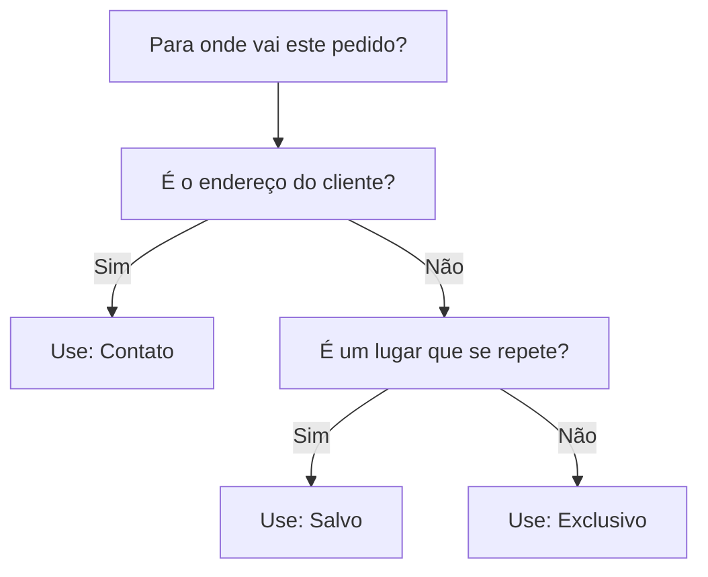

# Endereços e endereços salvos

Quase todo pedido precisa responder a uma pergunta simples: **para onde vai** (e, na locação, **de onde retiramos depois**). O LocFlow deixa você responder isso do jeito mais rápido possível — sem digitar o mesmo endereço de novo a cada orçamento.

A ideia central é esta: em vez de começar do zero, você **escolhe a origem do endereço**. Na maioria das vezes ele já está em algum lugar — no cadastro do cliente ou numa lista de lugares onde você já entregou antes.


**Por que isso te faz ganhar tempo (e fechar mais rápido):** condomínios, chácaras e salões de festa se repetem o ano inteiro. Guardar esses endereços uma vez e reaproveitá-los transforma o preenchimento de um orçamento de "minuto digitando CEP" em "dois toques".


## Três formas de dizer "para onde" {#tres-formas-de-dizer-para-onde}

Ao montar o trajeto do pedido (a parte **Para onde vai?** / **Onde retirar?**), você escolhe o **tipo de endereço**:

| Tipo | Quando usar | O que acontece |
| --- | --- | --- |
| **Contato** | O pedido vai para o **endereço do próprio cliente** (ex.: a casa dele) | O LocFlow puxa o endereço que já está no cadastro do contato |
| **Salvo** | É um **lugar recorrente** que você já atendeu antes (condomínio, chácara, galpão de um parceiro) | Você busca na sua lista de endereços salvos e seleciona |
| **Exclusivo** | É um endereço **só deste pedido**, que não vale a pena guardar | Você digita ali mesmo e ele fica só neste orçamento |

### Endereço do cliente {#endereco-do-cliente}

Se o cliente tem endereço no cadastro, o tipo **Contato** já traz tudo preenchido. É o caminho mais curto quando você entrega na casa ou na empresa do próprio cliente.


Se você escolher **Contato** e o cliente **ainda não tiver endereço cadastrado**, o LocFlow avisa e oferece ir à ficha do contato para completar — depois você volta ao orçamento com o endereço já preenchido. Veja [Contatos](../cadastros/contatos.md).


### Endereço salvo {#endereco-salvo}

Este é o **grande ganho de facilidade**. Um endereço salvo é um lugar recorrente que você guarda **uma vez** com um apelido — e reaproveita em quantos orçamentos quiser.

Pense nos lugares que se repetem no seu dia a dia:

- O **Condomínio Vila Verde**, para onde você já levou estrutura cinco vezes.
- A **Chácara do Lago**, palco de festa todo fim de semana.
- O **galpão de um parceiro** de onde você costuma sair.

Em vez de redigitar o CEP e o complexo "bloco B, portaria 2" de novo, você busca pelo apelido e seleciona. Pronto.

### Endereço só deste pedido {#endereco-so-deste-pedido}

Às vezes o destino é único — uma entrega avulsa que não vai se repetir. Para isso existe o tipo **Exclusivo**: você digita o endereço direto no orçamento e ele **não polui** suas listas. Sem cadastro, sem apelido, sem guardar nada.

## O CEP preenche quase tudo {#o-cep-preenche-quase-tudo}

Em qualquer um dos casos em que você **digita** um endereço, comece pelo **CEP**. Ao completar os 8 dígitos, o LocFlow busca e preenche sozinho o logradouro, o bairro e a cidade. Você só completa o **número** (e o complemento, se houver).


**E se eu não souber o CEP?** Há um interruptor **"Você sabe o CEP?"**. Hoje, o CEP é necessário para associar o endereço à cidade correta — como diz o próprio app:

> *"O CEP é obrigatório para associar o endereço ao município correto (IBGE)."*


**Em breve:** descobrir o CEP pelo **nome da rua** (integração com mapas). Por enquanto, tenha o CEP em mãos.



Não tem número? Marque a opção **S/N** (sem número) e siga em frente.

### Tipo do local {#tipo-do-local}

Todo endereço tem um **tipo do local**, que ajuda você e sua equipe a entender o destino na hora da entrega:

**Residencial · Comercial · Empresarial · Rural · Industrial · Condomínio · Chácara · Espaço de eventos.**

O padrão é **Residencial**. A única regra que muda algo prático é o **Condomínio**:


Quando o tipo é **Condomínio**, o **complemento vira obrigatório**. O app explica o porquê:

> *"Para condomínio, o complemento é obrigatório (bloco, apartamento, portaria etc.)."*

Faz sentido: sem o bloco/apartamento, o motorista chega ao portão e não sabe para onde ir.


## Salvar um endereço para reusar {#salvar-um-endereco-para-reusar}

Quando você perceber que um endereço vai se repetir, salve-o. No seletor de endereço do orçamento, escolha **Salvo** e use a opção de **criar um novo**. Você preenche:

1. **Identificador** — o apelido do lugar. É um **rótulo interno** só para você reconhecer depois. O app sugere exemplos como *"Depósito Central"* ou *"Filial SP"*. Use o que fizer sentido: *"Condomínio Vila Verde"*, *"Chácara do Lago"*.
2. **O endereço** — CEP, número, tipo do local e complemento, do mesmo jeito de sempre.

Ao salvar, o endereço já fica **selecionado no orçamento** e entra na sua lista para os próximos.


O identificador é como você vai **encontrar** o endereço depois. Quanto mais reconhecível o apelido, mais rápida a busca. Prefira nomes do mundo real ("Salão Festa & Cia") a códigos ("End. 014").


### Reusar um endereço salvo {#reusar-um-endereco-salvo}

Da próxima vez, escolha **Salvo** e busque — você pode pesquisar **pelo apelido** ou **por parte do endereço**. Selecione o resultado e o destino do pedido está pronto. É exatamente isso que economiza seu tempo.

## "Este é o local do evento" {#este-e-o-local-do-evento}

Ao informar o destino, você pode marcar **"Este é o local do evento"**. Use quando o endereço de entrega é o mesmo lugar onde a montagem/uso acontece — o caso mais comum em locação. É um detalhe que ajuda sua equipe a planejar a logística sem confusão.

## O pino de localização {#o-pino-de-localizacao}

Depois que o endereço está completo, pode aparecer um **pino de localização** num mapinha. Ele é **opcional** e serve só para **refinar** a posição exata — útil quando a entrega é numa entrada específica, num portão de fundos ou num ponto que o CEP não acerta com precisão. Como diz o app:

> *"Use o pino apenas se precisar refinar a localização."*

Para o dia a dia, o endereço digitado já basta. O pino é um capricho a mais para quem quer precisão.

## Por porte {#por-porte}

| Seu momento | Como aproveitar os endereços |
| --- | --- |
| **Autônomo / MEI** | Use **Contato** (entrega na casa do cliente) e **Exclusivo** (entrega avulsa). Nem precisa pensar em "endereços salvos" no começo. |
| **Empresa em crescimento** | Comece a **salvar os lugares que se repetem**. Cada condomínio ou salão salvo é um orçamento mais rápido no futuro. |
| **Operação grande** | Mantenha uma **biblioteca de endereços salvos** bem nomeada — sua equipe inteira monta orçamentos em segundos, com o complemento certo de cada bloco e portaria, e ainda refina o pino para os motoristas. |

## Situações reais {#situacoes-reais}

**"Entrego no mesmo condomínio toda semana."**
Salve o condomínio uma vez (com o complemento da portaria). A partir daí, é só escolher **Salvo** e buscar pelo apelido. Lembre que, sendo Condomínio, o complemento é obrigatório — preencha o bloco/portaria ao salvar.

**"O cliente quer receber em casa."**
Se o endereço dele já está no cadastro, escolha **Contato** e está feito. Se não estiver, o LocFlow te leva para completar a ficha e volta com tudo pronto.

**"É uma entrega única, num endereço que não vou usar de novo."**
Use **Exclusivo**: digite ali mesmo e siga. Nada fica guardado.

**"É locação: o que devolvo depois?"**
Na locação, o item **vai e volta**. Você define o destino da **entrega** e, depois, **de onde retirar** — muitas vezes o mesmo lugar. O seletor de endereço funciona igual nos dois momentos (entrega e retirada). Entenda a diferença em [Locação e venda](../conceitos/locacao-e-venda.md).

## Próximo passo {#proximo-passo}

- [Criando um orçamento](criando-um-orcamento.md) — onde o endereço entra no fluxo completo do pedido.
- [Contatos](../cadastros/contatos.md) — para que o endereço do cliente já venha pronto.
- [Locação e venda](../conceitos/locacao-e-venda.md) — por que a retirada existe só na locação.
