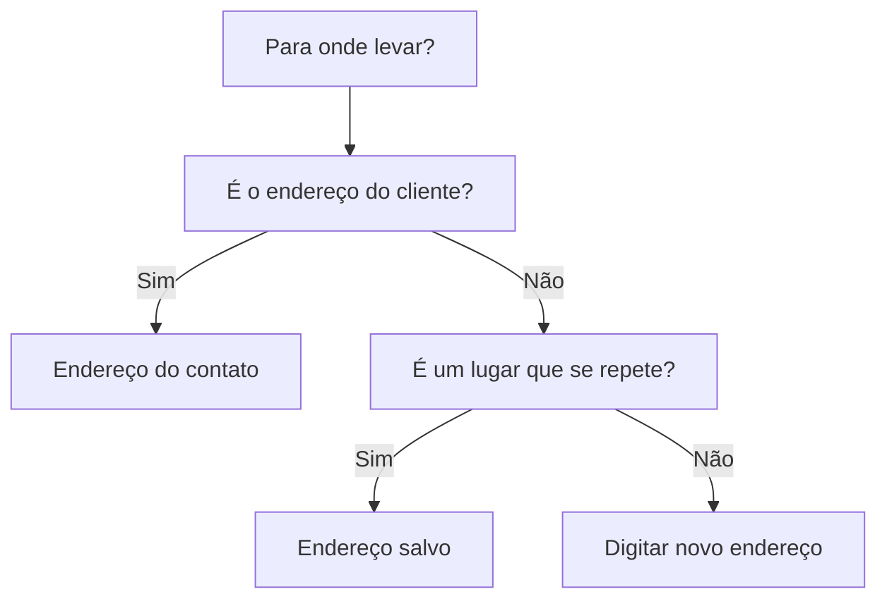

# Endereços e endereços salvos

Quase todo pedido precisa responder a uma pergunta simples: **para onde vai** (e, na locação, **de onde retiramos depois**). O LocFlow deixa você responder isso do jeito mais rápido possível — sem digitar o mesmo endereço de novo a cada orçamento.

A ideia central é esta: em vez de começar do zero, você **escolhe a origem do endereço**. Na maioria das vezes ele já está em algum lugar — no cadastro do cliente ou numa lista de lugares onde você já entregou antes.


**Por que isso te faz ganhar tempo (e fechar mais rápido):** condomínios, chácaras e salões de festa se repetem o ano inteiro. Guardar esses endereços uma vez e reaproveitá-los transforma o preenchimento de um orçamento de "minuto digitando CEP" em "dois toques".


## Três formas de dizer "para onde" {#tres-formas-de-dizer-para-onde}

No orçamento, a linha da entrega se chama **Para onde levar?** — e, na recolha da locação, **De onde recolher?**. Escolhido o endereço, ele aparece **resolvido**, em duas linhas. Para trocar, toque em **Usar outro endereço**, que mostra as três origens possíveis:

| Origem | Quando usar | O que acontece |
| --- | --- | --- |
| **Endereço do contato** | O pedido vai para o **endereço do próprio cliente** (ex.: a casa dele) | O LocFlow puxa o endereço que já está no cadastro do contato — a opção já mostra qual é, ou avisa *sem endereço cadastrado* |
| **Endereço salvo** | É um **lugar recorrente** que você já atendeu antes (condomínio, chácara, galpão de um parceiro) | Você busca na sua lista de endereços salvos e seleciona |
| **Digitar novo endereço** | É um endereço **só deste pedido** (o endereço *exclusivo*), que não vale a pena guardar | Você digita ali mesmo e ele fica só neste orçamento |

```mermaid
flowchart TD
    P["Para onde levar?"] --> C["É o endereço do cliente?"]
    C -->|Sim| CT["Endereço do contato"]
    C -->|Não| R["É um lugar que se repete?"]
    R -->|Sim| SV["Endereço salvo"]
    R -->|Não| EX["Digitar novo endereço"]
```

### Endereço do cliente {#endereco-do-cliente}

Se o cliente tem endereço no cadastro, **Endereço do contato** já traz tudo preenchido. É o caminho mais curto quando você entrega na casa ou na empresa do próprio cliente.


Se você escolher **Endereço do contato** e o cliente **ainda não tiver endereço cadastrado**, o LocFlow avisa e oferece ir à ficha do contato para completar — depois você volta ao orçamento com o endereço já preenchido. Veja [Contatos](../cadastros/contatos.md).


### Endereço salvo {#endereco-salvo}

Este é o **grande ganho de facilidade**. Um endereço salvo é um lugar recorrente que você guarda **uma vez** com um apelido — e reaproveita em quantos orçamentos quiser.

Pense nos lugares que se repetem no seu dia a dia:

- O **Condomínio Vila Verde**, para onde você já levou estrutura cinco vezes.
- A **Chácara do Lago**, palco de festa todo fim de semana.
- O **galpão de um parceiro** de onde você costuma sair.

Em vez de redigitar o CEP e o complexo "bloco B, portaria 2" de novo, você busca pelo apelido e seleciona. Pronto.


**Uma diferença que importa mais tarde: o endereço salvo é um atalho, não uma cópia.** Ao escolher o **endereço do contato** ou **digitar um novo**, o pedido guarda uma **cópia** do endereço — mudar o cadastro do cliente depois não mexe naquele pedido. Ao escolher um **endereço salvo**, o pedido guarda o **atalho** para o endereço: se alguém editar aquele endereço salvo, **o destino do pedido muda junto** — inclusive de pedidos já fechados e já roteirizados. Entenda em [Editar um endereço salvo depois](#editar-endereco-salvo).


### Endereço só deste pedido {#endereco-so-deste-pedido}

Às vezes o destino é único — uma entrega avulsa que não vai se repetir. Para isso existe **Digitar novo endereço** (o endereço *exclusivo* do pedido): você digita o endereço direto no orçamento e ele **não polui** suas listas. Sem cadastro, sem apelido, sem guardar nada.

## Três caminhos: pelo CEP, pelo mapa ou pelo link {#o-cep-preenche-quase-tudo}

Em qualquer um dos casos em que você **digita** um endereço, o LocFlow abre **três caminhos**, um abaixo do outro — você toca no que quiser e ele se abre ali mesmo:

| Caminho | Como funciona | Custo |
| --- | --- | --- |
| **Pelo CEP** *(aberto por padrão)* | Digite os 8 dígitos: logradouro, bairro e cidade se preenchem sozinhos. Você completa o **número** (e o complemento, se houver). | **Grátis** |
| **Buscar no mapa** | Digite o **nome da rua** e escolha uma sugestão: CEP, logradouro, bairro, município **e a localização exata** vêm juntos. | **Usa créditos** (o selo diz quantos) |
| **Link do Google Maps** | Cole o link que o cliente mandou — ou a mensagem inteira — e toque em **Usar este endereço**. | **Usa créditos** (os mesmos da busca) |


**A busca no mapa cobra créditos — e avisa antes.** O cabeçalho traz o selo com quantos créditos custa, e ao escolher uma sugestão o app pede confirmação (*"Confirmar endereço do mapa — endereço completo com localização exata, via Google Maps"*). O caminho **pelo CEP** resolve a maioria dos casos sem gastar nada, e por isso vem aberto primeiro.



**Não sabe o CEP?** É exatamente para isso que serve o **Buscar no mapa**: você acha o endereço pelo nome da rua. E se, no meio da busca, o LocFlow perceber que você digitou um **CEP** no campo do mapa, ele devolve você para o caminho gratuito com o CEP já preenchido — sem gastar crédito por algo que a consulta de CEP resolve de graça.


Não tem número? Marque a opção **S/N** (sem número) e siga em frente.

### O link que o cliente mandou {#link-do-google-maps}

Muitos clientes mandam pelo WhatsApp só o **link do lugar**, nunca o endereço escrito. Em vez de abrir o link e redigitar campo por campo — onde entram o número errado e o bairro trocado —, cole-o no campo *"Cole aqui o link do Google Maps"*:

* vale o link curto do WhatsApp, o endereço completo do navegador ou a **mensagem inteira** (*"segue o endereço da obra: https://… valeu"*) — o LocFlow acha o link no meio do texto;
* quando o link aponta um **lugar**, o endereço vem completo, como numa busca; quando traz só uma **localização compartilhada**, o endereço vem daquele ponto e **o pino guardado é o do link** — quem mandou estava apontando um portão específico, e o LocFlow não recalcula o ponto por cima;
* o cartão do endereço passa a dizer *"Endereço resolvido pelo link do cliente"*, para quem conferir o cadastro depois saber de onde veio o ponto;
* completar o CEP depois não apaga a rua e o bairro que o link trouxe.

Colar o mesmo link duas vezes na mesma tela não cobra em dobro. Se o link não puder ser lido, o app diz: *"Não consegui ler este link. Cole o link do lugar, ou informe o CEP."* E a mesma porta aparece em todo formulário de endereço do LocFlow — contato, endereço salvo, galpão, loja, dados da empresa.

### Tipo do local {#tipo-do-local}

Todo endereço tem um **tipo do local**, que ajuda você e sua equipe a entender o destino na hora da entrega:

**Residencial · Comercial · Empresarial · Rural · Industrial · Condomínio · Chácara · Espaço de eventos.**

O padrão é **Residencial**. A única regra que muda algo prático é o **Condomínio**:


Quando o tipo é **Condomínio**, o **complemento vira obrigatório**. O app explica o porquê:

> *"Para condomínio, o complemento é obrigatório (bloco, apartamento, portaria etc.)."*

Faz sentido: sem o bloco/apartamento, o motorista chega ao portão e não sabe para onde ir.


## Salvar um endereço para reusar {#salvar-um-endereco-para-reusar}

Quando você perceber que um endereço vai se repetir, salve-o. No seletor de endereço do orçamento, escolha **Endereço salvo** e use o **+** para **criar um novo**. Você preenche:

1. **Identificador** — o apelido do lugar. É um **rótulo interno** só para você reconhecer depois. O app sugere exemplos como *"Depósito Central"* ou *"Filial SP"*. Use o que fizer sentido: *"Condomínio Vila Verde"*, *"Chácara do Lago"*.
2. **O endereço** — CEP, número, tipo do local e complemento, do mesmo jeito de sempre.

Ao salvar, o endereço já fica **selecionado no orçamento** e entra na sua lista para os próximos.


O identificador é como você vai **encontrar** o endereço depois. Quanto mais reconhecível o apelido, mais rápida a busca. Prefira nomes do mundo real ("Salão Festa & Cia") a códigos ("End. 014").


### Reusar um endereço salvo {#reusar-um-endereco-salvo}

Da próxima vez, escolha **Endereço salvo** e busque — você pode pesquisar **pelo apelido** ou **por parte do endereço**. Selecione o resultado e o destino do pedido está pronto. É exatamente isso que economiza seu tempo.

## "Este local é o local do evento?" {#este-e-o-local-do-evento}

Na **locação**, depois que o endereço da entrega (ou da recolha) está escolhido, aparece a pergunta **Este local é o local do evento?** — **Sim** ou **Não**. O **Sim** já vem marcado, porque é o caso mais comum: o endereço de entrega é o mesmo lugar onde a montagem e o uso acontecem. Responda **Não** quando o material vai para um lugar e o evento acontece em outro. É um detalhe que ajuda sua equipe a planejar a logística sem confusão. Na venda, a pergunta não aparece.

## O pino de localização {#o-pino-de-localizacao}

Junto do endereço há o interruptor **Pino de localização**. Ele vem **desligado** — a localização que o CEP ou a busca trazem é um palpite do endereço, não um ponto que alguém marcou —, a não ser que o ponto já tenha sido marcado antes (inclusive pelo link que o cliente mandou). Ligue quando precisar apontar o **lugar exato** — uma entrada específica, um portão de fundos, um ponto que o CEP não acerta — e arraste o pino no mapa. Para o dia a dia, o endereço já basta.

Se o endereço mudar **depois** que você marcou o pino, o pino fica onde você o deixou e o app avisa: *"O pino continua no ponto que você marcou — o endereço mudou depois disso."* O botão **Recalcular** leva o pino para o endereço novo; sem esse toque, ele não se move — a decisão é de quem marcou.


**O pino não é um detalhe local do pedido — ele grava no cadastro.** Nos endereços salvos e do contato, o **?** ao lado do interruptor avisa: *o pino grava no cadastro*. Arrastar o pino de um **endereço salvo** **regrava aquele endereço** para a empresa inteira; e, quando o mapa consegue reconhecer o novo ponto, ele regrava também **CEP, logradouro, número, bairro e município**. O mesmo vale para o pino do **endereço do contato**: ele atualiza a ficha do cliente (os pedidos antigos dele guardaram uma cópia e não mudam).

Isso significa que um arrasto de pino num endereço salvo pode **mudar o destino de outros pedidos** — inclusive pedidos já fechados. Leia a seção a seguir antes de mexer. No endereço digitado só para este pedido, não há esse risco.


## Editar um endereço salvo depois {#editar-endereco-salvo}

**Onde fica:** hoje a alteração de um endereço já salvo acontece **dentro do orçamento**, no próprio seletor de endereço: você escolhe **Endereço salvo**, seleciona o endereço, liga o **Pino de localização** e **arrasta o pino** no mapa. É esse gesto que regrava o cadastro.

Parece inofensivo. Não é — e o motivo é aquele atalho: **o pedido não guarda o endereço salvo, guarda a referência a ele**. A rota lê o endereço **na hora**. Então, quando o endereço muda, **a parada muda de lugar sozinha** em todo pedido que aponta para ali.

### O alcance {#alcance-da-edicao}

São duas perguntas diferentes, e confundi-las é o que gera susto:

| A pergunta | A resposta |
| --- | --- |
| **Quais pedidos passam a apontar para o lugar novo?** | **Todos** os que usam aquele endereço salvo, em qualquer estado — em negociação, ganhos, com roteiro montado, repassados a um parceiro. É o atalho funcionando: ninguém guardou uma cópia do endereço, todos leem o cadastro na hora. |
| **Quais geram pendência de roteiro e aviso?** | Só os **ganhos e ainda não finalizados**. Um pedido em negociação não tem operação a desatualizar — quando for ganho, já sai com o endereço novo. Um pedido finalizado não é tocado: a operação acabou, não há mais o que ajustar. |

Em cada pedido **ganho e não finalizado**, na hora:

* o movimento afetado ganha uma **versão nova** (a antiga vira histórico);
* o roteiro que continha aquela parada fica **desatualizado**;
* aquela parada fica **bloqueada para a equipe em campo** até o roteiro ser ajustado;
* o operador logístico é avisado — ou o **parceiro**, se o pedido tiver sido repassado.


**Só o apelido não muda nada.** Renomear o **identificador** (*"Chácara do Lago"* → *"Chácara do Lago — portaria 2"*) é rótulo, não lugar: nenhum roteiro é afetado. O que conta como "mudou de lugar" é CEP, logradouro, número, complemento, bairro, município, UF, tipo do local ou a posição no mapa.



**Corrigir um endereço salvo é uma alteração da empresa inteira, não deste pedido.** Se o que você quer é só ajustar **este** pedido (o cliente mudou o salão, a entrega é noutra portaria), **não** edite o endereço salvo: use **Digitar novo endereço** e digite o endereço ali, ou selecione outro endereço salvo. Assim você não desatualiza os roteiros de mais ninguém.


### Quando editar é a coisa certa {#quando-editar-e-certo}

Quando o **lugar** está de fato errado no cadastro — o número da chácara é 340, não 34; o pino ficou no meio da rodovia. Aí você **quer** que todos os pedidos vivos apontem para o lugar certo. Só lembre de, depois:

1. Abrir cada **roteiro desatualizado** e salvar a edição (é o que destrava a execução).
2. Conferir o **galpão de origem** dos pedidos afetados, se a distância mudou bastante — veja [Movimentos, janelas e galpão de origem](movimentos-e-janelas.md).

Entenda a cadeia completa em [Quando um pedido muda depois de fechado](../logistica/quando-um-pedido-muda.md#mudar-o-endereco).

## Por porte {#por-porte}

| Seu momento | Como aproveitar os endereços |
| --- | --- |
| **Autônomo / MEI** | Use o **endereço do contato** (entrega na casa do cliente) e **Digitar novo endereço** (entrega avulsa). Nem precisa pensar em "endereços salvos" no começo. |
| **Empresa em crescimento** | Comece a **salvar os lugares que se repetem**. Cada condomínio ou salão salvo é um orçamento mais rápido no futuro. |
| **Operação grande** | Mantenha uma **biblioteca de endereços salvos** bem nomeada — sua equipe inteira monta orçamentos em segundos, com o complemento certo de cada bloco e portaria, e ainda refina o pino para os motoristas. |

## Situações reais {#situacoes-reais}

**"Entrego no mesmo condomínio toda semana."**
Salve o condomínio uma vez (com o complemento da portaria). A partir daí, é só escolher **Endereço salvo** e buscar pelo apelido. Lembre que, sendo Condomínio, o complemento é obrigatório — preencha o bloco/portaria ao salvar.

**"O cliente quer receber em casa."**
Se o endereço dele já está no cadastro, escolha **Endereço do contato** e está feito. Se não estiver, o LocFlow te leva para completar a ficha e volta com tudo pronto.

**"É uma entrega única, num endereço que não vou usar de novo."**
Use **Digitar novo endereço**: digite ali mesmo e siga. Nada fica guardado.

**"O número do condomínio estava errado no cadastro; corrigi e três roteiros ficaram desatualizados."**
Era esperado: o endereço salvo é usado por vários pedidos, e todos os que ainda vão acontecer passaram a apontar para o lugar certo. Abra cada roteiro e salve a edição para destravar a execução. Se o que você queria era ajustar **só um** pedido, digite um endereço só daquele pedido (**Digitar novo endereço**).

**"É locação: o que devolvo depois?"**
Na locação, o item **vai e volta**. Você define o destino da **entrega** e, depois, **de onde recolher** — muitas vezes o mesmo lugar (o retorno já nasce espelhando a entrega). O seletor de endereço funciona igual nos dois momentos (entrega e recolha). Entenda a diferença em [Locação e venda](../conceitos/locacao-e-venda.md).

## Próximo passo {#proximo-passo}

- [Criando um orçamento](criando-um-orcamento.md) — onde o endereço entra no fluxo completo do pedido.
- [Contatos](../cadastros/contatos.md) — para que o endereço do cliente já venha pronto.
- [Locação e venda](../conceitos/locacao-e-venda.md) — por que a retirada existe só na locação.
- [Quando um pedido muda depois de fechado](../logistica/quando-um-pedido-muda.md#mudar-o-endereco) — o que acontece com a rota quando o destino muda.
