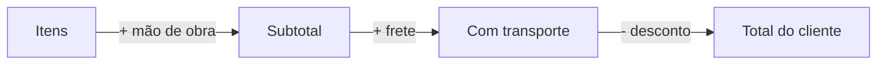

# Valores: mão de obra, frete e descontos

Depois de escolher o cliente, os itens e as datas, chega a hora de fechar o **preço**. No bloco de **Valores** do orçamento o LocFlow soma tudo e mostra o total que o cliente vai ver — somando o que custam os itens, acrescentando a **mão de obra** e o **frete**, e subtraindo o **desconto**.


**Valor não é cobrança.** Esta página é sobre como o **preço** se forma. O que o cliente efetivamente paga — em quantas parcelas, por qual meio, com qual vencimento — é a **fatura**, e isso é assunto da [Cobrança](../cobranca/faturas-e-parcelas.md). Aqui montamos só o valor.


## Como o preço se forma {#como-o-preco-se-forma}

O total é montado em quatro camadas, sempre nesta ordem:

Você não precisa preencher tudo: mão de obra, frete e desconto são **opcionais**. Um orçamento de balcão pode ser só itens; um de evento pode ter as quatro camadas.

## Itens: a base de tudo {#itens-a-base-de-tudo}

O ponto de partida é a soma dos **bens móveis** do orçamento — produtos e kits, pela quantidade e pelo valor de cada um. Esse subtotal de itens é a **base** sobre a qual a mão de obra é calculada (quando você usa porcentagem). Como adicionar e precificar itens é assunto de [Criando um orçamento](criando-um-orcamento.md).

## Mão de obra {#mao-de-obra}

A **mão de obra** é um acréscimo opcional para cobrar o trabalho que vai além dos itens em si: montagem, instalação, operação, desmontagem. Em alguns negócios ela aparece como "taxa de serviço" — é a mesma ideia.

Funciona com uma chave que você liga e dois modos:

| Modo | Como informar | Exemplo |
| --- | --- | --- |
| **R$ (valor fixo)** | Um valor em reais, direto | + R$ 300,00 |
| **% (porcentagem)** | Uma porcentagem sobre o **total dos itens** | 10% de R$ 2.000 = + R$ 200,00 |

Enquanto você digita, o LocFlow mostra um preview com o sinal de **+** e o quanto isso adiciona ao orçamento — assim você confere o efeito na hora.


A mão de obra incide **só sobre os itens** — não sobre o frete. Faz sentido: ela paga o trabalho com os bens móveis, não o transporte.


## Frete {#frete}

O **frete** é o valor do transporte. No LocFlow ele não é um número solto: ele nasce dos **movimentos** da operação — a **entrega** (levar até o cliente) e, na locação, a **retirada** (buscar de volta). Cada movimento tem a sua origem (o galpão) e o seu destino, e o frete soma o que custa percorrer esses caminhos.

### Cobrar frete {#cobrar-frete}

Existe uma chave **"Cobrar frete"**. Quando ela está ligada, abre o painel para informar ou calcular o valor. Quando você a desliga, o orçamento simplesmente não inclui frete — e o LocFlow deixa isso explícito:


*"Este orçamento não inclui cobrança de frete. Reative para informar ou calcular um valor."* {#frete-desativado}

(É a mensagem que o app mostra com o frete desligado — útil quando você combina a entrega "por conta do cliente" ou quando o transporte já está embutido no preço dos itens.)


### Viagens por movimento {#viagens-por-movimento}

Cada movimento tem um contador de **viagens** — quantas idas o veículo precisa fazer para dar conta da carga. Uma festa grande pode exigir 2 ou 3 viagens de entrega; a retirada, outras tantas.

O número de viagens faz duas coisas: **alimenta o frete** (mais idas, mais custo) e **alimenta o planejamento do roteiro** depois que o pedido é ganho. Por isso o contador de viagens aparece **mesmo com a cobrança de frete desligada** — o planejamento precisa dele de qualquer jeito.


**O LocFlow só pede o que a operação tem.** Se o cliente vai **retirar no galpão**, não existe movimento de entrega — e o app esconde as viagens de entrega. Se, na locação, ele vai **devolver no galpão**, não há retirada com deslocamento. Se ele faz tudo no galpão, o aviso é direto: *"O cliente vai retirar e devolver no galpão, então não há frete a calcular."*


### Frete automático x frete manual {#frete-automatico-x-manual}

Com a cobrança de frete ligada, você escolhe entre duas abas:

| Aba | O que faz | Quando usar |
| --- | --- | --- |
| **Frete automático** | O LocFlow calcula o valor a partir dos endereços e das suas regras de frete | Quando você tem o **Motor de Frete** configurado e os endereços preenchidos |
| **Frete manual** | Você digita o valor do transporte à mão | Quando prefere um valor fechado, ou quando falta algum dado para o cálculo |

No **frete automático**, o LocFlow primeiro confere se tem tudo que precisa (galpão de origem, destino, e — dependendo das suas regras — data e horário). Se faltar algo, ele lista o que preencher antes de liberar o botão **Calcular frete**. Calculou, ele mostra o valor e, quando há mais de uma rota possível, oferece **cenários** alternativos (por exemplo, evitar pedágio) para você escolher.


**O cálculo de frete consome créditos** — ele consulta o mapa para medir a rota real. O app sinaliza isso no botão. E atenção: se você **mudar o endereço de destino** depois de calcular, o LocFlow avisa *"O destino mudou. Recalcule o frete antes de salvar"* — porque o valor antigo era de outro caminho.


Quando você **não tem** um motor de frete ativo, o painel já abre direto no campo manual — não há o que calcular automaticamente. Se um cálculo falhar (um endereço que o mapa não localiza, um galpão sem coordenadas), o LocFlow explica o motivo e oferece **"Informar manualmente"** para você não travar a proposta.

> A montagem das regras de frete (preço por quilômetro, por viagem, por peso/volume, faixas, veículos) vive no **Motor de Frete**, nas Configurações. Veja [Motores operacionais](../configuracoes/motores-operacionais.md). Aqui no orçamento você só **usa** o resultado.

## Descontos {#descontos}

O **desconto** é um abatimento sobre o orçamento. Vem **desligado por padrão** — você liga quando quer dar um preço melhor. Como na mão de obra, há dois modos:

| Modo | Como informar | Incide sobre |
| --- | --- | --- |
| **R$ (valor fixo)** | Um valor em reais | O total (itens + frete + mão de obra) |
| **% (porcentagem)** | Uma porcentagem de 0 a 100 | O total (itens + frete + mão de obra) |

O preview mostra o sinal de **−** e o quanto sai do total. O desconto nunca derruba o orçamento abaixo de zero, e o LocFlow não deixa você dar um desconto em reais maior que o próprio total.

### Desconto proporcional aos kits {#desconto-proporcional-aos-kits}

Esta é uma ajuda inteligente do LocFlow. Quando os **produtos avulsos** que você colocou no orçamento, juntos, formam um ou mais **kits** do seu catálogo, o sistema percebe e oferece aplicar a **economia do kit** como desconto — recompensando o cliente que leva o combo, sem você ter que fazer a conta.

Aparece como uma chave que só surge quando há kit formável. Os textos de ajuda do app dizem tudo:


Antes de ligar: *"Identificamos kits formáveis com os produtos avulsos selecionados. Ative para aplicar a economia como desconto."*

Depois de ligar: *"X kit(s) formado(s) com os produtos avulsos. Desconto aplicado: R$ Y,YY."*


Quando esse desconto proporcional está **ligado**, ele assume o controle do campo de desconto (e adiciona uma observação automática explicando o abatimento). Para mexer no desconto à mão de novo, é só desligar a chave — o app avisa: *"Para alterar o desconto, desative o desconto proporcional aos kits."*


**Por que isso te faz vender mais:** o cliente que ia levar peças soltas vê que o **combo sai mais em conta** — e tende a fechar o conjunto inteiro. Você aumenta o ticket sem parecer que está empurrando; o sistema só mostra a economia que já existe.


## Por porte {#por-porte}

| Se você é… | O caminho mais provável |
| --- | --- |
| **Autônomo / MEI / micro** | Itens + frete manual num valor fechado. Sem mão de obra, sem cálculo de rota. Simples e rápido. |
| **Médio** | Frete automático com o Motor de Frete, mão de obra em % para serviços, e o desconto proporcional aos kits trabalhando a seu favor. |
| **Grande / muitas filiais** | Tudo acima, mais cenários de rota, viagens por movimento para cargas grandes e regras de frete por veículo/faixa — controle fino sobre cada real. |

A ideia é a mesma para todos: **abstrair** para quem quer simplicidade, **dar números e flexibilidade** para quem quer controle.

## Para quem quer os números {#para-quem-quer-os-numeros}

Se você gosta de saber exatamente como o total é montado, é assim (o LocFlow arredonda cada parcela para centavos):

1. **Total dos itens** = soma de (quantidade × valor) de cada produto e kit.
2. **Mão de obra** = um valor fixo, **ou** uma % aplicada **sobre o total dos itens**.
3. **Subtotal** = total dos itens **+** mão de obra **+** frete.
4. **Desconto** = um valor fixo, **ou** uma % aplicada **sobre o subtotal** (itens + frete + mão de obra).
5. **Total do cliente** = subtotal **−** desconto, nunca menor que zero.

Pontos finos que valem lembrar:

- A **mão de obra em %** olha só para os itens; o **desconto em %** olha para tudo (itens + frete + mão de obra).
- O **frete automático** é medido pela rota **real** entre o galpão e o destino (não pela linha reta nem por faixa de CEP), e segue as regras do seu Motor de Frete. Cada movimento entra com a sua quantidade de viagens.
- O desconto **proporcional aos kits** calcula a diferença entre comprar/alugar as peças soltas e o kit equivalente, e usa essa diferença como o valor do desconto.

## Situações reais {#situacoes-reais}

- **Evento com montagem:** itens + mão de obra de 10% (a montagem) + frete automático calculado pelos endereços. O cliente vê um total único e claro.
- **Carga grande:** 80 cadeiras não cabem numa viagem. Você coloca **2 viagens** na entrega — o frete dobra a perna do transporte e o roteiro já nasce sabendo das duas idas.
- **Cliente busca no galpão:** retirada no galpão ligada. O frete some sozinho e o app explica que não há transporte a cobrar.
- **Combo escondido:** o cliente pediu mesa, 4 cadeiras e toalha avulsos — que formam o seu "Kit Jantar". O LocFlow sugere o desconto proporcional e você fecha com a economia aplicada.

## Próximo passo {#proximo-passo}

- Montou o valor? Volte para [Criando um orçamento](criando-um-orcamento.md) e siga para o envio.
- Quer que o frete calcule sozinho? Configure o [Motor de Frete](../configuracoes/motores-operacionais.md).
- Vai transformar o valor em cobrança? Veja [Faturas e parcelas](../cobranca/faturas-e-parcelas.md).
- Dúvida em algum termo? Consulte o [glossário](../primeiros-passos/glossario.md).
