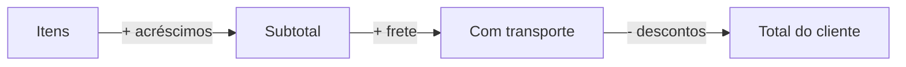

# Valores: acréscimos, frete e descontos

Depois de escolher o cliente, os itens e as datas, chega a hora de fechar o **preço**. Na etapa **Valores** do orçamento o LocFlow soma tudo e mostra o total que o cliente vai ver — somando o que custam os itens, acrescentando os **acréscimos** (mão de obra, montagem, layout…) e o **frete**, e subtraindo os **descontos**.


**Valor não é cobrança.** Esta página é sobre como o **preço** se forma. O que o cliente efetivamente paga — em quantas parcelas, por qual meio, com qual vencimento — é a **fatura**, e isso é assunto da [Cobrança](../cobranca/faturas-e-parcelas.md). Aqui montamos só o valor.


## Como o preço se forma {#como-o-preco-se-forma}

O total é montado em quatro camadas, sempre nesta ordem:

```mermaid
flowchart LR
    A[Itens] -->|+ acréscimos| B[Subtotal]
    B -->|+ frete| C[Com transporte]
    C -->|- descontos| D[Total do cliente]
```

Você não precisa preencher tudo: acréscimos, frete e descontos são **opcionais**. Um orçamento de balcão pode ser só itens; um de evento pode ter as quatro camadas.


**Duas listas, não dois campos.** Até a versão anterior o orçamento tinha **um** campo de mão de obra e **um** campo de desconto. Hoje são **duas listas**: você lança **quantos acréscimos** e **quantos descontos** precisar, cada um com o seu texto e o seu valor — e o cliente vê tudo discriminado no PDF e no WhatsApp, linha a linha.


## Itens: a base de tudo {#itens-a-base-de-tudo}

O ponto de partida é a soma dos **bens móveis** do orçamento — produtos e kits, pela quantidade e pelo valor de cada um. Esse subtotal de itens é a **base** sobre a qual todo acréscimo em porcentagem é calculado. Como adicionar e precificar itens é assunto de [Criando um orçamento](criando-um-orcamento.md).

## Acréscimos {#acrescimos}

**Acréscimo é tudo que soma ao orçamento e não é item.** O trabalho que vai além dos bens móveis: montar, instalar, operar, desmontar, desenhar o layout do salão. Em alguns negócios isso aparece como "taxa de serviço" — é a mesma ideia, agora com um nome só e uma lista própria.

O cartão **Acréscimos** mostra cada linha lançada, o total no cabeçalho (**+ R$ …**) e o botão **Adicionar acréscimo**.

### Os três campos de um acréscimo {#campos-do-acrescimo}

Ao tocar em **Adicionar acréscimo**, a folha pede três coisas:

| Campo | O que é | Obrigatório? |
| --- | --- | --- |
| **Tipo** | Que serviço é: **Mão de obra**, **Montagem**, **Desmontagem**, **Layout** ou **Outros** | Sim (já vem em *Mão de obra*) |
| **Descrição** | O texto que o **cliente lê** no orçamento — *"Equipe de 4 montadores"* | Não, **exceto em "Outros"** |
| **Valor** | **R$** (valor fechado) ou **%** (porcentagem **sobre o total dos itens**) | Sim |

Sem descrição, o documento imprime o **nome do tipo** ("Montagem") — que já diz o suficiente. A exceção é **"Outros"**: ali o rótulo sozinho não informa nada ao cliente, então o texto passa a ser exigido.


**Todo acréscimo em % incide sobre o total dos itens** — não sobre o frete, nem sobre um total que já inclua outro acréscimo. Dois acréscimos de 10% somam **20% dos itens**, nunca 21%: eles não se empilham um sobre o outro. Por isso a **ordem** em que você lança não muda o total; ela só define a ordem em que o cliente lê as linhas.


### O frete não entra nesta lista {#frete-fora-dos-acrescimos}

O **frete** é, conceitualmente, um acréscimo da mesma família — mas ele tem **seção própria e motor próprio** (regras, viagens, fornecedores). Lançá-lo também aqui daria dois números para a mesma coisa. Por isso a folha avisa: *"O frete não entra aqui: ele tem seção própria, com o cálculo do motor de frete."*

No **documento do cliente**, os dois se reencontram: PDF e WhatsApp trazem um bloco **Acréscimos** com todas as linhas de serviço **e** a linha do frete, cada uma com quanto somou em reais.

### A taxa de serviço já vem lançada {#taxa-de-servico-vira-acrescimo}

Se você configurou uma **taxa de serviço** padrão no [Motor de Orçamento](../configuracoes/motor-de-orcamento.md#taxa-de-servico), todo orçamento novo já nasce com **um acréscimo de Mão de obra em %** no valor dela. É só um ponto de partida: dá para mudar o valor, trocar o tipo, escrever uma descrição ou remover a linha.


**Por que isso te faz faturar mais:** com um campo só, o vendedor somava montagem e desmontagem num número redondo e o cliente lia "mão de obra: R$ 800" sem saber o que estava pagando. Discriminado — *"Montagem R$ 500"*, *"Desmontagem R$ 300"* —, o mesmo valor **para de parecer taxa** e passa a parecer serviço. É a diferença entre justificar o preço e negociá-lo para baixo.


## Frete {#frete}

O **frete** é o valor do transporte. No LocFlow ele não é um número solto: ele nasce dos **movimentos** da operação — a **entrega** (levar até o cliente) e, na locação, a **retirada** (buscar de volta). Cada movimento tem a sua origem (o galpão) e o seu destino, e o frete soma o que custa percorrer esses caminhos.


**O frete mora na etapa "Movimentos", não em "Valores".** Ele é a **etapa ③** do cartão de movimentos, logo depois de ① *Trajeto e horários* e ② *Cargas e viagens* — assim você vê o preço mudar na mesma tela em que mexe nas viagens. Quando o cliente **retira e devolve no galpão**, não há viagem nenhuma e as etapas ② e ③ simplesmente não aparecem. Veja [Movimentos, janelas e galpão de origem](movimentos-e-janelas.md).


### Cobrar frete {#cobrar-frete}

Existe uma chave **"Cobrar frete"**. Quando ela está ligada, abre o painel para informar ou calcular o valor. Quando você a desliga, o orçamento simplesmente não inclui frete — e o LocFlow deixa isso explícito:


*"Este orçamento não inclui cobrança de frete. Reative para informar ou calcular um valor."* {#frete-desativado}

(É a mensagem que o app mostra com o frete desligado — útil quando você combina a entrega "por conta do cliente" ou quando o transporte já está embutido no preço dos itens.)


### Viagens por movimento {#viagens-por-movimento}

Cada movimento pode precisar de mais de uma **viagem** — idas do veículo para dar conta da carga. Uma festa grande pode exigir 2 ou 3 viagens de entrega; a retirada, outras tantas.

Você define as viagens **distribuindo a carga**: em *Opções avançadas* do painel de frete, o botão **"Distribuir carga em viagens"**. Sem distribuir, o LocFlow considera **1 viagem por movimento**. O número de viagens **alimenta o frete** (mais idas, mais custo) e, depois que o pedido é ganho, **o planejamento do roteiro**.


**O LocFlow só pede o que a operação tem.** Se o cliente vai **retirar no galpão**, não existe movimento de entrega. Se, na locação, ele vai **devolver no galpão**, não há retirada com deslocamento. Se ele faz tudo no galpão, o aviso é direto: *"O cliente vai retirar e devolver no galpão, então não há frete a calcular."*


### Distribuir a carga: automático ou manual {#distribuir-carga}

Ao tocar em **"Distribuir carga em viagens"**, abre a folha **Distribuir em viagens** — onde você fatia a carga do orçamento. São **dois modos**, e você escolhe o que combina com o seu jeito de trabalhar:

| Modo | Quem monta as viagens | Quando usar |
| --- | --- | --- |
| **Automático** | Você escolhe **um veículo** e o LocFlow **propõe a divisão** — quantas viagens cabem, com que carga em cada uma. Ele ainda sugere a **melhor distribuição** (a que rende menos viagens), pronta para aplicar num toque. | Quando quer rapidez e confia no cálculo por capacidade do veículo. |
| **Manual** | **Você monta** cada viagem à mão: distribui a quantidade de cada item entre as viagens e adiciona quantas precisar. Um marcador mostra quantos itens ainda faltam alocar até *"Toda a carga distribuída"*. | Quando quer controle fino — separar itens frágeis, respeitar uma ordem, montar as viagens do seu jeito. |


**Cada viagem pode usar a ficha de um fornecedor diferente.** Dentro da distribuição, você escolhe o **veículo de cada viagem** — e ele pode ser da sua frota **ou de um fornecedor de frete**. Ao apontar a ficha de um fornecedor, o frete **daquela viagem** passa a usar a **precificação desse fornecedor**, não a sua. É assim que uma mesma entrega combina, por exemplo, a sua frota numa viagem e uma transportadora parceira na outra — cada porção cobrada por quem a leva. Veja como os fornecedores entram em [Fornecedores de frete](../parcerias/fornecedores-de-frete.md).


**Elegibilidade: sem motor de frete, o veículo fica bloqueado.** Um fornecedor só cota transporte quando tem **motor de frete ativo**. Na distribuição, a ficha de um fornecedor **sem motor** aparece com um **cadeado** e a marca *"sem motor de frete"* — e **não pode ser escolhida**, porque a viagem sairia sem preço. A parte da carga que ficar sem veículo elegível é cobrada pelo **valor manual** do frete. Para destravar, configure o motor daquele fornecedor — veja [Motor de frete por detentor](../configuracoes/motor-de-frete-detentor.md).

### Frete automático e ajuste manual {#frete-automatico-x-manual}

Com a cobrança de frete ligada e o **Motor de Frete** configurado, o LocFlow calcula o valor a partir dos endereços e das suas regras. Antes de liberar o botão **Calcular frete**, ele mostra o card *"Antes de calcular, preencha"* com um **checklist** do que falta — e o checklist é **por movimento**, não um "destino" genérico. Assim você bate o olho e sabe exatamente onde clicar:

| Item do checklist | O que significa |
| --- | --- |
| **Local de entrega** | Falta o endereço de destino da **entrega**. |
| **Local de retirada** | Falta o endereço da **retirada** (aparece só na locação, quando há retirada com deslocamento). |
| **Galpão de saída (entrega)** / **(retirada)** | Falta escolher de qual **galpão** a equipe sai. O rótulo separa entrega e retirada quando a operação tem os dois; se só um, aparece **Galpão de saída**. |

Dependendo das suas regras, o motor pode ainda pedir **data** e **horário**. Preencheu tudo, o card fica verde (*"Tudo pronto para calcular o frete."*) e o botão libera.

Calculou, você pode **ajustar o valor à mão** a qualquer momento pelo toggle **"Ajustar valor manualmente"** — útil quando prefere um valor fechado. E, quando há mais de uma rota possível, o painel oferece **cenários de rota** alternativos em *Opções avançadas* (veja adiante).


**O cálculo de frete consome créditos** — ele consulta o mapa para medir a rota real. O app sinaliza isso no botão. E atenção: se você **mudar o endereço de destino** depois de calcular, o LocFlow avisa *"Cálculo desatualizado — recalcule o frete antes de salvar"* — porque o valor antigo era de outro caminho.


Quando você **não tem** um motor de frete ativo, o painel já abre direto no campo manual — não há o que calcular automaticamente. Se um cálculo falhar (um endereço que o mapa não localiza, um galpão sem coordenadas), o LocFlow explica o motivo e oferece **"Informar manualmente"** para você não travar a proposta.

> A montagem das regras de frete (preço por quilômetro, por viagem, por peso/volume, faixas, veículos) vive no **Motor de Frete**, nas Configurações. Veja [Motores operacionais](../configuracoes/motores-operacionais.md). Aqui no orçamento você só **usa** o resultado.

### Cenários de rota {#cenarios-de-rota}

Em *Opções avançadas*, **depois de calcular** o frete, o LocFlow mostra os **cenários de rota** — variações do caminho, cada uma com o seu preço, apresentadas como **chips** que você toca para escolher:

| Cenário | O que muda |
| --- | --- |
| **Padrão** | A melhor rota que o mapa encontrou, com o valor cheio. |
| **Sem pedágio** | Evita praças de pedágio. Costuma ser mais longo — o preço acompanha a distância. |
| **Sem balsa** | Evita travessias de balsa. |
| **Sem rodovia** | Evita rodovias (fica por vias locais). |

Os cenários alternativos só aparecem quando existem de fato para aquela rota. O valor de cada um é **proporcional à distância** do cenário em relação à rota padrão — um caminho mais longo por evitar o pedágio sai mais caro no transporte, e você decide se compensa. Tocar num chip **troca o valor do frete** para o daquele cenário; o **Padrão** continua ali para voltar quando quiser.

### A composição do frete: uma ou várias transportadoras {#composicao-do-frete}

Depois de calcular, o frete aparece como uma **Composição do frete**: uma lista das transportadoras disponíveis — a **sua própria organização** e cada **fornecedor de frete** cadastrado —, ordenadas por preço, com o selo **"Menor preço"** na mais barata. Aí você decide, **na própria lista**:

* **Marque uma** transportadora → ela faz o **frete inteiro**.
* **Marque várias** → a carga **divide as viagens** entre elas, e cada uma é cobrada pela **sua** precificação.

Marcar é livre. Quando você marca **duas ou mais**, aparece o botão **"Dividir a carga"**: ao tocá-lo, o LocFlow monta a divisão (round-robin das viagens entre as marcadas, cada uma com o veículo equivalente) e **recalcula** o valor por porção. Como o cálculo **consome créditos**, essa divisão é uma ação sua — não recalcula a cada clique. Depois de dividida, você pode voltar à lista (**"Escolher outras transportadoras"**) sem gastar crédito e ajustar quem entra.


**Precificação por detentor.** Cada fornecedor tem o **seu** Motor de Frete: as viagens atribuídas a ele são cobradas pelas regras dele, não pelas suas. O **total** do frete é a **soma das porções**. Se qualquer fornecedor da divisão **pede confirmação**, o orçamento **nasce pendente** aguardando a resposta — o app avisa antes de você enviar.


### Estratégia de seleção {#estrategia-de-selecao}

Ao lado do título da composição há um seletor de **estratégia** — a recomendação inicial de qual transportadora usar. Ele já vem preenchido pela **regra da sua organização** e você pode trocar **só para este orçamento**:

* **Menor preço** — recomenda a mais barata que não exige aprovação.
* **Aproveitamento** — prioriza a **sua própria frota**.
* **Manual** — você escolhe na mão.

### Quanto você repassa ao cliente (margem no frete) {#repasse-e-margem}

O que um **fornecedor cobra** de você **não** precisa ser o que o cliente paga. Em cada fornecedor incluído, o LocFlow separa as duas coisas:

* **Fornecedor cobra** — o custo, vindo do Motor de Frete dele (fixo).
* **Repassar ao cliente** — um campo **editável**. Começa igual ao custo, mas você pode repassar mais (para ter **lucro**) ou menos (para **absorver** e fechar com o cliente).

Ao lado, o app mostra a **margem viva**: **+R$** em verde quando você lucra, **−R$** em âmbar quando absorve. O total do frete ao cliente é a soma dos repasses, e a margem fica **registrada** para os seus relatórios. A **sua própria organização não tem repasse** — o preço do motor dela já é o valor.


O campo de repasse aparece em **cada fornecedor** da composição — tanto quando você marca **um** fornecedor sozinho quanto em **cada** fornecedor de uma divisão entre várias transportadoras.



**Dois "repasses" diferentes, cuidado para não confundir.** O repasse **desta seção** é quanto você cobra do cliente pelo transporte de um **fornecedor de frete** — ele só cota a viagem. Já o **repasse ao parceiro logístico** da [Rede de Parceiros](../parcerias/visao-geral.md) é outra coisa: lá o parceiro **executa a operação inteira** (entrega, cuida do material, retira) e recebe pelos preços combinados num acordo. Veja [O dinheiro da parceria](../parcerias/dinheiro-da-parceria.md#a-conta).


### A decisão fica salva {#frete-salvo}

Tudo o que você definiu — **quais transportadoras**, quantas viagens, os veículos, o que cada fornecedor cobra e o que você repassa — é **guardado no orçamento**. Ao **reabrir para editar**, o painel reconstrói essa **"Frete definido"** exatamente como você deixou, sem precisar recalcular (o que gastaria crédito). Para atualizar os valores ou trocar a transportadora, é só **Recalcular**.

## Descontos {#descontos}

**Desconto é tudo que abate do orçamento.** Assim como nos acréscimos, não é mais um campo: é uma **lista**. Você pode somar quantos descontos precisar — os que já estão **tabelados** no seu catálogo de regras e os que você concede **só naquele orçamento**, na hora da negociação.

O cartão **Descontos** tem três partes, nesta ordem:

1. **O que já está aplicado** — cada linha com a descrição que o cliente vai ler, um selo de origem e quanto ela abateu.
2. **Sugestões para este orçamento** — o que o LocFlow percebeu que cabe neste carrinho. Um toque em **Usar** aplica.
3. **Os avisos** — pendências de cálculo e o alerta de teto (mais adiante).

No cabeçalho, o total abatido: **− R$ …**. E a legenda que resume a regra da casa: *"Somados sobre o valor original — nunca em cascata."*

### As duas origens de um desconto {#origens-do-desconto}

Toque em **Adicionar desconto** e a folha abre com duas abas:

| Aba | O que é | Selo na lista |
| --- | --- | --- |
| **Do catálogo** | As **regras de desconto** da sua organização, já avaliadas contra este orçamento. Aqui também dá para **cadastrar uma regra nova** sem sair da proposta. | **Tabelado** |
| **Só neste orçamento** | Um desconto **avulso**: você escreve a descrição e o valor. Não vira regra, não se repete em outro pedido. | **Avulso** |

Descontos avulsos podem repetir à vontade (duas linhas de "negociação" é uma decisão legítima sua). Já a **mesma regra tabelada não entra duas vezes** no mesmo orçamento — seria o mesmo benefício contado em dobro.


**A descrição fica congelada.** O texto que vai para o PDF e para o WhatsApp é gravado **no momento em que você aplica** o desconto. Editar ou desativar a regra depois **não** reescreve o que o cliente já leu.


### O que a regra tem de diferente: condição e base {#condicao-e-base}

Um desconto avulso é simples — descrição e valor. Uma **regra tabelada** tem duas peças a mais, e são elas que fazem o sistema **sugerir sozinho** o desconto certo na hora certa:

* a **condição** — *quando* aquele desconto vale;
* a **base de incidência** — *sobre qual valor* ele morde.

O cadastro completo (com exemplos, prévia da frase e o diagrama da base) está em [Regras de desconto](../configuracoes/regras-de-desconto.md). Aqui vai o essencial para entender o que aparece no orçamento.

#### A condição: quando o desconto vale {#condicoes}

| Condição | O que dispara | Exemplo |
| --- | --- | --- |
| **Sem condição** | Nada a conferir — **quem decide é você** | *"Pagamento à vista"* |
| **Por valor do orçamento** | O total atinge um valor mínimo | *"Para orçamentos a partir de R$ 2.000"* |
| **Por quantidade** | Um produto ou kit atinge N unidades | *"A partir de 10 unidades de Cadeira Tiffany"* |

#### A base: sobre o que ele incide {#base-de-incidencia}

Aqui mora a parte que mais muda dinheiro. **10% de desconto** pode significar três valores bem diferentes:

| Base | O que entra na conta | 10% num orçamento de R$ 2.000 em itens + R$ 300 de mão de obra + R$ 200 de frete |
| --- | --- | --- |
| **Sobre o total** | Itens **+** acréscimos **+** frete — tudo o que o cliente paga | **− R$ 250,00** |
| **Sobre os itens** | Só os bens móveis; frete e serviços ficam de fora | **− R$ 200,00** |
| **Sobre o item** | Só o produto/kit que **ativou a condição** de quantidade | 10% do subtotal daquele item — se as 10 cadeiras somam R$ 800, **− R$ 80,00** |


**"Sobre o item" só existe com a condição por quantidade.** É ela que define *qual* item ativou a regra — sem item ativador não há sobre o que incidir. Nas outras duas condições essa base fica indisponível, e o app explica por quê.



**Onde isso te protege:** dar "10% no pedido" quando você queria dizer "10% nas cadeiras" entrega de graça uma fatia do **frete** — justamente a parte em que você não tem margem, porque o combustível e o motorista custam o mesmo. Fixar a base é o que impede o desconto de comer o que não era para ele comer.


### As sugestões: o sistema oferece, você concede {#sugestoes}

Enquanto você monta o carrinho, o LocFlow avalia as suas regras contra **este** orçamento e mostra, no cartão, as que cabem — com o valor já calculado e o botão **Usar**. Cada uma vem com um selo dizendo em que pé está:

| Selo | Significa | Dá para aplicar? |
| --- | --- | --- |
| 🟢 **Condição atendida** | O sistema **conferiu** e este orçamento cumpre a condição | Sim |
| 🟡 **Depende de você** | A regra não tem nada objetivo a conferir (*"pagamento à vista"*) — quem afirma que vale é você | Sim |
| ⚪ **Ainda não atendida** | A condição existe e **não** foi cumprida (faltam unidades, falta valor) | Não |

O cartão mostra até três sugestões — as que já podem ser aplicadas. As demais, e as que ainda não bateram, ficam em **Ver todas as regras**, dentro da folha. Uma regra não cumprida nunca aparece no cartão principal: ali ela pareceria uma oferta, e não é.


**O sistema nunca aplica um desconto sozinho.** Ele calcula, sugere e mostra o valor — mas quem concede é sempre o vendedor, com um toque. Isso vale inclusive para a sugestão automática abaixo.


### O desconto proporcional aos kits {#desconto-proporcional-aos-kits}

Esta é a sugestão que o LocFlow **calcula do zero**, sem regra cadastrada. Quando os **produtos avulsos** do orçamento, juntos, formam um ou mais **kits** do seu catálogo, o sistema percebe que o combo sairia mais barato e oferece a **economia** como desconto — sem você ter que fazer a conta.

Ela aparece **na mesma lista das outras sugestões**, no topo, com o selo **Automático** e o valor já calculado. Toque em **Usar** e ela vira uma linha da lista de descontos aplicados — com o mesmo selo, porque o valor **se recalcula sozinho** sempre que o carrinho muda. Para desfazer, remova a linha no **✕**: a sugestão volta a ser oferecida.


**Por que isso te faz vender mais:** o cliente que ia levar peças soltas vê que o **combo sai mais em conta** — e tende a fechar o conjunto inteiro. Você aumenta o ticket sem parecer que está empurrando; o sistema só mostra a economia que já existe.


### Como os descontos se somam {#soma-dos-descontos}

Todos os descontos incidem sobre o **valor original**, nunca um sobre o resultado do outro. **10% + 10% abatem 20%**, não 19%. Consequência prática: a **ordem** em que você aplica não muda nada no total.

E há três travas para o abatimento nunca passar do que a base vale:

1. o que incide sobre **um item** não passa do subtotal daquele item;
2. o que incide sobre **os itens** não passa do valor dos itens;
3. a soma geral não passa do **valor total** — o orçamento chega a zero, nunca a negativo. Não existe troco.

### O teto: quando o desconto pede aprovação {#teto-de-desconto}

A sua organização pode definir um **teto de desconto**: o quanto o vendedor concede **sozinho**, sem pedir nada a ninguém. Ele fica em **Ajustes › Motores › Operação do orçamento** — veja [Motor de Orçamento](../configuracoes/motor-de-orcamento.md#teto-de-desconto).

Enquanto você monta o orçamento, o cartão mostra o placar:

* dentro do teto → *"8% concedidos — o teto sem aprovação é 15%."*
* acima do teto → aviso âmbar: *"20% de desconto passa do teto de 15% — ao salvar, o orçamento vai para aprovação."*

Passar do teto **não é erro**: conceder acima dele é uma decisão legítima, só não é autônoma. O orçamento **nasce congelado**, aguardando o aval de quem tem permissão para aprovar — o mesmo mecanismo do [frete acima do limite](aprovacao.md). Conceder **exatamente** o teto não exige aprovação: a régua é "acima de", não "a partir de".

### Quando o LocFlow não consegue calcular {#pendencia-de-calculo}

Se um desconto incide sobre um item que está no orçamento **sem preço unitário**, o app não mostra "R$ 0,00" — mostra **"Sem preço"** e explica a pendência. Zero seria mentira em dois sentidos: para você, que veria um desconto sem efeito, e para o cliente, que leria no PDF um benefício que não existe. Informe o preço do item ou remova aquele desconto.

### O que o cliente vê {#descontos-no-documento}

No PDF e no texto de WhatsApp, os descontos saem **listados linha a linha**, cada um com a sua descrição e **quanto abateu em reais** — e a soma das linhas fecha exatamente com o total impresso. O cliente não consegue conferir "10%" de cabeça; ele confere reais.

## Por porte {#por-porte}

| Se você é… | O caminho mais provável |
| --- | --- |
| **Autônomo / MEI / micro** | Itens + frete manual num valor fechado. Sem acréscimos, sem cálculo de rota, desconto avulso na hora da negociação. Simples e rápido. |
| **Médio** | Frete automático com o Motor de Frete, acréscimos discriminados (montagem, desmontagem) e duas ou três **regras de desconto** que o sistema sugere sozinho. |
| **Grande / muitas filiais** | Tudo acima, mais cenários de rota, viagens por movimento para cargas grandes, regras de desconto com base fixada por item e **teto de desconto** com aprovação — controle fino sobre cada real. |

A ideia é a mesma para todos: **abstrair** para quem quer simplicidade, **dar números e flexibilidade** para quem quer controle.

## Para quem quer os números {#para-quem-quer-os-numeros}

Se você gosta de saber exatamente como o total é montado, é assim (o LocFlow arredonda cada parcela para centavos):

1. **Total dos itens** = soma de (quantidade × valor) de cada produto e kit.
2. **Acréscimos** = para cada linha, um valor fixo **ou** uma % aplicada **sobre o total dos itens**. Todas as porcentagens usam a **mesma** base — nenhuma incide sobre o resultado da outra.
3. **Subtotal** = total dos itens **+** acréscimos **+** frete.
4. **Descontos** = para cada linha, um valor fixo ou uma %, aplicada sobre **a base daquela linha** (o total, os itens, ou o item que ativou a condição). Todas partem do valor **original**.
5. **Total do cliente** = subtotal **−** soma dos descontos, nunca menor que zero.

Pontos finos que valem lembrar:

- Acréscimo em % olha **só para os itens**. Desconto em % olha para **a base que a regra fixou** — e é por isso que a base importa tanto.
- Quando os descontos, somados, passariam do que a base vale, o LocFlow **corta no limite** e **rateia** o corte proporcionalmente entre as linhas do documento. Assim a lista que o cliente lê sempre fecha com o total impresso.
- O **percentual concedido** que aparece no aviso de teto é o abatimento total dividido pelo valor total — o número para você ler. A decisão de exigir aprovação é tomada **em reais**, com tolerância de meio centavo, para um arredondamento não mandar à aprovação um desconto que estava no limite.
- **Se você repassar este pedido a um parceiro**, é este **total do cliente** — o número que sai da conta acima, já com desconto — que vira a base dos 8% da taxa de plataforma e da conta da sua margem. Um desconto grande no fim reduz a sua margem, não o repasse combinado com o parceiro. Veja [O dinheiro da parceria](../parcerias/dinheiro-da-parceria.md#taxa-de-plataforma).
- O **frete automático** é medido pela rota **real** entre o galpão e o destino (não pela linha reta nem por faixa de CEP), e segue as regras do seu Motor de Frete. Cada movimento entra com a sua quantidade de viagens.
- O desconto **proporcional aos kits** calcula a diferença entre levar as peças soltas e o kit equivalente, e usa essa diferença como o valor do desconto.

## Situações reais {#situacoes-reais}

- **Evento com montagem:** itens + dois acréscimos (*"Montagem — 10%"* e *"Desmontagem — R$ 300"*) + frete automático calculado pelos endereços. O cliente lê as três linhas e entende pelo que paga.
- **Carga grande:** 80 cadeiras não cabem numa viagem. Você coloca **2 viagens** na entrega — o frete dobra a perna do transporte e o roteiro já nasce sabendo das duas idas.
- **Cliente busca no galpão:** retirada no galpão ligada. O frete some sozinho e o app explica que não há transporte a cobrar.
- **Combo escondido:** o cliente pediu mesa, 4 cadeiras e toalha avulsos — que formam o seu "Kit Jantar". A sugestão **Automático** aparece entre os descontos e você fecha com a economia aplicada.
- **Volume nas cadeiras, não no frete:** a regra *"a partir de 10 cadeiras, 10% sobre o item"* dispara sozinha quando o carrinho chega às 10 unidades. O abatimento sai do subtotal das cadeiras — o frete e a montagem seguem intactos.
- **À vista, com aval:** o cliente pede 20% para pagar à vista e o seu teto é 15%. Você aplica assim mesmo; o orçamento nasce **aguardando aprovação** e o gestor decide pelo celular.

## Próximo passo {#proximo-passo}

- Montou o valor? Volte para [Criando um orçamento](criando-um-orcamento.md) e siga para o envio.
- Quer que os descontos se sugiram sozinhos? Cadastre suas [Regras de desconto](../configuracoes/regras-de-desconto.md).
- Quer um limite para o que a equipe concede? Configure o [teto de desconto](../configuracoes/motor-de-orcamento.md#teto-de-desconto).
- Quer que o frete calcule sozinho? Configure o [Motor de Frete](../configuracoes/motores-operacionais.md).
- Vai transformar o valor em cobrança? Veja [Faturas e parcelas](../cobranca/faturas-e-parcelas.md).
- Dúvida em algum termo? Consulte o [glossário](../primeiros-passos/glossario.md).
