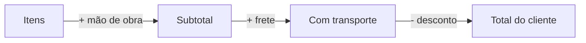

# Valores: mão de obra, frete e descontos

Depois de escolher o cliente, os itens e as datas, chega a hora de fechar o **preço**. No bloco de **Valores** do orçamento o LocFlow soma tudo e mostra o total que o cliente vai ver — somando o que custam os itens, acrescentando a **mão de obra** e o **frete**, e subtraindo o **desconto**.


**Valor não é cobrança.** Esta página é sobre como o **preço** se forma. O que o cliente efetivamente paga — em quantas parcelas, por qual meio, com qual vencimento — é a **fatura**, e isso é assunto da [Cobrança](../cobranca/faturas-e-parcelas.md). Aqui montamos só o valor.


## Como o preço se forma {#como-o-preco-se-forma}

O total é montado em quatro camadas, sempre nesta ordem:

```mermaid
flowchart LR
    A[Itens] -->|+ mão de obra| B[Subtotal]
    B -->|+ frete| C[Com transporte]
    C -->|- desconto| D[Total do cliente]
```

Você não precisa preencher tudo: mão de obra, frete e desconto são **opcionais**. Um orçamento de balcão pode ser só itens; um de evento pode ter as quatro camadas.

## Itens: a base de tudo {#itens-a-base-de-tudo}

O ponto de partida é a soma dos **bens móveis** do orçamento — produtos e kits, pela quantidade e pelo valor de cada um. Esse subtotal de itens é a **base** sobre a qual a mão de obra é calculada (quando você usa porcentagem). Como adicionar e precificar itens é assunto de [Criando um orçamento](criando-um-orcamento.md).

## Mão de obra {#mao-de-obra}

A **mão de obra** é um acréscimo opcional para cobrar o trabalho que vai além dos itens em si: montagem, instalação, operação, desmontagem. Em alguns negócios ela aparece como "taxa de serviço" — é a mesma ideia.

Funciona com uma chave que você liga e dois modos:

| Modo | Como informar | Exemplo |
| --- | --- | --- |
| **R$ (valor fixo)** | Um valor em reais, direto | + R$ 300,00 |
| **% (porcentagem)** | Uma porcentagem sobre o **total dos itens** | 10% de R$ 2.000 = + R$ 200,00 |

Enquanto você digita, o LocFlow mostra um preview com o sinal de **+** e o quanto isso adiciona ao orçamento — assim você confere o efeito na hora.


A mão de obra incide **só sobre os itens** — não sobre o frete. Faz sentido: ela paga o trabalho com os bens móveis, não o transporte.


## Frete {#frete}

O **frete** é o valor do transporte. No LocFlow ele não é um número solto: ele nasce dos **movimentos** da operação — a **entrega** (levar até o cliente) e, na locação, a **retirada** (buscar de volta). Cada movimento tem a sua origem (o galpão) e o seu destino, e o frete soma o que custa percorrer esses caminhos.

### Cobrar frete {#cobrar-frete}

Existe uma chave **"Cobrar frete"**. Quando ela está ligada, abre o painel para informar ou calcular o valor. Quando você a desliga, o orçamento simplesmente não inclui frete — e o LocFlow deixa isso explícito:


*"Este orçamento não inclui cobrança de frete. Reative para informar ou calcular um valor."* {#frete-desativado}

(É a mensagem que o app mostra com o frete desligado — útil quando você combina a entrega "por conta do cliente" ou quando o transporte já está embutido no preço dos itens.)


### Viagens por movimento {#viagens-por-movimento}

Cada movimento pode precisar de mais de uma **viagem** — idas do veículo para dar conta da carga. Uma festa grande pode exigir 2 ou 3 viagens de entrega; a retirada, outras tantas.

Você define as viagens **distribuindo a carga**: em *Opções avançadas* do painel de frete, o botão **"Distribuir carga em viagens"**. Sem distribuir, o LocFlow considera **1 viagem por movimento**. O número de viagens **alimenta o frete** (mais idas, mais custo) e, depois que o pedido é ganho, **o planejamento do roteiro**.


**O LocFlow só pede o que a operação tem.** Se o cliente vai **retirar no galpão**, não existe movimento de entrega. Se, na locação, ele vai **devolver no galpão**, não há retirada com deslocamento. Se ele faz tudo no galpão, o aviso é direto: *"O cliente vai retirar e devolver no galpão, então não há frete a calcular."*


### Distribuir a carga: automático ou manual {#distribuir-carga}

Ao tocar em **"Distribuir carga em viagens"**, abre a folha **Distribuir em viagens** — onde você fatia a carga do orçamento. São **dois modos**, e você escolhe o que combina com o seu jeito de trabalhar:

| Modo | Quem monta as viagens | Quando usar |
| --- | --- | --- |
| **Automático** | Você escolhe **um veículo** e o LocFlow **propõe a divisão** — quantas viagens cabem, com que carga em cada uma. Ele ainda sugere a **melhor distribuição** (a que rende menos viagens), pronta para aplicar num toque. | Quando quer rapidez e confia no cálculo por capacidade do veículo. |
| **Manual** | **Você monta** cada viagem à mão: distribui a quantidade de cada item entre as viagens e adiciona quantas precisar. Um marcador mostra quantos itens ainda faltam alocar até *"Toda a carga distribuída"*. | Quando quer controle fino — separar itens frágeis, respeitar uma ordem, montar as viagens do seu jeito. |


**Cada viagem pode usar a ficha de um fornecedor diferente.** Dentro da distribuição, você escolhe o **veículo de cada viagem** — e ele pode ser da sua frota **ou de um fornecedor de frete**. Ao apontar a ficha de um fornecedor, o frete **daquela viagem** passa a usar a **precificação desse fornecedor**, não a sua. É assim que uma mesma entrega combina, por exemplo, a sua frota numa viagem e uma transportadora parceira na outra — cada porção cobrada por quem a leva. Veja como os fornecedores entram em [Fornecedores de frete](../parcerias/fornecedores-de-frete.md).


**Elegibilidade: sem motor de frete, o veículo fica bloqueado.** Um fornecedor só cota transporte quando tem **motor de frete ativo**. Na distribuição, a ficha de um fornecedor **sem motor** aparece com um **cadeado** e a marca *"sem motor de frete"* — e **não pode ser escolhida**, porque a viagem sairia sem preço. A parte da carga que ficar sem veículo elegível é cobrada pelo **valor manual** do frete. Para destravar, configure o motor daquele fornecedor — veja [Motor de frete por detentor](../configuracoes/motor-de-frete-detentor.md).

### Frete automático e ajuste manual {#frete-automatico-x-manual}

Com a cobrança de frete ligada e o **Motor de Frete** configurado, o LocFlow calcula o valor a partir dos endereços e das suas regras. Antes de liberar o botão **Calcular frete**, ele mostra o card *"Antes de calcular, preencha"* com um **checklist** do que falta — e o checklist é **por movimento**, não um "destino" genérico. Assim você bate o olho e sabe exatamente onde clicar:

| Item do checklist | O que significa |
| --- | --- |
| **Local de entrega** | Falta o endereço de destino da **entrega**. |
| **Local de retirada** | Falta o endereço da **retirada** (aparece só na locação, quando há retirada com deslocamento). |
| **Galpão de saída (entrega)** / **(retirada)** | Falta escolher de qual **galpão** a equipe sai. O rótulo separa entrega e retirada quando a operação tem os dois; se só um, aparece **Galpão de saída**. |

Dependendo das suas regras, o motor pode ainda pedir **data** e **horário**. Preencheu tudo, o card fica verde (*"Tudo pronto para calcular o frete."*) e o botão libera.

Calculou, você pode **ajustar o valor à mão** a qualquer momento pelo toggle **"Ajustar valor manualmente"** — útil quando prefere um valor fechado. E, quando há mais de uma rota possível, o painel oferece **cenários de rota** alternativos em *Opções avançadas* (veja adiante).


**O cálculo de frete consome créditos** — ele consulta o mapa para medir a rota real. O app sinaliza isso no botão. E atenção: se você **mudar o endereço de destino** depois de calcular, o LocFlow avisa *"Cálculo desatualizado — recalcule o frete antes de salvar"* — porque o valor antigo era de outro caminho.


Quando você **não tem** um motor de frete ativo, o painel já abre direto no campo manual — não há o que calcular automaticamente. Se um cálculo falhar (um endereço que o mapa não localiza, um galpão sem coordenadas), o LocFlow explica o motivo e oferece **"Informar manualmente"** para você não travar a proposta.

> A montagem das regras de frete (preço por quilômetro, por viagem, por peso/volume, faixas, veículos) vive no **Motor de Frete**, nas Configurações. Veja [Motores operacionais](../configuracoes/motores-operacionais.md). Aqui no orçamento você só **usa** o resultado.

### Cenários de rota {#cenarios-de-rota}

Em *Opções avançadas*, **depois de calcular** o frete, o LocFlow mostra os **cenários de rota** — variações do caminho, cada uma com o seu preço, apresentadas como **chips** que você toca para escolher:

| Cenário | O que muda |
| --- | --- |
| **Padrão** | A melhor rota que o mapa encontrou, com o valor cheio. |
| **Sem pedágio** | Evita praças de pedágio. Costuma ser mais longo — o preço acompanha a distância. |
| **Sem balsa** | Evita travessias de balsa. |
| **Sem rodovia** | Evita rodovias (fica por vias locais). |

Os cenários alternativos só aparecem quando existem de fato para aquela rota. O valor de cada um é **proporcional à distância** do cenário em relação à rota padrão — um caminho mais longo por evitar o pedágio sai mais caro no transporte, e você decide se compensa. Tocar num chip **troca o valor do frete** para o daquele cenário; o **Padrão** continua ali para voltar quando quiser.

### A composição do frete: uma ou várias transportadoras {#composicao-do-frete}

Depois de calcular, o frete aparece como uma **Composição do frete**: uma lista das transportadoras disponíveis — a **sua própria organização** e cada **fornecedor de frete** cadastrado —, ordenadas por preço, com o selo **"Menor preço"** na mais barata. Aí você decide, **na própria lista**:

* **Marque uma** transportadora → ela faz o **frete inteiro**.
* **Marque várias** → a carga **divide as viagens** entre elas, e cada uma é cobrada pela **sua** precificação.

Marcar é livre. Quando você marca **duas ou mais**, aparece o botão **"Dividir a carga"**: ao tocá-lo, o LocFlow monta a divisão (round-robin das viagens entre as marcadas, cada uma com o veículo equivalente) e **recalcula** o valor por porção. Como o cálculo **consome créditos**, essa divisão é uma ação sua — não recalcula a cada clique. Depois de dividida, você pode voltar à lista (**"Escolher outras transportadoras"**) sem gastar crédito e ajustar quem entra.


**Precificação por detentor.** Cada fornecedor tem o **seu** Motor de Frete: as viagens atribuídas a ele são cobradas pelas regras dele, não pelas suas. O **total** do frete é a **soma das porções**. Se qualquer fornecedor da divisão **pede confirmação**, o orçamento **nasce pendente** aguardando a resposta — o app avisa antes de você enviar.


### Estratégia de seleção {#estrategia-de-selecao}

Ao lado do título da composição há um seletor de **estratégia** — a recomendação inicial de qual transportadora usar. Ele já vem preenchido pela **regra da sua organização** e você pode trocar **só para este orçamento**:

* **Menor preço** — recomenda a mais barata que não exige aprovação.
* **Aproveitamento** — prioriza a **sua própria frota**.
* **Manual** — você escolhe na mão.

### Quanto você repassa ao cliente (margem no frete) {#repasse-e-margem}

O que um **fornecedor cobra** de você **não** precisa ser o que o cliente paga. Em cada fornecedor incluído, o LocFlow separa as duas coisas:

* **Fornecedor cobra** — o custo, vindo do Motor de Frete dele (fixo).
* **Repassar ao cliente** — um campo **editável**. Começa igual ao custo, mas você pode repassar mais (para ter **lucro**) ou menos (para **absorver** e fechar com o cliente).

Ao lado, o app mostra a **margem viva**: **+R$** em verde quando você lucra, **−R$** em âmbar quando absorve. O total do frete ao cliente é a soma dos repasses, e a margem fica **registrada** para os seus relatórios. A **sua própria organização não tem repasse** — o preço do motor dela já é o valor.


O campo de repasse aparece em **cada fornecedor** da composição — tanto quando você marca **um** fornecedor sozinho quanto em **cada** fornecedor de uma divisão entre várias transportadoras.



**Dois "repasses" diferentes, cuidado para não confundir.** O repasse **desta seção** é quanto você cobra do cliente pelo transporte de um **fornecedor de frete** — ele só cota a viagem. Já o **repasse ao parceiro logístico** da [Rede de Parceiros](../parcerias/visao-geral.md) é outra coisa: lá o parceiro **executa a operação inteira** (entrega, cuida do material, retira) e recebe pelos preços combinados num acordo. Veja [O dinheiro da parceria](../parcerias/dinheiro-da-parceria.md#a-conta).


### A decisão fica salva {#frete-salvo}

Tudo o que você definiu — **quais transportadoras**, quantas viagens, os veículos, o que cada fornecedor cobra e o que você repassa — é **guardado no orçamento**. Ao **reabrir para editar**, o painel reconstrói essa **"Frete definido"** exatamente como você deixou, sem precisar recalcular (o que gastaria crédito). Para atualizar os valores ou trocar a transportadora, é só **Recalcular**.

## Descontos {#descontos}

O **desconto** é um abatimento sobre o orçamento. Vem **desligado por padrão** — você liga quando quer dar um preço melhor. Como na mão de obra, há dois modos:

| Modo | Como informar | Incide sobre |
| --- | --- | --- |
| **R$ (valor fixo)** | Um valor em reais | O total (itens + frete + mão de obra) |
| **% (porcentagem)** | Uma porcentagem de 0 a 100 | O total (itens + frete + mão de obra) |

O preview mostra o sinal de **−** e o quanto sai do total. O desconto nunca derruba o orçamento abaixo de zero, e o LocFlow não deixa você dar um desconto em reais maior que o próprio total.

### Desconto proporcional aos kits {#desconto-proporcional-aos-kits}

Esta é uma ajuda inteligente do LocFlow. Quando os **produtos avulsos** que você colocou no orçamento, juntos, formam um ou mais **kits** do seu catálogo, o sistema percebe e oferece aplicar a **economia do kit** como desconto — recompensando o cliente que leva o combo, sem você ter que fazer a conta.

Aparece como uma chave que só surge quando há kit formável. Os textos de ajuda do app dizem tudo:


Antes de ligar: *"Identificamos kits formáveis com os produtos avulsos selecionados. Ative para aplicar a economia como desconto."*

Depois de ligar: *"X kit(s) formado(s) com os produtos avulsos. Desconto aplicado: R$ Y,YY."*


Quando esse desconto proporcional está **ligado**, ele assume o controle do campo de desconto (e adiciona uma observação automática explicando o abatimento). Para mexer no desconto à mão de novo, é só desligar a chave — o app avisa: *"Para alterar o desconto, desative o desconto proporcional aos kits."*


**Por que isso te faz vender mais:** o cliente que ia levar peças soltas vê que o **combo sai mais em conta** — e tende a fechar o conjunto inteiro. Você aumenta o ticket sem parecer que está empurrando; o sistema só mostra a economia que já existe.


## Por porte {#por-porte}

| Se você é… | O caminho mais provável |
| --- | --- |
| **Autônomo / MEI / micro** | Itens + frete manual num valor fechado. Sem mão de obra, sem cálculo de rota. Simples e rápido. |
| **Médio** | Frete automático com o Motor de Frete, mão de obra em % para serviços, e o desconto proporcional aos kits trabalhando a seu favor. |
| **Grande / muitas filiais** | Tudo acima, mais cenários de rota, viagens por movimento para cargas grandes e regras de frete por veículo/faixa — controle fino sobre cada real. |

A ideia é a mesma para todos: **abstrair** para quem quer simplicidade, **dar números e flexibilidade** para quem quer controle.

## Para quem quer os números {#para-quem-quer-os-numeros}

Se você gosta de saber exatamente como o total é montado, é assim (o LocFlow arredonda cada parcela para centavos):

1. **Total dos itens** = soma de (quantidade × valor) de cada produto e kit.
2. **Mão de obra** = um valor fixo, **ou** uma % aplicada **sobre o total dos itens**.
3. **Subtotal** = total dos itens **+** mão de obra **+** frete.
4. **Desconto** = um valor fixo, **ou** uma % aplicada **sobre o subtotal** (itens + frete + mão de obra).
5. **Total do cliente** = subtotal **−** desconto, nunca menor que zero.

Pontos finos que valem lembrar:

- A **mão de obra em %** olha só para os itens; o **desconto em %** olha para tudo (itens + frete + mão de obra).
- **Se você repassar este pedido a um parceiro**, é este **total do cliente** — o número que sai da conta acima, já com desconto — que vira a base dos 8% da taxa de plataforma e da conta da sua margem. Um desconto grande no fim reduz a sua margem, não o repasse combinado com o parceiro. Veja [O dinheiro da parceria](../parcerias/dinheiro-da-parceria.md#taxa-de-plataforma).
- O **frete automático** é medido pela rota **real** entre o galpão e o destino (não pela linha reta nem por faixa de CEP), e segue as regras do seu Motor de Frete. Cada movimento entra com a sua quantidade de viagens.
- O desconto **proporcional aos kits** calcula a diferença entre comprar/alugar as peças soltas e o kit equivalente, e usa essa diferença como o valor do desconto.

## Situações reais {#situacoes-reais}

- **Evento com montagem:** itens + mão de obra de 10% (a montagem) + frete automático calculado pelos endereços. O cliente vê um total único e claro.
- **Carga grande:** 80 cadeiras não cabem numa viagem. Você coloca **2 viagens** na entrega — o frete dobra a perna do transporte e o roteiro já nasce sabendo das duas idas.
- **Cliente busca no galpão:** retirada no galpão ligada. O frete some sozinho e o app explica que não há transporte a cobrar.
- **Combo escondido:** o cliente pediu mesa, 4 cadeiras e toalha avulsos — que formam o seu "Kit Jantar". O LocFlow sugere o desconto proporcional e você fecha com a economia aplicada.

## Próximo passo {#proximo-passo}

- Montou o valor? Volte para [Criando um orçamento](criando-um-orcamento.md) e siga para o envio.
- Quer que o frete calcule sozinho? Configure o [Motor de Frete](../configuracoes/motores-operacionais.md).
- Vai transformar o valor em cobrança? Veja [Faturas e parcelas](../cobranca/faturas-e-parcelas.md).
- Dúvida em algum termo? Consulte o [glossário](../primeiros-passos/glossario.md).
