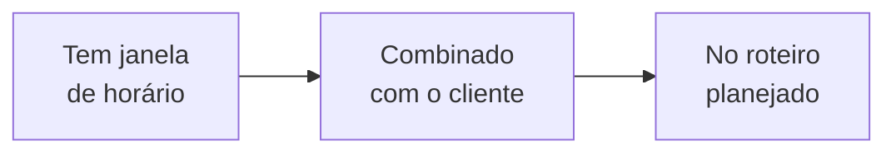

# Calendário logístico

O **calendário logístico** é a sua agenda da operação. Ele reúne, num só lugar, **quando** cada entrega e cada retirada acontece — e, pela **cor**, mostra **o quanto aquele movimento já está definido**: ainda é um chute de data, já tem horário, já foi combinado com o cliente ou já está no roteiro.

É a leitura que responde "**o que eu preciso organizar para os próximos dias?**" — sem abrir pedido por pedido.


Este calendário é **só de logística** — entrega e retirada de [itens](../primeiros-passos/glossario.md). Ele **não** mostra a chance de fechar um orçamento (isso vive no [funil de vendas](../orcamentos/acompanhando-e-fechando.md)). Aqui tudo já é movimento de material a organizar.



**Por que isso te faz faturar mais:** quando você enxerga, num piscar de olhos, o que ainda está "no chute" e o que já está fechado, você ataca primeiro o que trava o dia — combina a janela que falta, encaixa no roteiro a entrega que está em âmbar. Menos surpresa de véspera, menos viagem remarcada.


## O que o calendário mostra 

O calendário é sobre **roteiros**, não sobre reservas. Como diz a ajuda dentro do app:

> Aqui você organiza a **logística** — não vendas. Cada **roteiro** é um conjunto de **rotas** (os trechos: entrega ou retirada).

Cada dia traz os **fatos** logísticos daquele dia: uma entrega, uma retirada, ou o **evento** do cliente (a data que o aluguel atende). Tocar num fato abre os **detalhes** — e de lá você abre o **orçamento**, o **roteiro planejado** ou o **histórico de execução** no módulo de logística.


Os dados deste calendário são **reais**: vêm direto dos seus orçamentos ganhos e roteiros. Não há números de exemplo aqui — o que você vê é a sua operação.


## Como ler a cor: o nível de precisão (1 a 5) 

A **cor** é a leitura principal. Ela resume **o quanto o movimento já está definido**, numa escala de **5 níveis**. Quanto mais avançado o nível, mais "fechado" está aquele movimento.

A ajuda do app explica a cor por **três perguntas**, nesta ordem:

> A **cor** resume **o quanto o movimento já está definido**, por **três perguntas** que acontecem NESTA ordem:
>
> 1. **Âncora — o "quando":** quão preciso é o horário — só a **data do evento**? Já tem o **dia**? Já tem a **janela de horário**?
> 2. **Combinado — o cliente:** você já **combinou a janela com o cliente** e ele confirmou? Isso vem **antes** de planejar a rota.
> 3. **Roteiro — a operação:** a operação já entrou num **roteiro planejado** (dia, veículo, equipe)? Só dá para planejar o que **já foi combinado**.

A partir dessas três perguntas, cada movimento recebe um nível:

| Nível | Cor | O que significa | Sua ação |
| :---: | --- | --- | --- |
| **1** | Cinza tracejado | Sem data marcada | Ainda nada a fazer aqui |
| **2** | Azul | Data prevista, sem combinar | Definir o horário |
| **3** | Cinza-azulado | Horário previsto, sem combinar | **Combinar a janela com o cliente** |
| **4** | **Âmbar** | Combinado com o cliente, mas ainda fora do roteiro | **Encaixar no roteiro (roteirizar)** |
| **5** | **Verde** | No roteiro planejado | Pronto — é só executar |
| — | Cinza | Concluído (já aconteceu) | Histórico |


O **âmbar (nível 4)** é o seu sinal de **ação operacional**. Como diz o app: *o cliente já confirmou a janela, falta encaixar no roteiro planejado (roteirizar). Roteirizado, vira verde (5).* Se você abrir o calendário e ver âmbar nos próximos dias, é ali que vale mexer.


### A ordem é fixa (não dá para pular etapa)

Os três passos **dependem um do outro**, sempre nesta direção:

> Planejar exige ter **combinado**, que exige ter uma **janela**.

Por isso **"no roteiro sem combinar" não existe**: se um movimento está no roteiro planejado (verde), o cliente necessariamente já confirmou a janela. O nível só sobe — nunca pula um degrau.


**O nível é por movimento.** Uma entrega pode estar combinada (âmbar) enquanto a retirada do mesmo pedido ainda é só uma data prevista (azul). Como cada roteiro tem suas pontas, a cor da **linha do roteiro** acompanha a ponta **menos definida** — assim você nunca acha que está tudo pronto quando ainda falta algo.


## Os três tipos de roteiro 

O calendário separa os roteiros em três tipos — você pode mostrar ou ocultar cada um pelos [filtros](#filtros):

| Tipo | O que é |
| --- | --- |
| **Estimado** | Um orçamento ganho que **ainda não entrou** num roteiro planejado — os horários são uma **estimativa** (níveis 1 a 4). |
| **Planejado** | Junta **vários orçamentos** numa mesma saída e define **quando** cada entrega e retirada acontece (nível 5). |
| **Executado** | O que **já aconteceu** — em cinza, o histórico. |

Veja [Planejando o roteiro](../logistica/planejando-o-roteiro.md) para entender como um estimado vira planejado.


**O executado aparece na hora em que de fato aconteceu.** Quando um movimento é concluído — seja na [execução em campo](../logistica/execucao-em-campo.md), na [execução em lote](../logistica/execucao-em-lote.md) (retroativa) ou no balcão (o cliente retira/devolve no galpão) —, o calendário deixa de mostrá-lo no horário *planejado* e passa a mostrá-lo no **momento real** do registro, em cinza. Assim a sua agenda reflete a operação **como ela realmente correu**, não como estava prevista.



**Mesmo sem janela combinada, o concluído aparece.** Um movimento que foi executado mas nunca teve um horário combinado com o cliente ainda assim entra no calendário — ancorado na **data real** em que foi concluído. Antes, um movimento assim podia não aparecer; agora o histórico fica completo.


## Os ícones: quem é responsável 

Cada fato traz um **ícone** que diz **quem é responsável** pelo transporte. O **sentido** (entrega no começo, retirada no fim) você lê pela ordem na linha do tempo — então o ícone foca em **quem leva o material**. São os **mesmos ícones** do frete e do galpão no resto do sistema:

| Ícone | Significa |
| --- | --- |
| **Caminhão** | **Nossa equipe transporta** — você entrega ou retira (o mesmo caminhão do frete). |
| **Galpão** | **Cliente no galpão** — o cliente vem retirar ou devolver no seu [galpão](../primeiros-passos/glossario.md). |
| **Calendário** | **Evento** — a data do cliente, que o aluguel atende. |

A cronologia de um aluguel é sempre **entrega → evento → retirada**; uma [venda](../conceitos/locacao-e-venda.md) tem **só a entrega** (o item sai em definitivo, sem retirada).

## Adaptado à sua forma de operação 

O calendário **fala a língua da sua operação**. Conforme a **Forma de operação** que você definiu no [Motor de Logística](../configuracoes/motores-operacionais.md), ele destaca só o que faz sentido:

* **Só no balcão** (o cliente retira e devolve no galpão): não há rota a planejar, então o calendário deixa de falar em "roteiros" e passa a falar em **atendimentos no balcão** — a estimativa de **retirada** e de **devolução**, em qual galpão e a que horas. A legenda esconde o **caminhão** (não há transporte da equipe) e o **balcão** vira o protagonista.
* **Só pela equipe** (entrega e retirada na rota): a legenda esconde o **galpão** (o cliente não vem até você); o foco fica nos roteiros.
* **Mista**: tudo aparece — caminhão e balcão —, porque você usa as duas formas.


**Quer ver tudo mesmo assim?** Na **legenda** do calendário há um **olho** ("Ver toda a operação"). Toque nele para revelar a operação **completa** — caminhão e balcão juntos —, como se naquele momento você fosse uma operação mista. É a [filosofia do LocFlow](../primeiros-passos/filosofia.md) na prática: a tela abstrai o que você não usa, mas a operação inteira fica **a um toque**.


Em todos os casos, os **dados não mudam** — muda só o **destaque** e o **vocabulário**. Um atendimento de balcão sempre traz o galpão e o horário; um movimento de rota sempre traz quem é responsável pelo transporte.

## A janela: combinada × estimada 

Além da cor (o nível) e do ícone (o responsável), o **traço** de cada janela de horário diz se aquele intervalo já foi **fechado com o cliente**:

* **Linha cheia = combinada com o cliente.** Ex.: o cliente confirmou a entrega entre 9h e 11h — a janela está fechada.
* **Linha pontilhada = estimada.** A janela ainda **não foi alinhada com o cliente** — é a sua previsão e **pode mudar**.


Combinar a janela é o passo que **leva o movimento ao nível 4 (âmbar)**. Por isso, no calendário, *pontilhado* costuma andar junto de *azul/cinza-azulado*, e *cheio* junto de *âmbar/verde*.


## O fuso horário 

Os horários aparecem no **fuso da operação** (indicado no topo). Quando um roteiro foi **combinado em outro fuso** — por exemplo, um cliente em outra região do país —, um **selo** indica o fuso original, para você não se confundir na hora de ligar para confirmar.

## Mês, dia e tela cheia 

O calendário tem duas visões, alternadas no topo:

* **Mês** — a visão geral: cada roteiro é uma **linha** dentro do mês, do começo ao fim da alocação. Quando duas linhas se sobrepõem no tempo, aparecem **uma abaixo da outra**.
* **Dia** — o detalhe de um dia: os fatos em **ordem cronológica**, com a janela de horário de cada um e o traço (combinado × estimado). É daqui que você abre o roteiro ou o orçamento.

Há ainda o botão de **tela cheia**, que abre o calendário numa tela dedicada (estilo agenda) — útil em telas grandes para enxergar a semana inteira de uma vez.


**Em telas estreitas (celular), cada dia vira um resumo.** Em vez das linhas com horário, cada dia mostra só os **ícones dos fatos** ("Ícone › Ícone › Ícone") — uma visão geral de *o que acontece e quem é responsável*. Para os horários e a janela exata, **toque o dia** e veja a visão detalhada.


## Filtros 

O botão de **filtros** abre dois recortes — e mostra ao lado só o que está aplicado:

* **Tipos de roteiro** — mostrar ou ocultar estimado, planejado e executado.
* **Galpões** — quando você tem mais de um, filtrar por galpão de origem.

Há também o botão de **legenda** (mostrar/ocultar), que exibe a escala de cores, os ícones e os traços diretamente sobre o calendário.

## Como planejar o dia e a semana 

Uma rotina simples para usar o calendário todo dia:

1. **Abra na visão Mês** e olhe os próximos 7 dias.
2. **Procure o âmbar (nível 4):** são os movimentos já combinados que ainda **não estão no roteiro**. Encaixe-os num [roteiro planejado](../logistica/planejando-o-roteiro.md) — eles viram verde.
3. **Olhe os pontilhados (estimados):** janelas que você ainda não confirmou com o cliente. Confirme as dos próximos dias.
4. **Confie no verde:** está no roteiro, é só executar em campo.

## Por porte

| Porte | Como o calendário te serve |
| --- | --- |
| **Começando** | Poucos roteiros, quase tudo estimado. O calendário já te avisa o que falta combinar antes de cada entrega. |
| **Crescendo** | Vários roteiros por semana se sobrepondo. As linhas empilhadas e o filtro por galpão evitam que algo passe batido. |
| **Estruturado** | Operação cheia, vários galpões e fusos. A tela cheia e os filtros viram a sua mesa de controle do dia. |

## Para quem quer os números 


Bloco opcional. Você não precisa dele para usar o calendário — ele explica **como o nível (1 a 5) é calculado**.


O nível de cada movimento vem do seu **estado**, a partir de **três dimensões**:

* **Âncora** — quão preciso é o "quando": sem data → só o **dia** → a **janela de horário**.
* **Combinado** — a janela já foi **alinhada e confirmada** com o cliente.
* **Roteiro** — a operação já entrou num **roteiro planejado**.

A regra exata, espelhando o que o sistema faz, é:

| Nível | Condição |
| :---: | --- |
| **5** | Está **no roteiro planejado** (ou já executado). |
| **4** | **Combinado** com o cliente, mas ainda **não roteirizado**. |
| **3** | Tem **janela de horário**, mas **não combinada**. |
| **2** | Tem **só o dia** previsto, sem horário e sem combinar. |
| **1** | **Sem data marcada.** |
| Cinza | **Concluído** (já aconteceu) — sobrepõe qualquer nível. |

A leitura formal é uma **dependência fixa**:

$$\text{planejado} \rightarrow \text{combinado} \rightarrow \text{tem janela}$$

Ou seja: para estar no roteiro (nível 5) é preciso estar combinado; para estar combinado (nível 4) é preciso ter uma janela. Por isso **"no roteiro sem combinar" não existe** e o nível sobe um degrau de cada vez.


**Detalhe técnico:** internamente o sistema também guarda um "peso" estrutural contínuo (de 0 a 1) que mede o quão definido está o movimento, combinando as três dimensões. Mas a **cor que você vê** usa os **5 níveis discretos** acima — justamente para você distinguir cada estado de relance, sem comparar tons parecidos.


## Situações reais 

* **Entrega da semana ainda no chute:** você ganhou o pedido, mas só anotou o dia. A entrega aparece **azul (2)**. Liga para o cliente, fecha o horário das 9h às 11h → vira **âmbar (4)**.
* **Tudo combinado, faltou roteirizar:** vários âmbares nos próximos dias. É o sinal para montar o **roteiro planejado** e agrupar as entregas — todos viram **verde (5)**.
* **Cliente retira no galpão:** sem rota. O fato aparece com o **ícone de galpão**; você só confirma a janela em que ele vem buscar.
* **Locação de evento em outra cidade:** o horário foi combinado no fuso do cliente. O calendário mostra no **fuso da sua operação** e exibe o **selo** do fuso original.

## Próximo passo 

* Para transformar os **âmbares** em verde: [Planejando o roteiro](../logistica/planejando-o-roteiro.md).
* Para entender as fases por trás de cada fato: [Visão geral da logística](../logistica/visao-geral.md).
* Para a chance de **fechar** um orçamento (que **não** está aqui): [Acompanhando e fechando](../orcamentos/acompanhando-e-fechando.md).
