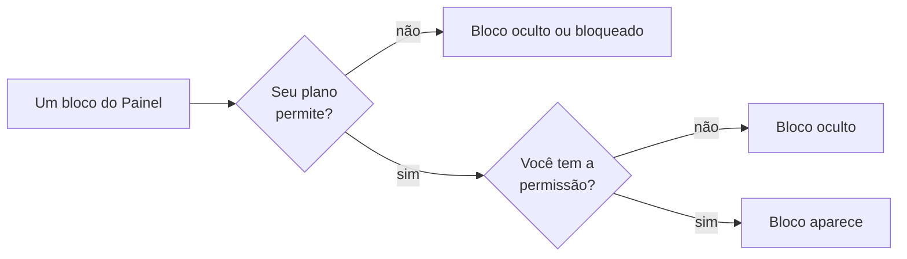

# O Painel (sua tela inicial)

O **Painel** é a primeira tela que você vê ao entrar no LocFlow — a sua **Visão geral**. Ele reúne, num lugar só, um resumo de como anda a sua operação: quanto você fechou, onde os negócios estão travando, o que precisa sair do [galpão](../primeiros-passos/glossario.md) hoje e quanto dinheiro já entrou.

O próprio cabeçalho da tela resume a ideia:

> **Visão geral** — Um resumo de como está fluindo a sua operação.


O Painel é **a mesma tela no celular e no computador**. No celular, os blocos se empilham um sob o outro; em telas largas, eles se organizam lado a lado. O menu de módulos (Orçamentos, Cobrança, Logística…) fica na aba **Menu** (celular) ou na barra lateral (computador) — não confunda com o Painel.


## O que é o Painel 

Pense no Painel como o **espelho da sua operação**: ele não é onde você faz as coisas (isso é nos módulos), e sim onde você **lê o estado do negócio de relance** para decidir o que fazer a seguir. Cada número aqui é um atalho mental para uma pergunta:

- Quanto eu fechei e quanto já recebi?
- Onde meus orçamentos estão emperrando?
- O que a equipe precisa carregar, levar ou buscar hoje?


Todos os indicadores do Painel são calculados a partir dos **seus dados reais** — orçamentos, faturas e roteiros que você cadastrou. Não há números de exemplo: um Painel vazio significa, simplesmente, que ainda não há movimento naquele recorte (e os blocos avisam isso com mensagens como *"Sem cancelamentos no período"* ou *"Nada pendente — operação em dia."*).


## Os blocos do Painel 

O Painel é montado por **cinco blocos**. Cada um responde a uma pergunta diferente e tem o seu próprio botão de **ajuda** (o ícone de informação no canto do card) que explica o que aquele número significa.

| Bloco | Pergunta que responde | Página |
| --- | --- | --- |
| **Indicadores** | Quanto fechei, quantos negócios ganhei, qual minha conversão e o que estou cancelando? | [Indicadores do painel](indicadores.md) |
| **Funil de vendas** | Onde meus negócios estão e onde eles travam? | [O funil de vendas no painel](funil-de-vendas.md) |
| **Logística** | O que precisa sair, voltar ou está pendente de informação? | [O card de Logística](card-logistica.md) |
| **Calendário logístico** | Quando cada entrega e retirada acontece? | [Calendário logístico](calendario-logistico.md) |
| **Faturamento** | Quanto contratei × quanto entrou no caixa, ao longo do tempo? | [Faturas e parcelas](../cobranca/faturas-e-parcelas.md) |

Em poucas palavras, citando a própria ajuda de cada bloco dentro do app:

- **Indicadores** — os números-chave do mês: **Faturamento** (Contratado × Recebido), **Negócios ganhos** (separados em Aluguel e Venda), **Conversão · Perda** e **Cancelamento**, cada um com o maior motivo quando faz sentido.
- **Funil de vendas** — *"mostra onde seus negócios estão e onde eles travam — do primeiro contato até fechar"*, com a etapa **gargalo** destacada. É separado por **Aluguel** e **Venda**.
- **Logística** — *"a sua lista de tarefas do galpão — o que carregar, levar, buscar e guardar"*, em três pilhas: **Precisa sair**, **Precisa voltar** e **Pendente de informação** (esta última em destaque âmbar, porque é o que alguém precisa resolver agora).
- **Calendário logístico** — *"aqui você organiza a logística — não vendas"*: quando cada entrega/retirada acontece, com cor por nível de definição do horário.
- **Faturamento** — duas linhas no tempo: **Contratado** (o que você fechou) e **Recebido** (o dinheiro que entrou no caixa), com seletores de período e agrupamento.


Cada bloco tem páginas próprias nesta seção (links acima). Esta página é a **porta de entrada**: ela apresenta o conjunto. Use a ajuda **dentro do app** (ícone de informação no card) quando quiser a explicação rápida sem sair da tela.


## O que aparece pra você 

O Painel **não mostra os mesmos blocos para todo mundo**. O que aparece depende de **dois filtros que agem juntos** — um do seu **plano**, outro das suas **permissões**. Um bloco só aparece quando passa nos dois.

### O filtro do plano 

Alguns blocos só existem em planos superiores. Quando o seu plano não inclui um recurso (por exemplo, a logística completa), o bloco correspondente pode aparecer **bloqueado** — um card com cadeado e o aviso:

> Disponível em um plano superior.

Isso é proposital: você enxerga que aquela capacidade existe e para onde pode crescer, sem que ela ocupe espaço útil enquanto não fizer parte do seu plano.

### O filtro das permissões 

Mesmo dentro do seu plano, cada bloco respeita o que o **seu acesso** permite ver (veja [Papéis, funções e competências](../conceitos/papeis-funcoes-competencias.md)):

- Quem **não pode ver orçamentos** não vê o **Funil**, o **Calendário** nem os indicadores de negócios.
- Quem **não pode ver faturas** não vê o **Faturamento** nem o indicador de faturamento.
- Quem **não pode ver roteiros** não vê o bloco de **Logística**.

Quando o seu acesso não alcança **nenhum** bloco, o Painel mostra uma mensagem honesta no lugar dos cards:

> Sem indicadores disponíveis para o seu acesso.


Por isso é normal que **duas pessoas da mesma empresa vejam Painéis diferentes**. Um vendedor pode ver Funil e Indicadores; alguém da operação pode ver só a Logística e o Calendário. Cada um vê o que é do seu trabalho.


## Personalizar o Painel 

Dentre os blocos que você **tem direito de ver**, você ainda escolhe **quais quer enxergar**. No canto do cabeçalho há o botão **Personalizar**. Ao abrir, o LocFlow mostra:

> **Personalizar painel** — Escolha quais cards aparecem na sua visão geral.

Você liga e desliga cada bloco com um toque. Há também o atalho **Mostrar todos** para reativar tudo de uma vez. Se você ocultar todos, o Painel avisa *"Todos os cards estão ocultos."* e oferece um botão para reabrir a personalização.


A sua escolha **fica guardada no aparelho** e é **só sua** — por organização e por usuário. Personalizar o seu Painel não muda o de ninguém, e cada dispositivo guarda a própria preferência.


## A faixa de status da assinatura 

No **rodapé** do LocFlow pode aparecer uma **faixa fina e discreta** com o status da sua assinatura. Ela **não fica no topo do Painel** justamente para não cortar o visual da tela inicial — vive no rodapé, presente em todo o painel de uso.

A faixa só aparece para quem **pode gerir o contrato** da empresa, e a aparência escala com a urgência:

| Situação | Como aparece | O que faz |
| --- | --- | --- |
| **Período de teste** | Aviso suave (cor da marca), dispensável | Convida a assinar antes do fim do teste |
| **Pagamento pendente** | Âmbar, fixo | Leva a atualizar a forma de pagamento |
| **Faturas em atraso** | Vermelho, fixo | Leva a regularizar para não perder o acesso |
| **Contrato encerrado** | Convite para reativar | Reativa de onde você parou |

Só o aviso de teste pode ser **dispensado**; os avisos de pagamento ficam até a situação ser resolvida. Para os detalhes do que cada estado significa e como resolver, veja [Minha assinatura e créditos](../configuracoes/assinatura-e-creditos.md).


No **iPhone/iPad** essa faixa não é exibida (a assinatura é gerida fora do app). Você acompanha e ajusta a assinatura pelo **computador** ou pela web.


## Por porte: o Painel cresce com você 

O Painel é o mesmo para todos, mas **rende diferente conforme você cresce**:

- **Quem está começando** vê os números essenciais sem configurar nada — fechamento, conversão, o que sair hoje. Blocos de planos superiores aparecem como convite, não como ruído.
- **Operação em crescimento** começa a usar o **Funil** para achar o gargalo e a **Logística** para não deixar pedido parado, ocultando o que não acompanha no dia a dia.
- **Operação grande** se beneficia do duplo filtro (plano + permissões): cada papel vê só o seu recorte, e cada pessoa personaliza o próprio Painel — o gestor vê faturamento e funil, a operação vê galpão e calendário.

## Situações reais 

**"Entrei e não aparece quase nada."**
Provavelmente o seu acesso alcança poucos blocos, ou você ocultou alguns. Toque em **Personalizar** para conferir o que está ligado. Se aparecer *"Sem indicadores disponíveis para o seu acesso"*, fale com quem administra os [acessos](../configuracoes/colaboradores-e-acessos.md) da sua empresa.

**"Vejo um card com cadeado dizendo 'Disponível em um plano superior'."**
Aquele recurso existe, mas não está no seu plano. Veja [Minha assinatura e créditos](../configuracoes/assinatura-e-creditos.md) para entender o que cada plano inclui.

**"Quero ver só a logística do dia, sem os gráficos de venda."**
Abra **Personalizar** e desligue Indicadores, Funil e Faturamento. Ficam só Logística e Calendário — e a escolha continua salva no seu aparelho na próxima vez que você entrar.

**"Apareceu uma faixa vermelha no rodapé."**
É o status da assinatura: há faturas em atraso. Toque em **Resolver** e veja [Minha assinatura e créditos](../configuracoes/assinatura-e-creditos.md).

## Próximo passo 

- Entenda o bloco que mais te interessa: [Acompanhando e fechando](../orcamentos/acompanhando-e-fechando.md) (o Funil), [Visão geral da logística](../logistica/visao-geral.md) e [Acompanhando seus roteiros](../logistica/acompanhando-roteiros.md) (o Calendário).
- Veja como o caixa entra em [Faturas e parcelas](../cobranca/faturas-e-parcelas.md).
- Ajuste quem vê o quê em [Colaboradores e acessos](../configuracoes/colaboradores-e-acessos.md).
- Confira o que cada plano inclui em [Minha assinatura e créditos](../configuracoes/assinatura-e-creditos.md).
