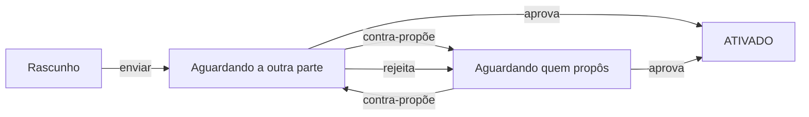

# Acordos de parceria

**Onde fica:** no espaço **Rede de Parceiros** (alterne o espaço pelo menu lateral ou pela aba Menu) → **Acordos**.

O **acordo** é o contrato da parceria: o documento vivo, dentro do LocFlow, que registra **quem faz o quê e por quanto**. De um lado, o **vendedor** — dono do cliente, do orçamento e da fatura. Do outro, o **parceiro logístico** — quem executa a operação. O acordo diz quais itens entram, quanto o parceiro recebe por cada um, **quando e quanto** desse repasse é pago, como fica o frete e se ele pode receber o cliente na porta. Vale para **locação** e para **venda** de bens móveis.

Sem acordo **ativado**, não há repasse: é ele que dá a régua para todo pedido que você [repassar ao parceiro](repassando-um-pedido.md). Com ele, o combinado deixa de morar em conversa de WhatsApp e passa a ser aplicado **automaticamente**, pedido a pedido.


**As duas formas de parceria.** O acordo funciona igual nas duas: na parceria **externa**, o parceiro é um convidado seu, que trabalha dentro da sua conta com um papel restrito (veja [Parceiro Logístico Externo](parceiro-logistico-externo.md)); na parceria **interna**, as duas partes são organizações LocFlow de verdade, conectadas por um vínculo (veja [Parceria interna](#parceria-interna), adiante).


## Como um acordo nasce {#como-nasce}

Um acordo pode começar dos dois lados: **você cria** e envia ao parceiro, ou **o parceiro propõe** a você. A partir daí ele entra num vai e volta de aprovação — um **ping-pong** — até as duas partes concordarem com os mesmos termos:



O mecanismo é simples de lembrar: **quem edita já concorda**. Se o parceiro devolve uma contra-proposta mexendo num preço, ele está dizendo "assim eu topo" — e a bola volta para **você** aprovar, rejeitar ou contra-propor de novo. Rejeitar não mata o acordo: devolve para a outra parte revisar. Quando um lado **aprova** a proposta que está na mesa, o acordo fica **ATIVADO** e passa a valer para os pedidos repassados dali em diante.


**Editar qualquer termo reabre a aprovação.** Mesmo num acordo já ativado, mudar itens, preços, modelo de pagamento ou frete cria uma **nova proposta** — e a outra parte precisa aprovar de novo antes de a mudança valer. Nada muda por baixo dos panos sem o "ok" dos dois.



**Cada um mexe no próprio lado.** Numa contraproposta, o parceiro logístico ajusta **o que ele recebe**; o preço ao cliente é seu e ele não altera. Se a proposta dele tentar mexer no seu bloco, o app **recusa e diz o motivo** — em vez de aceitar e descartar a alteração em silêncio, que era o comportamento antigo e a origem de discussões do tipo "mas eu mudei e não mudou".


## Os termos, um a um {#os-termos}

### Itens acordados {#itens-acordados}

O coração do acordo é a lista de **itens acordados**: quais produtos e kits do catálogo entram na parceria e por **dois preços** cada um — o **seu** (o preço ao cliente) e o **do parceiro** (o que ele recebe quando executa).

A regra de ouro: **o preço do parceiro é sempre menor que o seu, em todo item**. A diferença entre os dois é a **sua margem** — o que sobra para você por ter trazido o cliente. O LocFlow não deixa ativar um acordo em que o parceiro receberia mais do que o cliente paga: seria uma parceria em que você perde dinheiro por definição.


**Todo item precisa dos dois preços.** Se você tentar acordar um item que só aparece de um lado, o app recusa:

*"As duas partes do acordo devem citar os mesmos itens: todo item precisa ter preço ao cliente (vendedor) e repasse (logístico)."*

Não é burocracia: sem o preço ao cliente, **não existe a conta que protege a sua margem** — o acordo estaria prometendo repasse sobre uma receita que ninguém registrou. A regra vale ao criar, ao propor e ao promover o acordo.



Na tela do acordo, cada item mostra a quebra na hora: o preço ao cliente, o repasse ao parceiro, quantos **%** ele recebe e quanto **sobra para você** — antes de qualquer pedido acontecer. Você negocia vendo o efeito. **Os dois lados veem essa quebra**, item a item: é ela que dá sentido ao "você recebe 60%" (o recorte completo do que o parceiro enxerga está em [Rede de Parceiros: a visão](visao-geral.md#o-que-o-parceiro-ve)).


Um pedido só pode ser repassado se **todos** os itens dele estiverem no acordo — item fora do acordo exclui o parceiro daquele repasse. Por isso vale a pena acordar o catálogo com generosidade, mesmo os itens que giram pouco.

### Modelo de pagamento: quando e quanto {#gatilho-de-pagamento}

É o termo que mais mexe com o seu caixa. Ele tem **dois eixos**, e a tela te faz duas perguntas simples em vez de te obrigar a decorar rótulos.

#### Eixo 1 — **quando** o repasse vence {#quando-vence}

Escolha o **momento da operação** em que o parceiro passa a ter o valor a receber:

| Momento | O que significa |
| --- | --- |
| **Quando o cliente pagar** | O repasse acompanha o dinheiro que entra — a cada parcela paga. |
| **Quando ele entregar** | A entrega ao cliente concluída faz o repasse vencer. |
| **Quando ele buscar de volta** | A retirada (a volta do material, na locação) faz o repasse vencer. |

Junto do momento vem uma **trava** que você liga ou desliga: **"só depois que o cliente pagar"**.

* **Trava ligada**, com o momento na entrega ou na retirada: você repassa quando o cliente pagar — **no máximo até** aquele momento. É o meio-termo: o repasse acompanha o dinheiro, mas o parceiro tem uma data-limite garantida.
* **Trava desligada**: ele entregou, ele recebe — mesmo que o cliente ainda não tenha pago. O risco da cobrança fica com você.

#### Eixo 2 — **quanto** do combinado vence ali {#quanto-vence}

A segunda pergunta é quanto do valor sai naquele momento:

| Modo | Como funciona |
| --- | --- |
| **Por parte cumprida** | Ele recebe **pelo que fez**: o valor dos itens vence inteiro **na entrega** (é ali que o material vai trabalhar) e o **frete da volta** vence quando ele busca o material de volta. |
| **O combinado inteiro** | Tudo sai de uma vez, no momento escolhido. É a antecipação de quem confia no parceiro. |


**"Por parte cumprida" só vale quando o momento escolhido é o ÚLTIMO da operação.** Num aluguel, o último momento é a **retirada** — pagar por partes antes disso seria adiantar uma perna que ainda não aconteceu. Se você escolher a entrega num aluguel, o valor sai **inteiro**, e o app **explica isso na tela** em vez de bloquear a escolha. Numa **venda** (que não tem retirada) a entrega **é** o fim, e o por-parte-cumprida vale normalmente.


#### Os combinados prontos {#presets}

Para você não montar isso do zero, a tela oferece três combinados prontos — e um quarto caminho para quem quer regular fino:

| Combinado | O que ele monta | Para quem |
| --- | --- | --- |
| **Pago pelo que ele fez** *(recomendado — é o padrão)* | Quando ele buscar de volta · trava ligada · por parte cumprida | Quase todo mundo. Entregou, recebe pelo que entregou; buscou de volta, recebe o frete da volta. |
| **Só quando o cliente pagar** | Quando o cliente pagar · o combinado inteiro | Quem não quer um centavo saindo antes de o dinheiro entrar. |
| **Confio, pago adiantado** | Na entrega · sem trava · o combinado inteiro | Parceiro de confiança antiga, para quem você adianta. |
| **Do meu jeito** | Você escolhe momento, trava e modo, um a um | Quando nenhum dos três encaixa. |


**Acordos antigos continuam como sempre foram.** Um acordo fechado antes de o segundo eixo existir segue pagando **o combinado inteiro** no momento escolhido — de propósito. Ninguém muda, sem as duas partes pactuarem, quanto um parceiro recebe numa operação em curso.



**Vencer não é o mesmo que ser pago na hora.** Quando o cliente paga online e o momento é o pagamento, a parte do parceiro se reparte **na fonte**. Nos demais casos, o repasse vira um **saldo a pagar** que você quita depois. Os caminhos do dinheiro — **Financeiro › Repasses** para você, **Meus Ganhos** para o parceiro — ficam em [O dinheiro da parceria](dinheiro-da-parceria.md).


### Cobrança na rua {#cobranca-na-rua}

Este termo responde a uma pergunta prática: **o parceiro pode receber o cliente na porta, em seu nome?**

Por padrão, **não** — num acordo novo ele nasce desligado. Ligado, o parceiro passa a poder gerar o **PIX da sua organização** para o cliente pagar na hora, ou **declarar** que recebeu em espécie. Nesse segundo caso a direção do acerto se inverte: em vez de você dever a ele, **ele passa a dever a você** a sua margem mais a taxa de plataforma.

O que **não** muda ao ligar: a fatura, a razão e a relação de crédito com o cliente continuam **suas**. O parceiro é **coletor no ponto de entrega**, nunca dono do crédito.


**Ligar a cobrança na rua muda o que o parceiro enxerga.** Ele passa a ver, **daquele pedido**, quanto o cliente deve, as parcelas, os vencimentos e o nome do contato — e pode gerar o **seu** PIX daquela parcela. Sem a autorização, ele recebe só uma linha de sinal: *Pago*, *Cobrança em aberto — com o vendedor* ou *Cobrança cancelada* — sem valor nenhum.


A página [Cobrança na rua](cobranca-na-rua.md) tem o fluxo inteiro: o que ele vê, os dois caminhos na porta, a regra do tudo-ou-nada e como desfazer uma coleta.

### Janela de aceite {#janela-de-aceite}

Todo repasse é uma **solicitação**: o parceiro vê o pedido e **aceita ou recusa**. A janela de aceite define a **antecedência mínima**, em horas, com que ele ainda pode aceitar antes da operação. Com uma janela de 12h, por exemplo, um pedido cuja entrega é às 14h só pode ser aceito até as 2h da manhã — depois disso o aceite é bloqueado, e o sistema **expira a solicitação sozinho**, liberando você para repassar a outro parceiro (ou fazer você mesmo).

O padrão é **0 = sem prazo**: o parceiro pode aceitar até o instante da operação. Suba o número quando a sua operação precisa de resposta cedo — material que exige preparo, rotas que fecham na véspera.

### Janela de desistência {#janela-de-desistencia}

Depois de aceitar, o parceiro ainda pode **desistir** (sempre com um motivo). A janela de desistência — **padrão de 24 horas** antes da operação — separa o desistir civilizado do desistir em cima da hora:

* **Dentro da janela**: é um direito. O pedido volta para você repassar de novo, sem drama.
* **Depois da janela (tardia)**: o sistema permite — ninguém é forçado a fazer uma entrega ruim — mas registra uma **penalidade** no índice de confiabilidade do parceiro.


**A mesma janela vale contra você.** Se **você** desfizer um repasse já aceito — revertendo o ganho do orçamento, por exemplo — fora dessa janela, a penalidade é registrada na reputação **da sua organização**, com o mesmo peso da desistência tardia do parceiro. O parceiro que aceitou já tinha reservado material e montado rota; perder isso em cima da hora custa igual dos dois lados. Veja [Índice de confiabilidade](reputacao-e-boas-praticas.md#indice-de-confiabilidade).



As duas janelas são o "SLA" do acordo: elas protegem **você** de ficar na mão e protegem **o parceiro** de compromissos impossíveis. Deixar de responder no prazo, desistir tarde ou cancelar tarde pesa na reputação de quem fez — de forma objetiva e contestável, não no grito.


### Frete do acordo {#frete-do-acordo}

O transporte de cada pedido repassado pode ser precificado de dois jeitos:

| Modo | Como funciona | Para quem |
| --- | --- | --- |
| **Manual (a combinar)** | O acordo não fixa regra de frete: o valor de cada operação é combinado caso a caso. | Parcerias começando, volumes baixos, rotas imprevisíveis. |
| **Motor** | As **regras de preço do parceiro** ficam embutidas no acordo — por quilômetro, por viagem, por faixa — e o LocFlow calcula o frete de cada pedido sozinho. | Parcerias com volume: preço previsível, sem negociar toda vez. |

No modo motor, as **especificações de veículo** citadas nas regras devem ser da **frota do parceiro** — é o caminhão dele que roda, então é a capacidade dele que precifica.


**Na parceria interna existe um terceiro caminho, e é o mais prático: não preencher o frete.** Deixando o bloco de frete em branco num acordo org↔org, o LocFlow usa o **motor de frete que a parceira já publicou** — as regras reais dela, mantidas por ela, sem você copiar nada e sem ficar desatualizado quando ela reajustar. Preencher o frete à mão substitui isso pelo que **você** digitou naquele dia.



Na hora de repassar um pedido, um parceiro **sem** motor de frete não fica de fora: ele aparece na seção **"Frete a combinar"** do comparativo — você só não vê o preço do transporte calculado.


## Vigência: enquanto o acordo vale {#vigencia}

Um acordo ativado **não expira sozinho** — vale até que alguém o encerre. Há **quatro caminhos**, dois de cada lado:

| Caminho | Quem faz | Quando |
| --- | --- | --- |
| **Cancelar o acordo** | Vendedor | Só **durante a negociação** (rascunho ou aguardando aprovação). Encerra o ping-pong. |
| **Revogar a participação** | Parceiro logístico | A qualquer momento, **inclusive num acordo já ativado** — ele é uma operação independente e não fica preso a uma parceria que não quer mais. |
| **Encerrar o vínculo** *(parceria interna)* | Vendedor | Rompe a conexão entre as duas organizações — e **cancela os acordos do par nos dois sentidos**. Veja [Vínculos](entrando-na-rede.md#vinculos). |
| **Encerrar a parceria externa** | Vendedor | Tira o parceiro convidado de dentro da sua conta — e **cancela os acordos vigentes dele**. Veja [Encerrar a parceria](parceiro-logistico-externo.md#encerrar-parceria). |

A doutrina é a mesma nos quatro: **fecha a porta do que vem, não arranca o que já foi pactuado.**


**Compromisso assumido é compromisso.** Um acordo encerrado não aceita **novas** reservas e não gera **novos** repasses. Mas as operações que o parceiro **já aceitou** continuam valendo, continuam sendo executadas e **continuam sendo pagas** — nos dois sentidos: o que ele já coletou do cliente também continua devido a você. Encerrar não é calote, em nenhuma direção.


## Parceria interna: acordo entre duas organizações {#parceria-interna}

Tudo acima vale para qualquer acordo. Quando as duas partes são **organizações LocFlow de verdade** — a parceria **interna** (org↔org) — o acordo ganha três características a mais:

**Exige um vínculo ativo.** Antes do acordo vem o **vínculo** de parceria entre as duas organizações (uma propõe, a outra aceita — pela vitrine de **Descobrir parceiros** ou por convite direto). O acordo interno é **endereçado à organização parceira**, não a uma pessoa: quem tem permissão do lado de lá negocia por ela.

**Mapeamento item a item.** Cada organização tem o **seu** catálogo — a sua "Mesa Rústica" e a "Mesa de Madeira 6 Lugares" dela podem ser o mesmo móvel com nomes diferentes. O acordo interno resolve isso com um **mapeamento item a item** entre os dois catálogos: o LocFlow sugere os pares automaticamente (**auto-match** pelo catálogo global) e você **valida** cada um. A **ativação exige o mapa completo** — todo item acordado precisa do seu correspondente do outro lado, porque é por essa tradução que o pedido repassado vira operação no sistema da parceira.

**Estoque espelhado.** Com o mapa pronto, quando a parceira aceita um repasse o material passa a sair **do estoque dela** — o sistema traduz os itens e reserva no galpão dela mais próximo da entrega. Se ela não tem estoque disponível na janela do pedido, o próprio aceite é barrado. Os detalhes estão em [Estoque na parceria](estoque-na-parceria.md).


**O que você ganha com a interna:** na hora de repassar um pedido, o comparativo já mostra a **cobertura e a disponibilidade** de cada parceira para a data — você descobre ali, e não no dia da entrega, que ela não tem o material ou que o acordo não traduz parte dos itens.


## Da externa para a interna: a promoção {#promocao}

Muita parceria começa **externa**: você convida um motorista ou uma transportadora pequena, que trabalha dentro da sua conta. Um dia esse parceiro cresce, cria a **própria organização** no LocFlow — e o acordo pode crescer junto, virando org↔org **sem recomeçar do zero**.

Quem promove é **o parceiro** (é ele quem ganhou estrutura própria), a partir de um acordo **ativado**. A promoção exige:

1. **Organização própria** dele, com um **vínculo ativo** com a sua.
2. **Catálogos alinháveis**: o auto-match precisa completar o mapeamento item a item entre o acordo e o catálogo da organização dele.
3. **Frota equivalente**, quando o frete do acordo é por motor: as fichas de veículo citadas nas regras precisam ter equivalentes na frota da organização dele — as regras de preço continuam fazendo sentido com os caminhões que passam a rodar.


**A reputação carrega.** As avaliações e o histórico que o parceiro acumulou na fase externa **vão junto** na promoção. Crescer não zera a confiança construída — nem para ele, nem para você.


## Para quem quer os números {#para-quem-quer-os-numeros}

A partir daqui é a conta por trás — você não precisa disso para fechar um bom acordo.

A cada pedido repassado, três valores se relacionam:

```
margem do vendedor = total do cliente − repasse ao parceiro − taxa de plataforma (sua fatia)
```

* **Total do cliente** — o que o cliente paga pelo pedido, com os **seus** preços.
* **Repasse ao parceiro** — os preços **do acordo** × as quantidades × o **fator de locação** do pedido (as diárias/locações cobradas — o mesmo multiplicador que incide sobre o preço ao cliente; veja [Duração, cobrança e bloqueio](../orcamentos/duracao-e-bloqueio.md#o-multiplicador-de-cobranca)). O **frete calculado pelo motor não multiplica** — transporte se paga por viagem, não por diária.
* **Taxa de plataforma** — **8% do total do cliente** (não do repasse), fixos, divididos entre as duas partes na proporção que o próprio acordo define nos **Ajustes finos**. O padrão é 8% inteiros do lado do vendedor. O líquido do parceiro é o repasse menos a fatia **dele**; a sua margem desconta a **sua**.

A soma sempre fecha: **sua margem + líquido do parceiro + taxa de plataforma = total do cliente**. É essa margem — calculada com os termos de cada acordo — que ordena o comparativo de parceiros quando você repassa um pedido ("**Você lucra**").


**A base da taxa é o total da operação, e o frete conta.** Num pedido de **R$ 1.000 em itens mais R$ 200 de frete**, a taxa é **8% de R$ 1.200 = R$ 96** — não R$ 80. Vale conhecer esse número antes de fechar preço num acordo apertado.



Os 8% **não** variam por plano de assinatura, e são cobrados **uma vez por orçamento**: se o mesmo pedido passar por dois parceiros, cada um recebe o direito dele por inteiro, mas a plataforma cobra os 8% uma única vez. A conta completa, com exemplos numéricos, está em [O dinheiro da parceria](dinheiro-da-parceria.md#taxa-de-plataforma).


## Situações reais {#situacoes-reais}

**"O parceiro devolveu o acordo com outros preços. Perdi o que eu tinha feito?"**
Não — é o ping-pong normal. A contra-proposta dele está na mesa aguardando **você**: aprove, rejeite (volta para ele revisar) ou contra-proponha de novo. Nada vale até um lado aprovar a proposta do outro.

**"O app recusou o acordo dizendo que os itens divergem entre as partes."**
Algum item está com preço de um lado só. Todo item precisa do **preço ao cliente** (seu) **e** do **repasse** (dele). Complete o par — ou tire o item do acordo.

**"Quero mudar o preço de um item num acordo que já está ativado."**
Pode — mas a mudança é uma nova proposta e a outra parte precisa aprovar. Até lá, os repasses continuam saindo pelos termos antigos.

**"Copiei o frete da minha parceira no acordo e agora ele está desatualizado."**
Na parceria interna, **apague o bloco de frete**: o LocFlow passa a usar o motor publicado por ela, que ela mantém. Um trabalho a menos e um erro a menos.

**"O sistema não deixa ativar o acordo interno."**
Confira o **mapeamento**: a ativação exige que todo item acordado tenha o correspondente no catálogo da parceira. O auto-match sugere os pares; os que ficarem sem par você resolve à mão (ou tira o item do acordo).

**"O parceiro vive deixando solicitações expirarem."**
Considere subir a **janela de aceite** (força resposta cedo) e olhe o índice de confiabilidade dele — expirar prazo penaliza. Se o problema persistir, o comparativo de repasses vai naturalmente favorecer parceiros que respondem.

**"Encerrei um acordo. E os pedidos que ele já executou?"**
Permanecem devidos: encerrar corta **novas** reservas e **novos** repasses, não apaga o passado. Os saldos pendentes continuam em Financeiro › Repasses.

## Próximo passo {#proximo-passo}

* [Parcerias: a visão](visao-geral.md) — o panorama da Rede e as linhas de responsabilidade.
* [Cobrança na rua](cobranca-na-rua.md) — o termo que autoriza o parceiro a receber o cliente na porta.
* [Parceiro Logístico Externo](parceiro-logistico-externo.md) — o convite, o papel restrito e o dia a dia do parceiro externo.
* [Estoque na parceria](estoque-na-parceria.md) — o espelho de estoque da parceria interna.
* [Pagamento online](../cobranca/pagamento-online.md) — o recebedor que habilita a divisão do dinheiro na fonte.
* [Duração, cobrança e bloqueio](../orcamentos/duracao-e-bloqueio.md) — o fator de locação que multiplica itens (e repasses).
