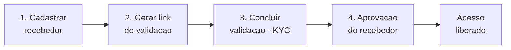

# Acordos de parceria

Os **Acordos de parceria** são o caminho do LocFlow para você trabalhar junto com outra empresa em um mesmo pedido e **dividir os ganhos de forma automática**, com regra clara e menos conferência manual. Valem para **locação** e para **venda** de bens móveis.

É a evolução do que antes se chamava "Programa de Parceiros": a ideia de dividir a comissão com quem traz negócio, agora dentro da área de **Parcerias**.


**Onde fica:** no menu da sua organização, em **Parcerias › Acordos**.



**Ainda em construção.** Os Acordos estão majoritariamente **em construção** — hoje o que você faz é **preparar o acesso**. A criação dos acordos e a divisão automática de valores ainda não estão no ar (veja [O que já dá e o que vem](#o-que-ja-da-e-o-que-vem)). Esta página explica o que existe agora e o que vem a seguir, sem prometer o que ainda não entrou no ar nem datas.


## Onde os Acordos entram nas Parcerias {#acordos-nas-parcerias}

A área de **Parcerias** reúne as formas de você trabalhar com quem está **fora** da sua organização. Hoje ela tem dois itens irmãos:

| Item | O que é | Situação |
| --- | --- | --- |
| **[Fornecedores de frete](fornecedores-de-frete.md)** | Um terceiro que **você** cadastra e gerencia — você monta a frota-espelho dele e o motor de frete dele — para compor o transporte dos seus pedidos. | **Disponível** |
| **Acordos de parceria** | Uma empresa parceira com quem você **divide os ganhos** de um pedido, conforme um acordo aceito pelas duas partes. | **Em construção** |

A visão de longo prazo é a mesma para as duas: um **parceiro é um usuário externo**, que não faz parte da sua equipe e tem **estrutura própria**. O fornecedor de frete é o **primeiro passo** dessa visão — só que, por enquanto, é um terceiro **sem login próprio**, que vive **dentro** da sua conta e que você administra por inteiro. Os Acordos caminham para a próxima etapa: parceiros de verdade, externos, com a conta deles. Para o panorama completo, veja [Parcerias: visão geral](visao-geral.md).

## O que é um acordo {#o-que-e}

Imagine que você fecha um pedido com um cliente, mas quem entrega (ou parte do material) vem de uma **empresa parceira**. Em vez de fazer acertos por fora — planilha, conversa de WhatsApp, conferência no fim do mês — o LocFlow registra o **acordo** entre as duas empresas e, quando o cliente paga, **divide os valores conforme o combinado**.

O acordo se apoia em quatro ideias:

| Ideia | O que significa para você |
| --- | --- |
| **Acordos simples e claros** | Você define com quem vai trabalhar e quais regras valem para cada parceria. |
| **Valores combinados antes de começar** | Preço dos itens, frete e condições ficam registrados no acordo — sem conversa perdida. |
| **Comissionamento automático** | Quando o pagamento entra, o sistema divide os valores conforme o combinado entre as partes. |
| **Mais agilidade no dia a dia** | Previsibilidade financeira e menos operação manual em repasses e conferências. |

## Como vai funcionar {#como-funciona}

A parceria nasce de um **acordo** entre duas empresas: uma que fecha a venda com o cliente (o lado **vendedor**) e outra que entra com material e/ou logística (o lado **parceiro**). O acordo registra quais itens entram, os valores e como os ganhos se dividem.

O acordo passa por um **vai e volta de aceite** — cada lado ajusta até as duas concordarem:

1. Uma parte **propõe** o acordo (itens, valores, divisão).
2. A outra **ajusta** (faz uma contraproposta) ou **aceita**.
3. Quando ambas concordam, a parceria fica **ativa** e passa a valer para os pedidos repassados.


Esse vai e volta evita mal-entendido: nada começa a valer sem o "ok" das duas empresas. Enquanto não há acordo, cada pedido segue normal, só seu.


A primeira versão vai atender a **parceria dentro da sua organização** — quando a empresa parceira trabalha usando o **mesmo catálogo** de itens que você. Assim os itens já são os mesmos para as duas partes, sem precisar "casar" produto por produto. A parceria entre **duas contas LocFlow diferentes** virá depois.

## O que já dá e o que vem {#o-que-ja-da-e-o-que-vem}

Hoje, a área de Acordos tem **um único trabalho**: **preparar o acesso**. O cadastro de parceiros e os acordos aparecem como uma prévia — **"Em breve"** — enquanto o recurso é finalizado.

### O que já dá para fazer {#o-que-ja-da}

* **Deixar o acesso pronto.** Como a divisão de valores acontece no **pagamento online**, você já pode adiantar o passo que **desbloqueia** os Acordos: ter a sua **integração de pagamento aprovada** (veja [O desbloqueio de acesso](#o-desbloqueio-de-acesso)). Feito isso, quando os acordos entrarem no ar, é só começar.

### O que ainda está em construção {#em-construcao}

* **Cadastrar parceiros** — adicionar a empresa com quem você vai trabalhar.
* **Criar e negociar acordos** — propor, ajustar e aceitar os termos (o vai e volta descrito em [Como vai funcionar](#como-funciona)).
* **Divisão automática no pagamento** — repartir cada parcela recebida conforme o acordo, sem lançamento manual.
* **Parceiro externo com conta própria** — a etapa em que o parceiro é um usuário de fora, com a estrutura dele (a primeira versão atende a parceria dentro da sua organização).


Você **não precisa esperar** para se preparar: deixe a sua integração de pagamento **aprovada** desde já.


## O desbloqueio de acesso {#o-desbloqueio-de-acesso}

Para dividir valores de um pedido entre você e um parceiro, o dinheiro precisa entrar pelo **pagamento online** e ser repartido na origem. Por isso, os **Acordos só liberam depois que a sua integração de pagamento estiver aprovada**.

É o mesmo cadastro de **recebedor** que você usa para receber online — explicado em [Pagamento online](../cobranca/pagamento-online.md). Enquanto a integração não estiver pronta, o LocFlow mostra um **passo a passo** com o que falta e um atalho para concluir.


**Atalho:** **Ajustes › Integrações › Integração de Pagamento.** É lá que você cadastra e acompanha o recebedor.


### Passo a passo para liberar {#passo-a-passo-para-liberar}

O desbloqueio acompanha quatro marcos. Cada um acende quando o anterior é concluído:

| Marco | O que acontece |
| --- | --- |
| **1) Cadastrar recebedor** | Você preenche os dados básicos e bancários da sua locadora. O cadastro é enviado para análise. |
| **2) Gerar link de validação** | Você gera um link e envia ao responsável legal da empresa. |
| **3) Concluir validação (KYC)** | O responsável confirma a identidade pelo link. A partir daí, fica em análise. |
| **4) Aprovação do recebedor** | Quando aprovado, o **acesso aos Acordos** é liberado e o recebimento online fica ativo. |


**A aprovação é automática e pode levar algumas horas.** Ela acontece em segundo plano — você não precisa ficar olhando. Quando quiser conferir, **puxe a tela para baixo para atualizar**. Estar "em validação" **não** é o mesmo que aprovado: é preciso gerar o link e o responsável concluir a confirmação de identidade.



**Quem ativa:** o cadastro do recebedor é feito por quem administra a conta. Se você não tem esse acesso, peça ao responsável — o sistema mostra o motivo, ninguém fica travado sem entender o porquê.


## Como a divisão vai funcionar {#quem-recebe-o-que}

Quando esse recurso entrar no ar, um pedido em parceria pago terá o valor repartido **na hora**, conforme o acordo, sem você lançar nada à mão. O acordo vai definir:

* **O repasse** — quanto, de cada parcela paga, vai para a empresa parceira.
* **A sua parte** — o que sobra para você depois do repasse e da taxa de plataforma.
* **A taxa de plataforma** — o percentual que o LocFlow retém sobre o valor recebido. O acordo também combina **como essa taxa se divide** entre as duas empresas.
* **Quem cuida de quê** — quem é responsável por **reembolsos** ao cliente, em caso de cancelamento, e quem arca com a **taxa de processamento** do pagamento. O padrão recai sobre o lado vendedor, mas isso faz parte do que se combina.


A soma sempre fecha: **a sua parte + a parte do parceiro + a taxa de plataforma = o valor pago pelo cliente**. Nada some sem registro.



Os percentuais, valores e limites exatos fazem parte das **condições comerciais** e podem variar por plano. Confira sempre os números que aparecem **no próprio acordo**, na hora de fechá-lo — é o acordo que vale.


## Situações reais {#situacoes-reais}

**"Abri os Acordos e só aparece um aviso de 'Em breve'."**
É o esperado por enquanto. O cadastro de parceiros e a criação de acordos estão [em construção](#em-construcao). Hoje o passo útil é **deixar o acesso pronto**: garanta que a sua integração de pagamento esteja aprovada.

**"Concluí a validação, mas o acesso não liberou."**
Estar "em validação" não é o mesmo que aprovado. A aprovação é automática e **pode levar algumas horas**. Puxe a tela para baixo para atualizar. Se não tiver gerado o **link de validação** e o responsável não tiver concluído, esse é o passo que falta — veja [Pagamento online](../cobranca/pagamento-online.md).

**"Não consigo cadastrar o recebedor."**
O cadastro é feito por quem **administra a conta**. Se você não tem esse acesso, o sistema orienta a pedir ao responsável.

**"Preciso de um terceiro só para o transporte, não uma divisão de ganhos."**
Então o que você quer é um **fornecedor de frete**, não um acordo. Isso já funciona hoje — veja [Fornecedores de frete](fornecedores-de-frete.md).

## Próximo passo {#proximo-passo}

* [Parcerias: visão geral](visao-geral.md) — o panorama da área e como os itens se encaixam.
* [Fornecedores de frete](fornecedores-de-frete.md) — a forma de parceria que **já** funciona hoje.
* [Pagamento online](../cobranca/pagamento-online.md) — o recebedor, a validação (KYC) e a aprovação que liberam o acesso.
* [A página de pagamento do cliente](../cobranca/pagina-de-pagamento.md) — por onde o dinheiro entra e será repartido.
* [Minha assinatura e créditos](../configuracoes/assinatura-e-creditos.md) — recursos avançados podem depender do seu plano.
