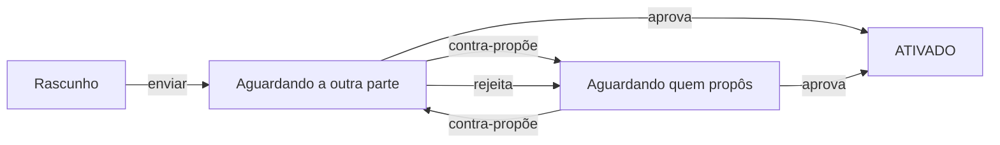

# Acordos de parceria

**Onde fica:** no espaço **Rede de Parceiros** (alterne o espaço pelo menu lateral ou pela aba Menu) → **Acordos**.

O **acordo** é o contrato da parceria: o documento vivo, dentro do LocFlow, que registra **quem faz o quê e por quanto**. De um lado, o **vendedor** — dono do cliente e do orçamento. Do outro, o **parceiro logístico** — quem executa a operação. O acordo diz quais itens entram, quanto o parceiro recebe por cada um, quando esse repasse é pago e como fica o frete. Vale para **locação** e para **venda** de bens móveis.

Sem acordo **ativado**, não há repasse: é ele que dá a régua para todo pedido que você [repassar ao parceiro](repassando-um-pedido.md). Com ele, o combinado deixa de morar em conversa de WhatsApp e passa a ser aplicado **automaticamente**, pedido a pedido.


**As duas formas de parceria.** O acordo funciona igual nas duas: na parceria **externa**, o parceiro é um convidado seu, que trabalha dentro da sua conta com um papel restrito (veja [Parceiro Logístico Externo](parceiro-logistico-externo.md)); na parceria **interna**, as duas partes são organizações LocFlow de verdade, conectadas por um vínculo (veja [Parceria interna](#parceria-interna), adiante).


## Como um acordo nasce {#como-nasce}

Um acordo pode começar dos dois lados: **você cria** e envia ao parceiro, ou **o parceiro propõe** a você. A partir daí ele entra num vai e volta de aprovação — um **ping-pong** — até as duas partes concordarem com os mesmos termos:



O mecanismo é simples de lembrar: **quem edita já concorda**. Se o parceiro devolve uma contra-proposta mexendo num preço, ele está dizendo "assim eu topo" — e a bola volta para **você** aprovar, rejeitar ou contra-propor de novo. Rejeitar não mata o acordo: devolve para a outra parte revisar. Quando um lado **aprova** a proposta que está na mesa, o acordo fica **ATIVADO** e passa a valer para os pedidos repassados dali em diante.


**Editar qualquer termo reabre a aprovação.** Mesmo num acordo já ativado, mudar itens, preços, gatilho ou frete cria uma **nova proposta** — e a outra parte precisa aprovar de novo antes de a mudança valer. Nada muda por baixo dos panos sem o "ok" dos dois.


## Os termos, um a um {#os-termos}

### Itens acordados {#itens-acordados}

O coração do acordo é a lista de **itens acordados**: quais produtos e kits do catálogo entram na parceria e por **dois preços** cada um — o **seu** (o preço ao cliente) e o **do parceiro** (o que ele recebe quando executa).

A regra de ouro: **o preço do parceiro é sempre menor que o seu, em todo item**. A diferença entre os dois é a **sua margem** — o que sobra para você por ter trazido o cliente. O LocFlow não deixa ativar um acordo em que o parceiro receberia mais do que o cliente paga: seria uma parceria em que você perde dinheiro por definição.


Na tela do acordo, cada item mostra a quebra na hora: o preço ao cliente, o repasse ao parceiro, quantos **%** ele recebe e quanto **sobra para você** — antes de qualquer pedido acontecer. Você negocia vendo o efeito.


Um pedido só pode ser repassado se **todos** os itens dele estiverem no acordo — item fora do acordo exclui o parceiro daquele repasse. Por isso vale a pena acordar o catálogo com generosidade, mesmo os itens que giram pouco.

### Gatilho de pagamento {#gatilho-de-pagamento}

O gatilho define **quando** o repasse do parceiro é gerado, a cada pedido. São cinco configurações:

| Gatilho | Quando o repasse é gerado |
| --- | --- |
| **No Pagamento de Parcela pelo Cliente** | A cada parcela que o cliente paga — a parte do parceiro nasce junto do dinheiro. |
| **Na Entrega** | Quando a entrega ao cliente é concluída, com ou sem pagamento. |
| **Na Retirada** | Quando a retirada (a volta do material, na locação) é concluída. |
| **Até a Entrega** | Segue as parcelas pagas, mas a **entrega é o teto**: chegou a entrega, o que faltar do repasse é gerado mesmo sem o cliente ter pago tudo. |
| **Até a Retirada** | Igual ao anterior, com a **retirada** como teto. |

Qual escolher? Depende de quem carrega o risco. "No pagamento" protege **você** (só repassa o que já entrou); "na entrega/retirada" protege **o parceiro** (ele trabalhou, ele recebe). As variantes "até a…" são o meio-termo: o repasse acompanha o dinheiro, mas o parceiro tem uma data-limite garantida.


**Gerado não é necessariamente pago na hora.** Quando o cliente paga online e o gatilho é "no pagamento", a parte do parceiro se reparte **na fonte**. Nos demais casos, o repasse vira um **saldo a pagar** que você quita depois. Os detalhes de como o dinheiro anda — **Financeiro › Repasses** para você, **Meus Ganhos** para o parceiro — ficam em [O dinheiro da parceria](dinheiro-da-parceria.md).


### Janela de aceite {#janela-de-aceite}

Todo repasse é uma **solicitação**: o parceiro vê o pedido e **aceita ou recusa**. A janela de aceite define a **antecedência mínima**, em horas, com que ele ainda pode aceitar antes da operação. Com uma janela de 12h, por exemplo, um pedido cuja entrega é às 14h só pode ser aceito até as 2h da manhã — depois disso o aceite é bloqueado, e o sistema **expira a solicitação sozinho**, liberando você para repassar a outro parceiro (ou fazer você mesmo).

O padrão é **0 = sem prazo**: o parceiro pode aceitar até o instante da operação. Suba o número quando a sua operação precisa de resposta cedo — material que exige preparo, rotas que fecham na véspera.

### Janela de desistência {#janela-de-desistencia}

Depois de aceitar, o parceiro ainda pode **desistir** (sempre com um motivo). A janela de desistência — **padrão de 24 horas** antes da operação — separa o desistir civilizado do desistir em cima da hora:

* **Dentro da janela**: é um direito. O pedido volta para você repassar de novo, sem drama.
* **Depois da janela (tardia)**: o sistema permite — ninguém é forçado a fazer uma entrega ruim — mas registra uma **penalidade** no índice de confiabilidade do parceiro.


As duas janelas são o "SLA" do acordo: elas protegem **você** de ficar na mão e protegem **o parceiro** de compromissos impossíveis. Deixar de responder no prazo ou desistir tarde pesa na reputação dele — de forma objetiva e contestável, não no grito.


### Frete do acordo {#frete-do-acordo}

O transporte de cada pedido repassado pode ser precificado de dois jeitos:

| Modo | Como funciona | Para quem |
| --- | --- | --- |
| **Manual (a combinar)** | O acordo não fixa regra de frete: o valor de cada operação é combinado caso a caso. | Parcerias começando, volumes baixos, rotas imprevisíveis. |
| **Motor** | As **regras de preço do parceiro** ficam embutidas no acordo — por quilômetro, por viagem, por faixa — e o LocFlow calcula o frete de cada pedido sozinho. | Parcerias com volume: preço previsível, sem negociar toda vez. |

No modo motor, as **especificações de veículo** citadas nas regras devem ser da **frota do parceiro** — é o caminhão dele que roda, então é a capacidade dele que precifica.


Na hora de repassar um pedido, um parceiro **sem** motor de frete não fica de fora: ele aparece na seção **"Frete a combinar"** do comparativo — você só não vê o preço do transporte calculado.


## Vigência: enquanto o acordo vale {#vigencia}

Um acordo ativado **não expira sozinho** — vale até que uma das partes o encerre:

* **Durante a negociação**, o vendedor pode **cancelar** o acordo a qualquer momento (encerra o ping-pong).
* **O parceiro pode revogar** a própria participação quando quiser, **inclusive de um acordo já ativado** — ele é uma operação independente, não fica preso a uma parceria que não quer mais.

Um acordo encerrado **não aceita novas reservas**: nenhum novo pedido pode ser repassado por ele, e nenhum novo repasse é gerado dali em diante. O que já aconteceu não é desfeito — repasses de pedidos concluídos permanecem devidos e registrados.

## Parceria interna: acordo entre duas organizações {#parceria-interna}

Tudo acima vale para qualquer acordo. Quando as duas partes são **organizações LocFlow de verdade** — a parceria **interna** (org↔org) — o acordo ganha três características a mais:

**Exige um vínculo ativo.** Antes do acordo vem o **vínculo** de parceria entre as duas organizações (uma propõe, a outra aceita — pela vitrine de **Descobrir parceiros** ou por convite direto). O acordo interno é **endereçado à organização parceira**, não a uma pessoa: quem tem permissão do lado de lá negocia por ela.

**Mapeamento item a item.** Cada organização tem o **seu** catálogo — a sua "Mesa Rústica" e a "Mesa de Madeira 6 Lugares" dela podem ser o mesmo móvel com nomes diferentes. O acordo interno resolve isso com um **mapeamento item a item** entre os dois catálogos: o LocFlow sugere os pares automaticamente (**auto-match** pelo catálogo global) e você **valida** cada um. A **ativação exige o mapa completo** — todo item acordado precisa do seu correspondente do outro lado, porque é por essa tradução que o pedido repassado vira operação no sistema da parceira.

**Estoque espelhado.** Com o mapa pronto, quando a parceira aceita um repasse o material passa a sair **do estoque dela** — o sistema traduz os itens e reserva no galpão dela mais próximo da entrega. Se ela não tem estoque disponível na janela do pedido, o próprio aceite é barrado. Os detalhes estão em [Estoque na parceria](estoque-na-parceria.md).


**O que você ganha com a interna:** na hora de repassar um pedido, o comparativo já mostra a **disponibilidade de estoque** de cada parceira para a data — você não descobre a falta de material no dia da entrega.


## Da externa para a interna: a promoção {#promocao}

Muita parceria começa **externa**: você convida um motorista ou uma transportadora pequena, que trabalha dentro da sua conta. Um dia esse parceiro cresce, cria a **própria organização** no LocFlow — e o acordo pode crescer junto, virando org↔org **sem recomeçar do zero**.

Quem promove é **o parceiro** (é ele quem ganhou estrutura própria), a partir de um acordo **ativado**. A promoção exige:

1. **Organização própria** dele, com um **vínculo ativo** com a sua.
2. **Catálogos alinháveis**: o auto-match precisa completar o mapeamento item a item entre o acordo e o catálogo da organização dele.
3. **Frota equivalente**, quando o frete do acordo é por motor: as fichas de veículo citadas nas regras precisam ter equivalentes na frota da organização dele — as regras de preço continuam fazendo sentido com os caminhões que passam a rodar.


**A reputação carrega.** As avaliações e o histórico que o parceiro acumulou na fase externa **vão junto** na promoção. Crescer não zera a confiança construída — nem para ele, nem para você.


## Para quem quer os números {#para-quem-quer-os-numeros}

A partir daqui é a conta por trás — você não precisa disso para fechar um bom acordo.

A cada pedido repassado, três valores se relacionam:

```
margem do vendedor = total do cliente − repasse ao parceiro − taxa de plataforma (sua fatia)
```

* **Total do cliente** — o que o cliente paga pelo pedido, com os **seus** preços.
* **Repasse ao parceiro** — os preços **do acordo** × as quantidades × o **fator de locação** do pedido (as diárias/locações cobradas — o mesmo multiplicador que incide sobre o preço ao cliente; veja [Duração, cobrança e bloqueio](../orcamentos/duracao-e-bloqueio.md)). O **frete calculado pelo motor não multiplica** — transporte se paga por viagem, não por diária.
* **Taxa de plataforma** — um percentual sobre o repasse, conforme o seu plano, dividido entre as duas partes na proporção que o próprio acordo mostra. O líquido do parceiro é o repasse menos a fatia **dele**; a sua margem desconta a **sua**.

A soma sempre fecha: **sua margem + líquido do parceiro + taxa de plataforma = total do cliente**. É essa margem — calculada com os termos de cada acordo — que ordena o comparativo de parceiros quando você repassa um pedido ("**Você lucra**").


Percentuais e limites são **condições comerciais** e variam por plano. O número que vale é o que aparece **no próprio acordo** na hora de fechá-lo.


## Situações reais {#situacoes-reais}

**"O parceiro devolveu o acordo com outros preços. Perdi o que eu tinha feito?"**
Não — é o ping-pong normal. A contra-proposta dele está na mesa aguardando **você**: aprove, rejeite (volta para ele revisar) ou contra-proponha de novo. Nada vale até um lado aprovar a proposta do outro.

**"Quero mudar o preço de um item num acordo que já está ativado."**
Pode — mas a mudança é uma nova proposta e a outra parte precisa aprovar. Até lá, os repasses continuam saindo pelos termos antigos.

**"O sistema não deixa ativar o acordo interno."**
Confira o **mapeamento**: a ativação exige que todo item acordado tenha o correspondente no catálogo da parceira. O auto-match sugere os pares; os que ficarem sem par você resolve à mão (ou tira o item do acordo).

**"O parceiro vive deixando solicitações expirarem."**
Considere subir a **janela de aceite** (força resposta cedo) e olhe o índice de confiabilidade dele — expirar prazo penaliza. Se o problema persistir, o comparativo de repasses vai naturalmente favorecer parceiros que respondem.

**"Encerrei um acordo. E os pedidos que ele já executou?"**
Permanecem devidos: encerrar corta **novas** reservas e **novos** repasses, não apaga o passado. Os saldos pendentes continuam em Financeiro › Repasses.

## Próximo passo {#proximo-passo}

* [Parcerias: a visão](visao-geral.md) — o panorama da Rede de Parceiros.
* [Parceiro Logístico Externo](parceiro-logistico-externo.md) — o convite, o papel restrito e o dia a dia do parceiro externo.
* [Estoque na parceria](estoque-na-parceria.md) — o espelho de estoque da parceria interna.
* [Pagamento online](../cobranca/pagamento-online.md) — o recebedor que habilita a divisão do dinheiro na fonte.
* [Duração, cobrança e bloqueio](../orcamentos/duracao-e-bloqueio.md) — o fator de locação que multiplica itens (e repasses).
