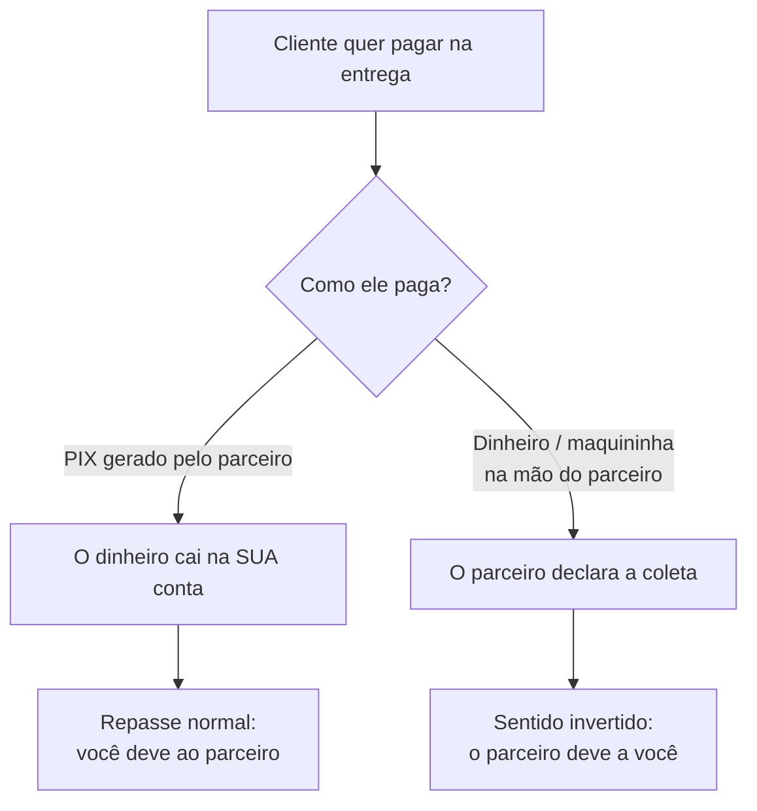

# Cobrança na rua

**Onde fica:** é um **termo do acordo de parceria** (veja [Acordos de parceria](acordos-de-parceria.md#cobranca-na-rua)). Ligado, ele aparece para o parceiro na tela de **cobrar** do movimento, dentro da execução da entrega.

O problema real é este: o seu parceiro chega com o material, o cliente abre a carteira e quer pagar ali. Sem uma regra combinada, o que acontece a seguir é ruim para os dois — o parceiro pega o dinheiro e ninguém sabe quanto ele deve devolver, ou ele recusa e o cliente fica com a sensação de que "esse pessoal não se entende".

A **cobrança na rua** é a resposta do LocFlow: uma **autorização explícita**, escrita no acordo, para o parceiro **receber o cliente na porta em nome da sua organização**.


**Ela nasce desligada, e isso é de propósito.** Num acordo novo, o parceiro **não** pode cobrar o cliente. Se ele tentar registrar um recebimento, o app responde: *"Este acordo não permite cobrar o cliente na rua. Mostre o PIX do vendedor para o pagamento."* Ligar é uma decisão de confiança que você toma acordo a acordo — não um comportamento padrão da parceria.


## A regra que sustenta tudo: o parceiro é coletor, não credor {#titularidade}

Isto é o que mais confunde, e o que mais custa caro quando se entende errado.

Autorizar a cobrança na rua **não transfere a cobrança para o parceiro**. A fatura continua sendo sua, a dívida do cliente continua sendo com a **sua organização**, e é você quem responde por ela. O parceiro faz um trabalho específico e limitado: **coletar o dinheiro no ponto de entrega** e entregá-lo a você.

Em linguagem de [linhas de responsabilidade](visao-geral.md#linhas-de-responsabilidade): **receber é um ato da linha logística**, mas **a titularidade da cobrança continua na linha de cobrança — que é do vendedor**.


**O erro que essa distinção evita:** o parceiro tem R$ 300 a receber pela operação e o cliente deve R$ 1.000 pelo pedido. Se ele confundir os dois números, cobra R$ 300 e vai embora — e sobram R$ 700 sem ninguém para cobrar na porta.

Por isso a tela dele mostra os dois **separados, com rótulos que não se confundem**: em destaque, **"O cliente deve a \[sua organização]: R$ 1.000,00"**; embaixo, numa linha à parte, *"Você recebe R$ 300,00 por esta operação"*.


## O que o parceiro passa a ver {#o-que-ele-ve}

Sem a autorização, o parceiro só recebe um **sinal simples** sobre a cobrança, em uma linha: *Pago*, *Cobrança em aberto — com o vendedor* ou *Cobrança cancelada* (e *sem cobrança gerada*, quando ainda não há fatura). Nada de valores, nada de parcelas, nada de link de pagamento. É o mínimo para ele não entregar em cima de uma pendência sem saber.

Com a autorização ligada — **e só depois de ele aceitar o repasse** —, ele passa a ver um **recorte** da fatura daquele pedido:

| Ele vê | Ele continua sem ver |
| --- | --- |
| **Quanto o cliente deve** à sua organização, em destaque | Qualquer outra fatura sua |
| As **parcelas**: valor, vencimento e situação de cada uma | Os outros orçamentos daquele cliente |
| O **nome do contato** e o **código do orçamento** | A sua carteira de clientes |
| O nome da **sua organização** — o dono da dívida | A composição do seu preço, descontos, histórico |


**O valor em destaque já desconta o que está a caminho.** Se o cliente já pagou R$ 500 a um operador seu e esse dinheiro ainda está na fila de conferência da tesouraria, o parceiro vê **R$ 500** para cobrar, não R$ 1.000. Sem esse cuidado, ele cobraria o dobro na porta — que é exatamente a classe de erro que esta tela existe para evitar.


## Os dois caminhos na porta {#dois-caminhos}

Com a autorização ligada, o parceiro tem **duas maneiras** de resolver o pagamento. Elas levam a lugares muito diferentes, e vale entender a diferença antes de ligar a chave.

### Caminho recomendado: o PIX da sua organização {#pix-do-vendedor}

Com a cobrança na rua ligada, o parceiro pode **gerar o PIX da parcela ali mesmo** e mostrar ao cliente. É o **seu** PIX: o dinheiro entra na **sua** conta, exatamente como se o cliente tivesse pago pelo link.

A partir daí, nada é diferente de um pedido comum: a fatura baixa, o seu caixa recebe, e o repasse ao parceiro segue o caminho normal — **você deve a ele**, pelo gatilho do acordo.


**É sempre esta a recomendação.** Um código de pagamento resolve, sem acerto nenhum depois, o que o dinheiro em espécie transforma em conta a acertar entre duas empresas.


### O outro caminho: o dinheiro fica com o parceiro {#coleta-declarada}

Se o cliente crava o dinheiro na mão do parceiro (ou passa na maquininha dele), o parceiro **declara a coleta** na tela de cobrar.

Três coisas acontecem na hora:

1. **A fatura do cliente é quitada, direto.** A declaração dele **não** passa pela fila de conferência da sua tesouraria — não há dinheiro seu para conferir: o dinheiro está com ele. O cliente sai quitado e com recibo.
2. **O seu caixa não registra entrada.** E está certo: você não recebeu nada ainda. O que nasce no lugar é um **valor a receber daquele parceiro**.
3. **O sentido do repasse se inverte.** Em vez de você dever ao parceiro, **o parceiro passa a dever a você**: a sua margem **mais** a taxa de plataforma. Ele fica com o que era dele.

Ele quita essa dívida por **PIX**, e a taxa da plataforma sai no mesmo ato. Zerou, acabou.


**Onde cada um vê isso:** para o parceiro, em **Meus Ganhos**, como um valor **a pagar** (em âmbar), com o botão de quitar via PIX ali mesmo. Para você, em **Financeiro › Repasses**, como um valor **a receber** daquele parceiro.


### A conta, com números {#a-conta}

Pedido de **R$ 1.000** ao cliente, repasse combinado de **R$ 600** ao parceiro, taxa de plataforma de **8%** inteirinha do lado do vendedor (o padrão).

| | Cliente paga a **você** (PIX/link) | Cliente paga **ao parceiro**, em espécie |
| --- | --- | --- |
| Quem segura o dinheiro | Você — R$ 1.000 | O parceiro — R$ 1.000 |
| Direção da obrigação | Você **deve** R$ 680 (repasse + taxa) | O parceiro **deve** R$ 400 (sua margem + taxa) |
| Fica com você, no fim | R$ 320 | R$ 320 |
| Fica com o parceiro, no fim | R$ 600 | R$ 600 |
| Taxa de plataforma | R$ 80 | R$ 80 |

O resultado é **exatamente o mesmo** nos dois caminhos. O que muda é só **quem paga a quem** — e, portanto, quem carrega o risco de o acerto demorar.

## A regra do tudo ou nada {#tudo-ou-nada}

Esta é a regra que mais gera dúvida na prática, e é melhor conhecê-la antes de a tela recusar.


**A coleta na rua tem de fechar a cobrança inteira daquele pedido.** Metade na porta e metade no PIX **não** é aceito. Se o parceiro tentar registrar um valor que não quita a operação sozinho, o app recusa com a frase:

*"A coleta na rua tem de fechar a cobrança inteira desta operação. Para receber só uma parte (ou quando já houve outro recebimento), use o PIX do vendedor."*


Na prática, a declaração do parceiro é recusada quando:

* **já houve outro recebimento** naquele pedido — confirmado, ou ainda em conferência da sua tesouraria;
* **há outra parcela em aberto** — uma fatura parcelada nunca fecha com uma coleta só;
* **o valor não cobre** o saldo daquela parcela.

**Por que a regra é dura assim?** Porque a dívida invertida — a que o parceiro passa a ter com você — é calculada **sobre o pedido inteiro**. Se ele recebesse metade e a conta nascesse cheia, ele estaria devendo por dinheiro que nunca segurou. E o caminho inverso é pior: sem a regra, um pagamento pela metade deixava o repasse **sem nascer de nenhum lado** — o parceiro terminava a operação com R$ 0,00 e a plataforma sem a taxa, para sempre.

**O caminho para o pagamento parcial existe e é simples:** o **PIX da sua organização**, para tudo. Ele aceita qualquer valor, quantas vezes for preciso, e mantém o repasse no fluxo normal.

## Desfazer uma coleta {#desfazer}

Marcou por engano? O cliente disse que não pagou? **Os dois lados podem desfazer** — o parceiro, corrigindo o próprio registro; você, contestando. A fatura reabre, a dívida invertida some, e nenhum dinheiro se moveu no sistema.

Mas há dois momentos em que o app **barra** a reversão, e por bons motivos:

| Situação | O que o app diz | Por quê |
| --- | --- | --- |
| Já existe um **PIX de acerto em aberto** para aquela coleta | *"Há um acerto PIX em aberto para esta coleta. Cancele ou aguarde a expiração antes de reverter."* | O código ainda é pagável. Reverter agora e o parceiro pagar depois viraria cobrança em dobro. |
| O parceiro **já quitou** o valor invertido | *"O repasse inverso já foi quitado pelo parceiro. Use o estorno para desfazer com devolução."* | Dinheiro de verdade já mudou de mãos — o caminho é o **estorno**, com devolução e registro em trilha. |

## Quando ligar (e quando não) {#quando-ligar}

| Ligue quando… | Deixe desligado quando… |
| --- | --- |
| O parceiro é de confiança antiga e você já opera assim na prática | A parceria é nova e vocês ainda estão se conhecendo |
| Boa parte dos seus clientes paga **na entrega**, em espécie | Os seus clientes pagam antecipado, ou por link |
| Você prefere que o cliente nunca ouça "não posso receber" | Você prefere que todo o caixa passe pela sua conta primeiro |
| As operações costumam ser **de parcela única** | Você parcela quase tudo (a coleta na rua não fecha fatura parcelada) |

### Onde se liga {#onde-se-liga}

A autorização é um **termo do acordo**, e mora junto dos outros (quem paga a taxa, quem devolve dinheiro ao cliente, os prazos). Na tela do acordo, sob o rótulo **"Se o cliente quiser pagar na entrega"**, há a chave:

* do seu lado: **"O parceiro pode receber o cliente na porta"**;
* do lado dele: **"Você pode receber o cliente na porta"** — a mesma chave, para o parceiro **pedir** a prerrogativa numa contraproposta.

O texto abaixo da chave já diz o que você está concedendo: o parceiro passa a **ver quanto o cliente deve**, o dinheiro pode passar pela mão dele **sem mudar de dono**, e vale a regra do **tudo ou nada**.


**Uma limitação honesta desta versão:** hoje a cobrança na rua funciona com o **parceiro externo**. Na parceria **interna** (org↔org), quem executa não tem usuário dentro da sua conta — e é por esse usuário que o sistema reconhece a coleta na porta. Numa parceria interna, o caminho para o cliente pagar na entrega continua sendo o PIX da sua organização.


## Situações reais {#situacoes-reais}

**"O parceiro entregou e o cliente pagou o PIX que ele mostrou."**
O dinheiro caiu na sua conta. Nada inverte: você deve o repasse a ele, como em qualquer pedido. É o caminho que você quer que aconteça na maioria das vezes.

**"O cliente pagou R$ 400 em dinheiro na porta, e o pedido é de R$ 1.000."**
O app recusa a declaração. Não é bug: a coleta na rua é tudo-ou-nada. Peça ao parceiro para gerar o **PIX** da parcela e receber os R$ 400 por ali — o resto segue cobrável normalmente.

**"O parceiro recebeu tudo em espécie e sumiu com o acerto."**
O valor está registrado como **a receber daquele parceiro** em Financeiro › Repasses, com o pedido que o originou. Não é uma conversa de WhatsApp: é uma dívida no sistema, que aparece para ele em Meus Ganhos e conta na relação de vocês.

**"Encerrei o acordo com esse parceiro. E o que ele coletou?"**
Continua devido, e continua cobrável. Encerrar fecha a porta do que vem; não apaga o que já foi pactuado. Veja [Vigência do acordo](acordos-de-parceria.md#vigencia).

**"O cliente pagou ao parceiro, mas o gatilho do acordo é 'na entrega'."**
Sem problema. A entrega feita continua valendo o que valia: o direito do parceiro é apurado normalmente e entra na conta do acerto. O sentido da obrigação muda; o valor que cabe a cada um, não.

## Próximo passo {#proximo-passo}

* [Acordos de parceria](acordos-de-parceria.md) — onde a autorização vive, ao lado do gatilho e do frete.
* [O dinheiro da parceria](dinheiro-da-parceria.md) — os caminhos completos do dinheiro e a taxa de plataforma.
* [Parceiro Logístico Externo](parceiro-logistico-externo.md#cobrar-na-rua) — a mesma história vista pelo lado de quem está na porta.
* [Pagamento online](../cobranca/pagamento-online.md) — o recebedor e o PIX que sustentam os dois caminhos.
