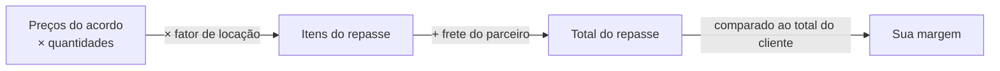

# O dinheiro da parceria

**Onde fica:** para o vendedor, em **Financeiro › Repasses**; para o parceiro, em **Meus Ganhos** — as duas telas carregam o selo **"Rede"** e aparecem também como atalhos no espaço **Rede de Parceiros**.

Quando você repassa um pedido a um parceiro, dois preços convivem no mesmo negócio: o que o **cliente paga a você** e o que **você paga ao parceiro**. A diferença entre eles é a **sua margem** — e o LocFlow faz essa conta sozinho, mostra antes de você decidir e liquida do jeito combinado no acordo. Esta página explica a conta, o momento do pagamento e os caminhos pelos quais o dinheiro chega ao parceiro.


**O parceiro nunca vê o preço do cliente.** Na solicitação de repasse, ele enxerga a operação, os itens e **quanto ele ganha** — o valor dele, pelos preços do acordo. O que o cliente paga a você é assunto seu. Veja [Acordos de parceria](acordos-de-parceria.md).


## A conta {#a-conta}

O valor do parceiro nasce dos **preços do acordo** — aqueles combinados item a item quando vocês fecharam a parceria, sempre **menores** que os seus preços ao cliente. Sobre eles, a conta é a mesma do orçamento:



Em palavras:

1. **Itens do repasse** = preço de cada item **no acordo** × quantidade × **fator de locação**.
2. **Frete do parceiro** = o que o motor de frete dele cotou para a operação (ou "a combinar", no frete manual). O frete **não** multiplica pelo fator.
3. **Sua margem** = total do cliente − repasse ao parceiro − taxa de plataforma.

### O fator de locação {#fator-de-locacao}

O **fator de locação** é o mesmo multiplicador de diárias/locações que engorda o preço do cliente — as **mesmas diárias** valem para os dois lados. Uma locação de 3 diárias cobra ×3 do cliente **e** paga ×3 ao parceiro sobre os preços do acordo. Justo dos dois lados: o parceiro roda a operação pelos mesmos dias que o cliente usa.

O **frete fica de fora do fator** — de novo, nos dois lados: assim como o cliente não paga 3 fretes por 3 diárias, o parceiro não recebe o frete multiplicado. Transporte é por viagem, não por dia de uso (veja [Valores do orçamento](../orcamentos/valores.md)).


**O comparativo já mostra essa conta pronta.** Na tela de repasse, cada candidato aparece com o total do repasse, a sua taxa de plataforma e o **"VOCÊ LUCRA"** — a margem exata. E não é uma estimativa "mais ou menos": é **a mesma conta que a liquidação vai pagar** depois. O que você viu ao escolher é o que sai do caixa.


## Quando o parceiro recebe {#quando-o-parceiro-recebe}

Quem decide o **momento** do pagamento é o **gatilho de pagamento** do acordo — combinado uma vez, vale para todos os repasses daquele acordo:

| Gatilho | O parceiro recebe… |
| --- | --- |
| **No Pagamento de Parcela pelo Cliente** | Sempre que o cliente **paga uma parcela** — o repasse acompanha o ritmo do dinheiro que entra. |
| **Na Entrega** | Quando a **entrega** ao cliente é concluída, independentemente do pagamento. |
| **Na Retirada** | Quando a **retirada** (a busca do material, na locação) é concluída. |
| **Até a Entrega** | No pagamento do cliente **ou** na entrega — **o que vier primeiro**. A entrega é o teto da espera. |
| **Até a Retirada** | No pagamento do cliente **ou** na retirada — o que vier primeiro. |

As variantes **"Até a…"** protegem o parceiro de esperar um cliente devagar: se o pagamento não veio até o marco da operação, o gatilho dispara mesmo assim.


O gatilho define **quando o valor se torna devido** ao parceiro. **Como** ele chega à conta do parceiro é o próximo assunto — e depende de o pagamento do cliente ser online ou não.


## Os três caminhos do dinheiro {#os-tres-caminhos}

Disparado o gatilho, o dinheiro percorre um de três caminhos. Você não escolhe entre eles a cada pedido — o LocFlow escolhe sozinho o melhor possível para a situação:


| Caminho | Quando acontece | Como o parceiro recebe |
| --- | --- | --- |
| **Split imediato** | Pagamento online + gatilho "No pagamento" + parceiro com recebedor configurado | **Na fonte**: o pagamento do cliente já se reparte — cada um recebe direto a sua parte. |
| **Saldo acumulado** | O gatilho dispara sem um pagamento online repartível (baixa manual, gatilho de entrega/retirada…) | Vira **saldo a pagar**; o vendedor quita gerando uma **cobrança de repasse** via PIX. |
| **Retroativo** | O cliente pagou **tudo antes** de o parceiro aceitar | O saldo **nasce no aceite** — nada se perde nem duplica. |

### Split imediato: reparte na fonte {#split-imediato}

O caminho mais automático. Quando o cliente paga **online** e o gatilho do acordo é **"No Pagamento de Parcela"**, o LocFlow reparte o valor **no próprio pagamento**: a parte do parceiro vai direto para a conta dele, a sua fica com você — ninguém transfere nada depois, ninguém deve nada a ninguém.

Para esse caminho existir, o **parceiro precisa ter o recebedor configurado** (veja [adiante](#recebedor-do-parceiro)). Sem recebedor, o mesmo pagamento cai no caminho do saldo — o valor não se perde, só muda a forma de chegar.

### Saldo acumulado e a cobrança de repasse {#saldo-acumulado}

Nem todo pagamento dá para repartir na fonte: o cliente pagou em dinheiro no balcão, o gatilho é "Na Entrega" (que não depende de pagamento), o parceiro ainda não tem recebedor. Nesses casos, quando o gatilho dispara, o valor do parceiro vira **saldo a pagar** — uma dívida sua com ele, registrada e visível para os dois lados.

Para quitar, o vendedor gera uma **cobrança de repasse**: um **PIX** no valor do saldo. Pagou, o saldo zera e o parceiro vê o ganho como **liquidado**. A própria cobrança já reparte na fonte — o parceiro recebe o dele e a taxa de plataforma sai no mesmo ato, sem acerto por fora.

O valor a pagar aparece **detalhado**: quanto vai **ao parceiro** e quanto é **taxa de plataforma** — para você saber exatamente o que está pagando, sem caixa-preta. O telefone do pagador vem do seu cadastro de recebimento, então você **não redigita** o número a cada quitação.


O saldo **acumula por parceiro**, não por pedido: vários repasses pequenos podem ser quitados numa cobrança só. Menos PIX, menos conferência.



**Se você já gerou o PIX e voltou depois, verá o mesmo código** — não gera outro nem dá erro de "já existe cobrança aberta". É como a cobrança do cliente final: pediu de novo, o LocFlow reabre o PIX que já está valendo. Se aquele PIX expirou, aí sim ele gera um novo.


### Retroativo: o cliente pagou antes do aceite {#retroativo}

E se o cliente **quitou tudo** antes mesmo de o parceiro aceitar a solicitação? O dinheiro já entrou inteiro para você — não há mais pagamento futuro para repartir. Nesse caso o LocFlow cria o saldo **no momento do aceite**: o parceiro aceitou, o valor dele nasce devido, e segue o caminho do saldo acumulado (cobrança de repasse para quitar).

O cuidado aqui é a **contagem única**: o sistema sabe o que já foi pago e o que já foi repassado — pagamentos anteriores ao aceite não geram repasse duplicado, e nenhuma parcela fica de fora.

## O parceiro recebeu do cliente? {#parceiro-recebeu-na-entrega}

Um caso que aparece na entrega: o **parceiro logístico** chega com o material e o **cliente quer pagar ali, na hora**. Como acertar isso sem ninguém sair perdendo?

### A regra de ouro: mostre o PIX do vendedor {#regra-de-ouro-pix}

Mesmo na entrega, o melhor caminho é o **PIX do vendedor** — o mesmo do link de pagamento. O parceiro mostra o código ao cliente, o cliente paga, e o **split imediato** faz o resto sozinho: o vendedor recebe a parte dele, o parceiro recebe o repasse, a plataforma retém a taxa — **tudo na fonte, sem acerto nenhum depois**.


**É sempre essa a recomendação.** O dinheiro cai já repartido, o parceiro já sai quitado e não sobra saldo para ninguém administrar. Um código de pagamento resolve o que, no dinheiro, viraria conta a acertar.


### A exceção: o cliente pagou em dinheiro, ao parceiro {#excecao-dinheiro-na-mao}

Às vezes o cliente crava o dinheiro na mão do parceiro. Aí o parceiro **é quem está com o valor** — e o LocFlow inverte a conta para acertar:

1. O parceiro **declara que recebeu**, na tela da entrega. Como o caixa é dele, essa palavra **dá baixa direta** no pedido — não passa pela conferência do vendedor, porque não há dinheiro do vendedor para conferir.
2. Nasce um **saldo ao contrário**: agora é **o parceiro que deve ao vendedor** — a margem do vendedor mais a taxa de plataforma. O parceiro fica só com o repasse que era dele.
3. O parceiro **quita esse saldo por PIX**, e a plataforma retém a taxa no mesmo ato. Zerou, acabou.

Para o parceiro isso aparece em **Meus Ganhos** como um valor **a repassar**; para o vendedor, em **Financeiro › Repasses**, como um valor **a receber** daquele parceiro.


**Marcou errado? Dá para desfazer.** Enquanto o parceiro ainda não repassou, tanto **ele** (corrigindo um engano) quanto **o vendedor** (se o cliente disser que não pagou) podem **desfazer a baixa** — o pedido volta a aberto e o saldo some, sem dinheiro nenhum ter se movido. Se o repasse já tiver sido pago, o acerto vira um **estorno**, com devolução e registro em trilha.


## Onde ver {#onde-ver}

| Você é… | A sua tela | O que mostra |
| --- | --- | --- |
| **Vendedor** | **Financeiro › Repasses** | Tudo o que você deve e já pagou a parceiros — e, quando um parceiro recebeu do cliente por você, também **o que ele tem a te repassar**. |
| **Parceiro** | **Meus Ganhos** | Tudo o que você tem a receber e já recebeu — e, se você recebeu do cliente na entrega, também **o que tem a repassar** ao vendedor. |

As duas vivem no **Financeiro da Operação** com um selo **"Rede"** — porque são dinheiro de verdade, junto do resto do seu financeiro — e têm **atalhos fixos** no espaço **Rede de Parceiros**, para você chegar nelas de dentro do contexto da parceria.

## Como ler seus ganhos {#status-dos-ganhos}

Em **Meus Ganhos**, todo valor está num de três **estágios de liquidação** — os mesmos três que aparecem coloridos logo abaixo do total, e que voltam agrupando as operações no detalhe de cada acordo:

| Estágio | Cor | O que significa |
| --- | --- | --- |
| **Realizado** | verde | Já liquidado — o dinheiro é seu neste período. |
| **A receber** | azul | Combinado e confirmado, aguardando a liquidação (a quitação do saldo pelo vendedor, ou o disparo do gatilho do acordo). |
| **Em processamento** | âmbar | O pagamento online do cliente ainda está sendo compensado pelo gateway; assim que cai, vira **realizado**. |

O número em destaque no topo **soma os três**: é tudo o que você tem para o período escolhido, tratando o que está a caminho como já sendo seu. É a mesma leitura no detalhe de um acordo, onde as operações aparecem **agrupadas por estágio**, com as mesmas cores.


Se você **recebeu do cliente na entrega** e ficou devendo ao vendedor, aparece também um valor **a pagar** (âmbar), com o botão de **quitar via PIX** ali mesmo — na visão geral e no próprio acordo. Veja [O parceiro recebeu do cliente?](#parceiro-recebeu-na-entrega).


O período (mês, semana, intervalo…) vale para as duas telas e pode ser ajustado **dentro** do detalhe do acordo — útil para filtrar as operações sem voltar. Use o **"?"** no topo de Meus Ganhos para rever esses estágios a qualquer momento.

## O recebedor do parceiro {#recebedor-do-parceiro}

Para o **split imediato** funcionar, o parceiro precisa de um **recebedor** — o cadastro de recebimento que diz para onde vai a parte dele no pagamento online. É o mesmo conceito do recebedor da sua organização na [cobrança online](../cobranca/pagamento-online.md): um cadastro guiado com os dados de recebimento, feito uma vez.

- **Com recebedor:** os pagamentos online com gatilho "No pagamento" repartem na fonte — o parceiro recebe direto, sem depender de você gerar cobrança.
- **Sem recebedor:** nada trava — os valores viram **saldo acumulado** e o parceiro recebe pelas cobranças de repasse via PIX.


**Vale a pena configurar.** Para o parceiro, o recebedor significa receber **junto com o cliente**, sem esperar quitação manual. Para o vendedor, significa **zero saldo acumulando** nos pedidos pagos online — menos uma coisa para administrar.


Na tela **Meu recebimento** (para o parceiro), o cadastro mostra um **passo a passo** — cadastrar, validar, aprovar, recebendo — para você saber exatamente em que ponto está. Quando o gateway pede a validação de identidade (KYC), o botão **"Gerar link de verificação"** abre o processo direto ali; assim que aprova, a conta fica **ativa** e os repasses passam a cair sozinhos.

## Para quem quer os números {#para-quem-quer-os-numeros}

A partir daqui é detalhe. Você **não** precisa disso para usar a Rede de Parceiros.

### A fórmula completa {#formula-completa}

```
itens do repasse   = Σ (preço do item no acordo × quantidade) × fator de locação
frete do parceiro  = cotação do motor de frete do parceiro (não multiplica pelo fator)
total do repasse   = itens do repasse + frete do parceiro
sua margem         = total do cliente − total do repasse − taxa de plataforma
```

- O **fator de locação** é o mesmo multiplicador aplicado ao preço do cliente (quantidade fixa de locações ou diárias do evento — veja [Duração e bloqueio](../orcamentos/duracao-e-bloqueio.md)).
- No **frete manual** ("a combinar"), o frete fica fora da conta automática — vocês acertam o transporte entre si, e o comparativo mostra o candidato na seção própria, sem margem calculada.

### Taxa de plataforma {#taxa-de-plataforma}

Sobre o valor repassado incide uma **taxa de plataforma** — é ela que mantém a Rede funcionando (descoberta, reputação, liquidação automática). O percentual vigente aparece sempre **discriminado antes de você decidir**: no comparativo de parceiros, a linha **"Sua taxa de plataforma"** mostra o valor em reais já dentro da conta do "VOCÊ LUCRA".

Por padrão, a taxa fica do lado do **vendedor** — mas o acordo pode combinar outra **divisão** entre as partes, registrada nos termos junto com o responsável pela tarifa do meio de pagamento online. Como tudo no acordo, vale depois do aceite bilateral.


**Cada lado vê a taxa que ELE paga.** No detalhe de um acordo, o vendedor lê a fatia dele; o parceiro lê a dele (já descontada do que recebe). Num acordo em que a taxa é dividida — digamos 6% para o vendedor e 2% para o parceiro —, o vendedor paga ao parceiro o repasse **mais** a fatia dele da taxa, e o parceiro recebe o valor do acordo **menos** a fatia que cabe a ele. A conta é a mesma nos dois sentidos (inclusive quando o parceiro cobra o cliente na rua): o número que cada um vê é o que sai (ou entra) no bolso dele.


### Teto de margem: "margem insuficiente" {#margem-insuficiente}

A margem tem um teto lógico: **repasse + taxa não podem passar do total do cliente**. Se, para um candidato, a soma estoura o total — preços do acordo altos demais para aquele pedido, frete do parceiro caro para aquele destino —, o comparativo marca o candidato como **"margem insuficiente"** e não deixa a escolha passar batida: você veria prejuízo antes de assinar embaixo.

Isso não é um erro — é o comparativo fazendo o trabalho dele. Vale conferir os preços daquele acordo ou escolher um parceiro mais perto do destino.

## Situações reais {#situacoes-reais}

- **Cliente paga o PIX do link, acordo "No pagamento", parceiro com recebedor.** O pagamento se reparte na hora: a parte do parceiro cai direto para ele, a sua fica com você. Ninguém gera nada.
- **Cliente paga na entrega, em dinheiro, a você (vendedor).** A baixa manual dispara o gatilho, o valor do parceiro vira saldo. No fim da semana, você abre **Financeiro › Repasses** e gera **uma** cobrança de repasse quitando os três pedidos daquele parceiro de uma vez.
- **Cliente paga na entrega, em dinheiro, ao parceiro.** Antes disso, o ideal era o parceiro ter mostrado o **seu PIX** — cairia repartido na hora. Mas se pegou o dinheiro, ele declara na entrega, a baixa é direta e nasce um **saldo ao contrário**: ele te repassa a sua margem + a taxa por PIX. Marcou por engano? Um dos dois desfaz enquanto ninguém pagou.
- **Acordo "Na Entrega", cliente ainda não pagou.** A entrega concluiu, o parceiro fez a parte dele — o repasse vira devido mesmo sem o pagamento do cliente. O risco de cobrança do cliente é seu, como combinado no gatilho.
- **Cliente quitou tudo, e só depois você repassou o pedido.** No aceite do parceiro, o saldo nasce retroativo — exatamente o valor dele, sem repasse dobrado.
- **Candidato ótimo, mas "margem insuficiente".** Para aquele pedido pequeno e distante, o frete do parceiro come a margem. Você escolhe outro candidato — ou renegocia os preços do acordo.

## Próximo passo {#proximo-passo}

- Entenda os termos que definem a conta — itens acordados, gatilho, janelas — em [Acordos de parceria](acordos-de-parceria.md).
- Veja o panorama da Rede de Parceiros em [Parcerias: a visão](visao-geral.md).
- Configure o seu recebedor (ou oriente o parceiro a configurar o dele) em [Pagamento online](../cobranca/pagamento-online.md).
- Reveja como o preço do cliente se forma em [Valores do orçamento](../orcamentos/valores.md).
