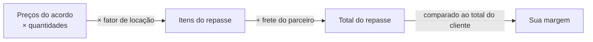
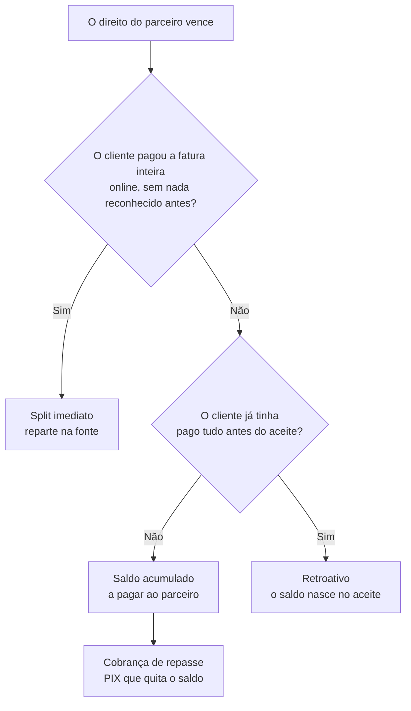

# O dinheiro da parceria

**Onde fica:** para o vendedor, em **Financeiro › Repasses**; para o parceiro, em **Meus Ganhos** — as duas telas carregam o selo **"Rede"** e aparecem também como atalhos no espaço **Rede de Parceiros**, no grupo **Financeiro da rede**.

Quando você repassa um pedido a um parceiro, dois preços convivem no mesmo negócio: o que o **cliente paga a você** e o que **você paga ao parceiro**. A diferença entre eles, menos a taxa da plataforma que couber a você, é a **sua margem** — e o LocFlow faz essa conta sozinho, mostra antes de você decidir e liquida do jeito combinado no acordo. Esta página explica a conta, o momento do pagamento, os caminhos pelos quais o dinheiro chega ao parceiro e o que acontece quando ele volta.

## Antes de tudo: o que o parceiro vê do seu dinheiro {#o-que-o-parceiro-ve}

Esta é a primeira dúvida de quase todo mundo, e a resposta curta é: ele vê **o negócio que está fazendo com você**, não o seu negócio.

* **Os preços dos itens do acordo** — o seu e o dele, item a item. Não é vazamento: "você recebe 70% do valor" só significa alguma coisa se o parceiro souber qual é o valor.
* **Quanto ele ganha** em cada operação repassada — sempre, sem exceção.
* **Quanto o cliente deve a você**, mas **só** quando o acordo o autoriza a [cobrar na rua](cobranca-na-rua.md). Sem essa autorização, ele não recebe valor nenhum da fatura: nem total, nem parcelas, nem link — só o sinal de que existe cobrança e se ela está paga ou em aberto.

O recorte completo — inclusive o que ele **não** vê — está em [Rede de Parceiros: a visão](visao-geral.md#o-que-o-parceiro-ve).


**Os dois números nunca se misturam.** Quando o parceiro cobra na porta, a tela dele mostra "o cliente deve **R$ 1.000,00** a [sua organização]" em destaque e, separado, "você recebe R$ 300,00 por esta operação". Cobrar R$ 300 de quem deve R$ 1.000 é o erro caro que essa separação existe para evitar.


## A conta {#a-conta}

O valor do parceiro nasce dos **preços do acordo** — aqueles combinados item a item quando vocês fecharam a parceria. Sobre eles, a conta é a mesma do orçamento:



Em palavras:

1. **Itens do repasse** = preço de cada item **no acordo** × quantidade × **fator de locação**.
2. **Frete do parceiro** = o que o motor de frete dele cotou para a operação (ou "a combinar", no frete manual). O frete **não** multiplica pelo fator.
3. **Sua margem** = total do cliente − repasse ao parceiro − **a sua fatia** da taxa de plataforma.


**A regra do "preço do parceiro é menor" vale entre os dois preços do acordo.** O LocFlow não deixa ativar um acordo em que o parceiro receberia mais do que o preço que você acordou para o mesmo item. Já o preço que você cobra do **cliente** é livre: você pode dar um desconto e vender abaixo do preço do acordo — o repasse combinado continua sendo honrado por inteiro. Descontar demais não é bloqueado item a item; o que aparece é o aviso de [margem insuficiente](#margem-insuficiente) quando a conta da operação não fecha.


### O fator de locação {#fator-de-locacao}

O **fator de locação** é o mesmo multiplicador de diárias/locações que engorda o preço do cliente — as **mesmas diárias** valem para os dois lados. Uma locação de 3 diárias cobra ×3 do cliente **e** paga ×3 ao parceiro sobre os preços do acordo. Justo dos dois lados: o parceiro roda a operação pelos mesmos dias que o cliente usa.

O **frete fica de fora do fator** — de novo, nos dois lados: assim como o cliente não paga 3 fretes por 3 diárias, o parceiro não recebe o frete multiplicado. Transporte é por viagem, não por dia de uso (veja [Duração, cobrança e bloqueio](../orcamentos/duracao-e-bloqueio.md#o-multiplicador-de-cobranca)).


**O comparativo já mostra essa conta pronta.** Na tela de repasse, cada candidato aparece com o total do repasse, a sua taxa de plataforma e o **"VOCÊ LUCRA"** — a margem exata. Não é uma estimativa "mais ou menos": é **a mesma conta** que a liquidação executa.



**Duas ressalvas honestas sobre esse número**, para você não estranhar depois:

* **Ele mostra o total, não o calendário.** Com o modo *por parte cumprida* — o padrão de um acordo novo — a saída acontece **em duas etapas**: o valor dos itens quando ele entrega, o frete da volta quando ele busca o material. O total é o mesmo; o momento é que se divide.
* **A margem pode terminar um pouco melhor.** Se aquele orçamento já pagou a taxa da plataforma (num repasse anterior, por exemplo) ou se ele encolher depois, o [teto por orçamento](#teto-da-taxa) devolve a taxa não cobrada à sua margem. A previsão é conservadora de propósito: ela não promete um desconto que talvez não aconteça.


## Quando o parceiro recebe: os três eixos {#quando-o-parceiro-recebe}

Este é o assunto que mais gera dúvida, e a causa é quase sempre a mesma: as pessoas tentam resolver com **uma** pergunta um combinado que tem **três**.

| Eixo | A pergunta | Quem responde |
| --- | --- | --- |
| **1. Quando** | Em que ponto da operação o direito do parceiro nasce? | O **marco** do acordo (+ a trava "só depois que o cliente pagar") |
| **2. Quanto foi ganho** | Ele recebe pelo que já fez, ou o combinado inteiro? | O **modo**: por parte cumprida × integral |
| **3. Quanto dá para antecipar** | O dinheiro do cliente já entrou para bancar isso? | O **caixa** da operação |

Você não configura três coisas separadas na mão: a tela do acordo oferece **combinados prontos** e só abre o controle fino se você pedir.

### Os combinados prontos {#combinados-prontos}

| Combinado | O que significa | Para quem |
| --- | --- | --- |
| **Pago pelo que ele fez** *(recomendado)* | Entregou, recebe pelo que entregou. Buscou de volta, recebe o frete da volta. E só sai do seu caixa depois que o cliente pagar. | Quase todo mundo. É o padrão de um acordo novo. |
| **Só quando o cliente pagar** | Você repassa na hora em que o dinheiro entra na sua conta. Nada sai antes. | Quem não quer bancar nada do próprio bolso. |
| **Confio, pago adiantado** | Você paga o combinado inteiro logo na entrega, antes de a operação terminar. | Parceiro de confiança, relação antiga. |
| **Do meu jeito** | Abre o controle fino: escolha o marco (**Quando o cliente pagar** · **Quando ele entregar** · **Quando ele buscar de volta**) e ligue ou desligue a trava "só depois que o cliente pagar". | Quem tem uma combinação própria. |


**As cinco configurações clássicas continuam existindo** — elas são o **produto** do marco pela trava, e é assim que aparecem no acordo já ativado:

| Marco | Sem a trava | Com a trava |
| --- | --- | --- |
| Quando o cliente pagar | — | **No Pagamento de Parcela pelo Cliente** |
| Quando ele entregar | **Na Entrega** | **Até a Entrega** |
| Quando ele buscar de volta | **Na Retirada** | **Até a Retirada** |

As variantes **"Até a…"** protegem o parceiro de esperar um cliente devagar: o repasse acompanha o dinheiro que entra, mas o marco é o **teto da espera** — chegou lá, o que faltar vence mesmo sem o cliente ter pago.


### Eixo 2: por parte cumprida ou o combinado inteiro {#modo-de-pagamento}

Este eixo é tão termo do acordo quanto o marco, e é o que mais muda o bolso do parceiro.

* **Por parte cumprida** *(padrão dos acordos novos)* — o parceiro recebe pelo que **fez**. É como o motoboy trabalha: entregou, recebe pela entrega; buscou de volta, recebe pela volta.
* **Integral** — você paga o combinado **inteiro** no marco, independentemente do que já foi cumprido. Não é defeito nem exceção suspeita: é a escolha legítima de quem confia no parceiro e antecipa.

Como o combinado se divide entre as duas pernas **não é um percentual que alguém escolhe** — é a operação que diz:

> O **valor dos itens** vence inteiro **na entrega** (é ali que o material vai trabalhar). O que remunera a viagem de volta é o **frete da perna de retirada**.

**Exemplo.** Repasse combinado de **R$ 300,00**: R$ 250,00 de itens + R$ 50,00 de frete (R$ 30,00 na ida, R$ 20,00 na volta).

| Momento | O que vence | Acumulado |
| --- | --- | --- |
| Entrega concluída | R$ 250,00 de itens + R$ 30,00 do frete de ida | **R$ 280,00** |
| Retirada concluída | R$ 20,00 do frete da volta | **R$ 300,00** |


**"Por parte cumprida" só vale quando o marco é o último evento da operação.** Numa locação, o último evento é a **retirada**; numa venda, é a **entrega**. Se o acordo diz "por parte cumprida" mas o marco é intermediário — "Na Entrega" numa locação, por exemplo —, pagar ali a parte da retirada seria adiantamento por definição. Nesse caso a operação paga **integral**, e o LocFlow registra o motivo em vez de mudar a regra em silêncio. A tela do acordo mostra essa consequência na hora de escolher.


### Eixo 3: o caixa manda no que dá para antecipar {#eixo-do-caixa}

Quando o acordo tem a trava **"só depois que o cliente pagar"**, o pagamento do cliente também libera repasse: a cada dinheiro que entra, vence **a proporção do que entrou**. Metade paga, metade liberada.


**O caixa manda no pagamento — ele não segura o que já foi feito.** São duas coisas diferentes, e é aqui que quase todo mundo se perde:

* **Por parte cumprida**: a proporção do dinheiro **nunca passa do que o parceiro já cumpriu**. O pagamento do cliente não antecipa serviço que não foi feito. Mas o contrário também vale — **a entrega concluída vence sozinha o que ela cumpriu**, tenha o cliente pagado ou não.
* **Combinado inteiro**: não há cumprimento limitando nada, e aí sim o pagamento do cliente **antecipa de verdade**, na proporção do que entrou.


**Exemplo.** Operação de **R$ 1.000,00** ao cliente, repasse de **R$ 300,00**, marco na retirada, trava ligada e *por parte cumprida* — que é exatamente o atalho **"Pago pelo que ele fez"**, marcado por padrão nos acordos novos. Usando a mesma divisão do eixo 2: a entrega concluída já vale **R$ 280,00** de cumprido.

| O que aconteceu | Quanto está vencido | Por quê |
| --- | --- | --- |
| O cliente pagou metade (R$ 500,00) e o parceiro **ainda não entregou** | **R$ 0,00** | A proporção do dinheiro daria R$ 150,00, mas nada foi cumprido — e aqui o cumprido é o teto. |
| **A entrega foi concluída** — tendo o cliente pagado metade, ou nada | **R$ 280,00** | O cumprimento vence sozinho: os itens mais o frete da ida. O que o cliente ainda deve não segura o serviço já prestado — vira saldo devedor seu. |
| O cliente pagou o resto, com a entrega já concluída | **R$ 280,00** *(não muda)* | O acumulado já era o cumprido. Não há mais parte feita para o dinheiro liberar. |
| Chegou a **retirada** (o marco), o cliente **não** pagou tudo | **R$ 300,00** | A retirada cumpre a última perna e vence o frete da volta. O marco é o fim da espera: o restante vence assim mesmo. |


**O que o cliente não pagou não some: vira saldo devedor seu.** Quando o direito do parceiro vence sem o dinheiro do cliente ter entrado, ele passa a constar como **o que você deve a ele**. O risco de cobrar o cliente é seu — foi exatamente isso que você combinou ao ligar (ou não ligar) a trava. A proporção é sempre arredondada **para baixo**: na dúvida, o sistema reconhece de menos, nunca de mais.


**A mesma operação, no combinado inteiro.** Trocando só o eixo 2, some o teto do cumprido: o cliente pagar metade faz vencer **R$ 150,00**, com ou sem entrega feita. É o que o atalho **"Só quando o cliente pagar"** faz — e é para isso que ele existe: quando você quer que o pagamento do cliente, sozinho, libere o repasse, sem esperar entrega nenhuma.

## Os três caminhos do dinheiro {#os-tres-caminhos}

Vencido o direito, o dinheiro percorre um de três caminhos. Você não escolhe entre eles a cada pedido — o LocFlow escolhe sozinho o melhor possível para a situação:



| Caminho | Quando acontece | Como o parceiro recebe |
| --- | --- | --- |
| **Split imediato** | O pagamento online do cliente cabe inteiro na conta (condições abaixo) | **Na fonte**: o pagamento do cliente já se reparte — cada um recebe direto a sua parte. |
| **Saldo acumulado** | O caminho mais comum: o direito vence sem um pagamento online repartível | Vira **saldo a pagar**; o vendedor quita gerando uma **cobrança de repasse** via PIX. |
| **Retroativo** | O cliente pagou **tudo antes** de o parceiro aceitar | O saldo **nasce no aceite** — nada se perde nem duplica. |

### Split imediato: reparte na fonte {#split-imediato}

O caminho mais automático — e o mais exigente. Para o pagamento do cliente já sair repartido em três (você, o parceiro e a plataforma), **tudo** isto precisa ser verdade:

* o cliente paga **online** e o pagamento quita a **fatura inteira** (numa fatura parcelada não há split completo);
* o acordo **não** é do tipo "Até a Entrega"/"Até a Retirada" (esses comissionam duas vezes — no pagamento e no marco — e o split não teria como saber);
* **nada do repasse foi reconhecido ainda** (se a entrega aconteceu antes do pagamento, o direito já nasceu e o split não repete);
* o acordo **não** está em renegociação nem encerrado (o crédito no gateway não tem volta — não se reparte dinheiro por um termo que a outra parte ainda não ratificou);
* o parceiro tem o **recebedor** configurado (veja [adiante](#recebedor-do-parceiro));
* as três partes ficam com valor positivo.

Faltando qualquer uma, o repasse cai no caminho do saldo — o valor não se perde, só muda a forma de chegar.

### A taxa sai na fonte mesmo sem split {#retencao-na-fonte}

Aqui está uma mudança que aparece no seu extrato e merece atenção: **quando o cliente paga online, os 8% daquele pagamento são retidos ali mesmo** — inclusive quando o repasse ao parceiro vai seguir pelo saldo acumulado.

O motivo é simples: a taxa não depende do marco do acordo, ela incide sobre a transação que o cliente **acabou de pagar**. Então a cobrança sai repartida em dois destinos (você e a plataforma), e o restante do dinheiro entra normalmente para você. Se o cliente pagou R$ 1.000,00, entram R$ 920,00; se pagou uma parcela de R$ 500,00, entram R$ 460,00.


**O efeito prático é bom para o seu bolso:** quando você for quitar o repasse depois, o LocFlow cobra **só a diferença**. Se a taxa já foi retida por inteiro no pagamento do cliente, o PIX de quitação vem só com o **líquido do parceiro** — a taxa não é cobrada duas vezes.


A retenção é conservadora: ela só acontece quando a taxa daquela venda ainda está **intacta**. Se alguma parte dos 8% já foi reconhecida (porque a entrega aconteceu antes do pagamento, ou porque o pedido já passou por outro parceiro), nada é retido ali — a taxa é cobrada na quitação, como sempre.

### Saldo acumulado e a cobrança de repasse {#saldo-acumulado}

Nem todo pagamento dá para repartir na fonte: o cliente pagou em dinheiro no balcão, pagou uma parcela de três, o acordo é "Na Entrega" e a entrega veio antes. Nesses casos, quando o direito vence, o valor do parceiro vira **saldo a pagar** — uma dívida sua com ele, registrada e visível para os dois lados.

Para quitar, o vendedor gera uma **cobrança de repasse**: um **PIX** no valor do saldo. Pagou, o saldo zera e o parceiro vê o ganho como **liquidado**. O próprio PIX já se reparte no destino, sem acerto por fora.

O valor a pagar aparece **detalhado**: quanto vai **ao parceiro** e quanto é **taxa de plataforma** — para você saber exatamente o que está pagando, sem caixa-preta. O telefone do pagador vem do seu cadastro de recebimento, então você **não redigita** o número a cada quitação.

#### Quitar todos os parceiros num PIX só {#quitar-em-lote}

Na tela de **Repasses**, a ação principal é **"Quitar todos via PIX"**: um único PIX que fecha o saldo de **todos** os parceiros de uma vez. O resumo no topo mostra o total decomposto — quanto vai aos parceiros e quanto é taxa da plataforma — antes de você gerar qualquer coisa.

Três coisas que valem saber:

* **Um PIX por vez.** Enquanto houver uma quitação em aberto (em lote ou individual), a outra fica travada. É o que impede pagar o mesmo repasse duas vezes.
* **Quem não tem recebimento apto fica de fora** — e o LocFlow avisa quantos ficaram, para você quitá-los individualmente depois de eles completarem o cadastro.
* **O PIX é reaproveitado.** Se você gerou e voltou depois, verá o **mesmo código**, não um novo (a menos que o anterior tenha expirado).


O saldo **acumula por parceiro**, não por pedido: vários repasses pequenos de um mesmo parceiro são quitados numa cobrança só. Menos PIX, menos conferência.


### Retroativo: o cliente pagou antes do aceite {#retroativo}

E se o cliente **quitou tudo** antes mesmo de o parceiro aceitar a solicitação? O dinheiro já entrou inteiro para você — não há mais pagamento futuro para repartir. Nesse caso o LocFlow cria o saldo **no momento do aceite**: o parceiro aceitou, o valor dele nasce devido, e segue o caminho do saldo acumulado.

O cuidado aqui é a **contagem única**: o sistema sabe o que já foi pago e o que já foi repassado — pagamentos anteriores ao aceite não geram repasse duplicado, e nenhuma parcela fica de fora.

## O parceiro cobrando o cliente na porta {#parceiro-recebeu-na-entrega}

O parceiro chega com o material e o **cliente quer pagar ali, na hora**. O que acontece depende de um termo do acordo.


Aqui você vê esse caso **pelo lado do dinheiro** — para onde ele vai e quem fica devendo a quem. A história completa (o que o parceiro passa a enxergar, as regras da tela, quando ligar e quando não) está em [Cobrança na rua](cobranca-na-rua.md).


### A regra de ouro: mostre o PIX do vendedor {#regra-de-ouro-pix}

Mesmo na porta do cliente, o melhor caminho é o **PIX do vendedor** — o mesmo do link de pagamento. Quando o acordo permite que ele cobre na rua, o parceiro **gera esse PIX ali mesmo**, na tela da entrega: o cliente paga, o dinheiro cai na **sua** conta, e não sobra acerto nenhum entre vocês dois.


**É sempre essa a recomendação.** O dinheiro vai direto para quem é dono da cobrança, o caixa do parceiro não se mistura com o seu, e ninguém precisa administrar saldo depois. Um código de pagamento resolve o que, no dinheiro, viraria conta a acertar.


Sem essa permissão no acordo, o parceiro **não cobra nada**: a tela dele não oferece nem o PIX nem o registro de recebimento, e diz apenas *"a cobrança deste cliente é do vendedor — você não recebe por este orçamento na rua"*. Ele vê só se a fatura está paga ou em aberto, que é o que muda a conduta dele na porta. Quem manda o link ao cliente é você.

### Quando o acordo permite receber na rua {#excecao-dinheiro-na-mao}

**Cobrar na rua é uma prerrogativa pactuada, não um improviso.** O acordo pode dar ao parceiro logístico o direito de **receber do cliente na porta** — em dinheiro, na maquininha dele, como for. Sem esse termo, o parceiro não consegue registrar recebimento nenhum: o app responde que *"este acordo não permite cobrar o cliente na rua — mostre o PIX do vendedor para o pagamento"*.


**Vale hoje para o parceiro externo.** Quem pode coletar na porta é o **parceiro logístico externo** — o convidado que trabalha dentro da sua conta (veja [Parceiro Logístico Externo](parceiro-logistico-externo.md)). Na parceria entre **duas organizações**, quem recebe do cliente continua sendo você, e o caminho na porta é sempre o seu PIX. E se você quer essa prerrogativa num acordo, leia antes as [limitações desta versão](cobranca-na-rua.md#quando-ligar).


Quando o acordo permite, três coisas continuam valendo, e é bom que fiquem claras:

1. **A cobrança continua sendo sua.** A fatura é sua, o cliente é seu, a relação é sua. O parceiro é **coletor no ponto de entrega**, não dono do crédito. O número que ele cobra é o que o cliente deve **à sua organização** — nunca o repasse dele.
2. **Ele só pode fechar a cobrança inteira.** A declaração de recebimento tem de ser, sozinha, **todo o caixa daquela operação**: nada recebido antes, nada aguardando conferência, nenhuma outra parcela em aberto, e o valor precisa cobrir o saldo. Coleta parcial ou fatura parcelada **não passa** — o caminho ali é o PIX do vendedor.
3. **A palavra dele fecha o caixa na hora.** Como o dinheiro está com ele, a declaração **não** entra na fila de conferência da sua tesouraria: a fatura é quitada na hora e o acerto passa a ser entre vocês dois. E o seu financeiro **não** lança uma entrada de caixa que você não recebeu — a entrada acontece quando ele te paga.

### O sentido inverso do repasse {#repasse-inverso}

Quem coletou o dinheiro é quem fica devendo. É esse fato — e não a bandeira do acordo — que decide a direção:

| Quem recebeu do cliente | O que acontece |
| --- | --- |
| **Você** (PIX, link, dinheiro registrado pela sua equipe) | Repasse normal: você deve ao parceiro. Vale inclusive nos acordos que permitem cobrança na rua. |
| **O parceiro**, na porta | **Inverte**: agora é ele que deve a você. |
| **Ninguém ainda** | O repasse **espera** — em vez de gravar um sentido chutado, o sistema aguarda o caixa fechar. |

**Exemplo com números.** Operação de **R$ 1.000,00** ao cliente, repasse de **R$ 300,00** ao parceiro, taxa de 8% inteira do seu lado.

| Se quem recebeu foi… | Quem paga quem | Valor |
| --- | --- | --- |
| **Você** | Você paga ao parceiro | **R$ 380,00** — R$ 300,00 a ele + R$ 80,00 de taxa |
| **O parceiro** | Ele paga a você | **R$ 700,00** — R$ 620,00 da sua margem + R$ 80,00 de taxa |

Nos dois casos o parceiro fica com R$ 300,00, você fica com R$ 620,00 e a plataforma com R$ 80,00. A conta é a mesma; só muda a mão que estava segurando o dinheiro.

Para o parceiro isso aparece em **Meus Ganhos** como **"A pagar à organização"**, com o botão de **quitar via PIX**; para você, em **Financeiro › Repasses**, como um valor **a receber** daquele parceiro.


**Marcou errado? Dá para desfazer — enquanto ninguém pagou.** Tanto o **parceiro** (corrigindo um engano) quanto **você** (se o cliente disser que não pagou) podem desfazer a baixa: o pedido volta a aberto e o saldo some, sem dinheiro nenhum ter se movido. Duas exceções: se já existe um **PIX de acerto em aberto**, cancele-o (ou espere expirar) antes de reverter; e se o parceiro **já pagou** o acerto, o caminho deixa de ser desfazer e passa a ser **estorno**, com devolução e registro em trilha.


## Quando o cliente pede o dinheiro de volta {#estorno}

Cliente contestou a compra no cartão, ou você devolveu o valor. O pagamento online **não** é desfeito na mão por ninguém, mas existe um caminho automático de **estorno**, e ele mexe em mais coisas do que parece. Vale saber antes de acontecer.

Quando o estorno de um pagamento chega ao LocFlow:

1. **A parcela reabre** na fatura — o cliente volta a dever.
2. **A entrada sai do seu financeiro** — aquele dinheiro deixa de constar como recebido.
3. **Se o repasse tinha saído no split imediato**, ele é revertido junto: o parceiro não recebeu e a taxa também volta atrás.
4. **Se o repasse veio pelo saldo acumulado e você já quitou, o dinheiro não volta sozinho do parceiro.** O LocFlow não apaga um valor que já se moveu de verdade: devolver é uma conversa comercial entre vocês, não um automatismo. O que é corrigido automaticamente é o reconhecimento da taxa da plataforma sobre uma venda que voltou.


**Estorno de uma parcela só (fatura parcelada) é diferente.** Se o cliente estornou uma parcela e o restante continua pago, a operação ainda gerou intermediação — então a taxa da plataforma daquela venda é **mantida**, e um ajuste proporcional, se for o caso, é decisão contábil. Só quando o caixa da operação **zera** por completo é que a taxa é cancelada por inteiro.


Um detalhe que joga a favor: uma linha de repasse **estornada ou cancelada deixa de contar** — nem como direito já reconhecido, nem como taxa já cobrada. Se a operação recomeçar, ela recomeça limpa.

## Onde ver {#onde-ver}

| Você é… | A sua tela | O que mostra |
| --- | --- | --- |
| **Vendedor** | **Financeiro › Repasses** | Tudo o que você deve e já pagou a parceiros — e, quando um parceiro recebeu do cliente por você, também **o que ele tem a te repassar**. |
| **Parceiro** | **Meus Ganhos** | Tudo o que você tem a receber e já recebeu — e, se você recebeu do cliente na entrega, também **o que tem a repassar** ao vendedor. |

Se você opera uma organização, as duas telas vivem no menu **Financeiro** com um selo **"Rede"** — porque são dinheiro de verdade, junto do resto do seu financeiro — e têm **atalhos fixos** no espaço **Rede de Parceiros**, no grupo **Financeiro da rede**. Se você é um **parceiro externo**, elas ficam direto no seu menu da Rede, junto de *Repasses recebidos* e *Minha reputação*.

## Como ler seus ganhos {#status-dos-ganhos}

Em **Meus Ganhos**, todo valor está num de três **estágios de liquidação** — os mesmos três que aparecem coloridos logo abaixo do total, e que voltam agrupando as operações no detalhe de cada acordo:

| Estágio | Cor | O que significa |
| --- | --- | --- |
| **Realizado** | verde | Já liquidado — o dinheiro é seu neste período. |
| **A receber** | azul | Combinado e confirmado, aguardando a liquidação (a quitação do saldo pelo vendedor, ou o vencimento pelo acordo). |
| **Em processamento** | âmbar | O pagamento online do cliente ainda está sendo compensado pelo gateway; assim que cai, vira **realizado**. |

O número em destaque no topo **soma os três**: é tudo o que você tem para o período escolhido, tratando o que está a caminho como já sendo seu. É a mesma leitura no detalhe de um acordo, onde as operações aparecem **agrupadas por estágio**, com as mesmas cores.


Se você **recebeu do cliente na entrega** e ficou devendo ao vendedor, aparece também um valor **"A pagar à organização"** (âmbar), com o botão de **quitar via PIX** ali mesmo — na visão geral e no próprio acordo. Veja [O sentido inverso do repasse](#repasse-inverso).


O período (mês, semana, intervalo…) vale para as duas telas e pode ser ajustado **dentro** do detalhe do acordo — útil para filtrar as operações sem voltar. Use o **"?"** no topo de Meus Ganhos para rever esses estágios a qualquer momento.

## O recebedor: sem ele o dinheiro empaca {#recebedor-do-parceiro}

O **recebedor** é o cadastro de recebimento que diz para onde vai o dinheiro de cada parte. É o mesmo conceito do recebedor da sua organização na [cobrança online](../cobranca/pagamento-online.md#ativando-o-recebimento): um cadastro guiado, feito uma vez, com verificação de identidade (KYC).

Na parceria ele **não é um opcional que "só deixa mais lento"** — é pré-requisito, em três frentes independentes:

| Quem precisa | Para quê | Sem ele |
| --- | --- | --- |
| **O parceiro logístico** | Receber o repasse | Você **não consegue gerar** o PIX de quitação daquele parceiro. O saldo nasce e fica registrado, mas não há como pagá-lo pelo app. |
| **A sua organização** | Ser a pagadora do PIX de quitação | Nenhuma quitação de repasse sai — nem individual, nem em lote. |
| **O parceiro** (de novo) | Quitar a dívida dele, quando ele cobrou o cliente na rua | Ele não consegue gerar o PIX do acerto: *"complete seu cadastro de recebimento para quitar via PIX"*. |


**Não deixe para depois.** O saldo continua nascendo e crescendo mesmo sem recebedor — o que não existe é o caminho para pagá-lo dentro do LocFlow. Descobrir isso no dia em que o parceiro cobra o dinheiro dele é o pior momento possível.


Na tela **Meu recebimento** (para o parceiro externo), o cadastro mostra um **passo a passo** — cadastrar, validar, aprovar, recebendo — para você saber exatamente em que ponto está. Quando o meio de pagamento exige a confirmação de identidade, aparece o cartão **"Falta a prova de vida para liberar seu saldo"**, com o botão **"Fazer prova de vida agora"**. Ele gera um endereço (e um QR Code) que dá para **abrir aqui** mesmo, **enviar** ao responsável ou **copiar** — o link **vale 20 minutos**, então é sempre gerado na hora; se expirar, gere outro ali mesmo. Assim que a identidade é aprovada, a conta fica **ativa** e os repasses passam a poder ser liquidados. Veja também [Saldo e antecipação](../cobranca/saldo-e-antecipacao.md).

## Para quem quer os números {#para-quem-quer-os-numeros}

A partir daqui é detalhe. Você **não** precisa disso para usar a Rede de Parceiros.

### A fórmula completa {#formula-completa}

```
itens do repasse   = Σ (preço do item no acordo × quantidade) × fator de locação
frete do parceiro  = cotação do motor de frete do parceiro (não multiplica pelo fator)
total do repasse   = itens do repasse + frete do parceiro

taxa da plataforma = 8% do TOTAL DO CLIENTE, dividida entre as duas partes
sua margem         = total do cliente − total do repasse − a SUA fatia da taxa
líquido do parceiro = total do repasse − a fatia DELE da taxa
```

E a soma sempre fecha: **sua margem + líquido do parceiro + taxa da plataforma = total do cliente.**

- O **fator de locação** é o mesmo multiplicador aplicado ao preço do cliente (quantidade fixa de locações ou diárias do evento — veja [Duração e bloqueio](../orcamentos/duracao-e-bloqueio.md)).
- No **frete manual** ("a combinar"), o frete fica fora da conta automática — vocês acertam o transporte entre si, e o comparativo mostra o candidato na seção própria, sem margem calculada.

### A taxa da plataforma {#taxa-de-plataforma}

A **taxa de plataforma** é o que mantém a Rede funcionando — descoberta, reputação, cálculo e liquidação automáticos. Três fatos que quase todo mundo entende errado:

**1. São 8%, fixos.** Não variam por plano de assinatura, não sobem com o volume, não têm letra miúda. O que o acordo escolhe é só **quem paga**.

**2. Incidem sobre o total da operação — o que o cliente paga —, não sobre o repasse.** Este é o ponto que mais confunde. Numa venda de **R$ 1.000,00** com repasse de **R$ 300,00**, a taxa é **R$ 80,00** (8% de R$ 1.000,00), e não R$ 24,00.

**3. A divisão é um termo negociável do acordo.** Por padrão os 8% ficam inteiros do lado do **vendedor**, mas na seção **Ajustes finos** do acordo há um controle que move essa fatia ponto a ponto entre as duas partes — 8/0, 6/2, 4/4, o que vocês combinarem, desde que some 8%. Como todo termo do acordo, vale depois do aceite das duas partes.

Veja a mesma operação nas duas divisões:

| | Taxa **8% você / 0% ele** | Taxa **6% você / 2% ele** |
| --- | --- | --- |
| Total do cliente | R$ 1.000,00 | R$ 1.000,00 |
| Repasse combinado | R$ 300,00 | R$ 300,00 |
| Taxa — sua fatia | R$ 80,00 | R$ 60,00 |
| Taxa — fatia dele | R$ 0,00 | R$ 20,00 |
| **Sua margem** | **R$ 620,00** | **R$ 640,00** |
| **Líquido do parceiro** | **R$ 300,00** | **R$ 280,00** |
| Você paga na quitação | R$ 380,00 | R$ 360,00 |


**Cada lado vê a taxa que ELE paga.** No detalhe de um acordo, o vendedor lê a fatia dele; o parceiro lê a dele (já descontada do que recebe). O número que cada um vê é o que sai (ou entra) no bolso dele — e a conta é a mesma nos dois sentidos, inclusive quando o parceiro cobra o cliente na rua.


### O teto por orçamento: 8% uma vez, não 8% por parceiro {#teto-da-taxa}

Os 8% incidem sobre a **transação do cliente**. O cliente pagou **uma vez** — então a plataforma cobra **uma vez**, por mais parceiros que aquele pedido atravesse.

**O caso clássico: você repassou e teve de repassar de novo.** O parceiro A executou e já foi pago (a taxa daquela venda saiu com ele); depois, o mesmo pedido acabou indo para o parceiro B.

| | Parceiro A | Parceiro B |
| --- | --- | --- |
| Direito dele | R$ 300,00 | R$ 300,00 — **inteiro**, ele executou |
| Taxa da plataforma | R$ 80,00 | **R$ 0,00** — os 8% daquela venda já foram cobrados |

Repare nas duas réguas, que são **diferentes de propósito**:

* o teto do **direito** é **por parceiro** — quem executa a operação recebe o que combinou, sempre;
* o teto da **taxa** é **por orçamento** — porque o fato que a gera é o pagamento do cliente, e ele aconteceu uma vez só.


**O que o teto resolve e o que ele não resolve.** Ele impede que a plataforma cobre duas vezes sobre a mesma venda. Ele **não** faz você pagar um parceiro só: se dois executaram, os dois recebem — e a sua margem sente isso. Repassar duas vezes o mesmo pedido continua sendo caro para você; só não é caro em dobro na taxa.


O mesmo teto protege você quando o **orçamento muda de valor** no meio do caminho. Se uma primeira fatia do repasse já foi reconhecida sobre R$ 1.000,00 e depois o pedido encolhe para R$ 500,00, a soma das taxas fecha em 8% de **R$ 500,00** — o valor que valeu de verdade. E o que a plataforma deixa de cobrar **volta a quem pagaria**: a fatia do vendedor volta para a sua margem, a fatia do logístico volta para o líquido dele, sem perder um centavo no caminho.

### Teto de margem: "margem insuficiente" {#margem-insuficiente}

A conta de uma operação repassada tem duas guardas, e as duas existem para impedir que alguém saia com valor negativo:

* **o total do cliente precisa cobrir o repasse mais a sua fatia da taxa** — senão a sua margem seria negativa;
* **o repasse precisa cobrir a fatia da taxa que cabe ao parceiro** — senão ele receberia menos que zero.

Se qualquer uma estourar — preços do acordo altos demais para aquele pedido, frete do parceiro caro para aquele destino, desconto agressivo ao cliente —, o comparativo marca o candidato como **"margem insuficiente"** e não deixa a escolha passar batida: você veria prejuízo antes de assinar embaixo. Há ainda uma trava anterior e mais simples, que barra o repasse maior que o próprio total da operação.

Isso não é um erro — é o comparativo fazendo o trabalho dele. Vale conferir os preços daquele acordo, rever o desconto ou escolher um parceiro mais perto do destino.

### Quem paga a maquininha e quem responde pelo estorno {#encargos}

Ainda nos **Ajustes finos**, o acordo tem **dois termos separados**, que muita gente confunde com um só:

| Termo | O que decide | Padrão |
| --- | --- | --- |
| **Quem paga a taxa da maquininha** | Quem arca com a tarifa do processador de pagamentos naquela cobrança | Você (o vendedor) |
| **Se o cliente pedir dinheiro de volta, quem devolve** | Quem responde por estorno e contestação de cartão | Você (o vendedor) |

Eles são independentes de propósito: dá para combinar que o parceiro absorve a tarifa do PIX sem que ele responda por um chargeback de cartão, e vice-versa.


**Duas despesas diferentes, dois nomes diferentes.** A **taxa da plataforma** (os 8% da Rede) e a **taxa de gateway** (o que o processador cobra para mover o dinheiro) são coisas distintas e entram separadas no seu financeiro, cada uma na sua categoria. Veja [Taxas do pagamento online](../cobranca/taxas-do-gateway.md). Quando a cobrança sai repartida só entre você e a plataforma — o caminho da [retenção na fonte](#retencao-na-fonte) —, esses encargos ficam com a sua organização, porque o parceiro não é destino daquele pagamento.


## Situações reais {#situacoes-reais}

- **Cliente paga o link inteiro, acordo "Só quando o cliente pagar", parceiro com recebedor.** O pagamento se reparte na hora em três: a parte do parceiro cai direto para ele, a taxa vai para a plataforma, o resto fica com você. Ninguém gera nada.
- **Cliente paga a primeira de três parcelas, online.** Não há split completo (o pagamento não quita a fatura inteira), mas os 8% **daquela parcela** já são retidos ali. Se o acordo tem a trava *"só depois que o cliente pagar"*, o direito do parceiro vence pro-rata e vira saldo — limitado ao que ele já cumpriu, quando o acordo é *por parte cumprida*. Sem a trava (*"Na Entrega"*, *"Na Retirada"*), o pagamento do cliente não faz nada vencer: quem manda ali é o marco. Na quitação, o LocFlow cobra só a parte da taxa que ainda faltava.
- **Cliente paga na entrega, em dinheiro, à sua equipe.** A baixa entra em conferência, e quando a tesouraria confirma o direito do parceiro vence. No fim da semana você abre **Financeiro › Repasses** e usa **Quitar todos via PIX** — um código fecha os três parceiros do mês.
- **Cliente paga na entrega, em dinheiro, ao parceiro (acordo permite).** A palavra dele fecha a fatura na hora e nasce o saldo ao contrário: ele te repassa a sua margem + a taxa, por PIX. Marcou por engano? Um dos dois desfaz, enquanto ninguém pagou.
- **Cliente quer pagar metade em dinheiro ao parceiro.** Não passa — a coleta na rua é tudo ou nada. O parceiro mostra o **seu PIX** para a parte que o cliente vai pagar, e o resto segue na fatura.
- **Acordo "Na Entrega", cliente ainda não pagou.** A entrega concluiu, o parceiro fez a parte dele — o repasse vira devido mesmo sem o pagamento do cliente. O risco de cobrança do cliente é seu, como combinado no acordo.
- **Cliente quitou tudo, e só depois você repassou o pedido.** No aceite do parceiro, o saldo nasce retroativo — exatamente o valor dele, sem repasse dobrado.
- **Você já tinha pago o parceiro A e o pedido acabou indo para o B.** B recebe o direito dele inteiro, porque foi ele quem executou; a taxa da plataforma daquela venda **não** é cobrada de novo. Você paga dois parceiros, mas 8% uma vez só.
- **Candidato ótimo, mas "margem insuficiente".** Para aquele pedido pequeno e distante, o frete do parceiro come a margem. Você escolhe outro candidato — ou renegocia os preços do acordo.

## Próximo passo {#proximo-passo}

- Entenda os termos que definem a conta — itens acordados, marco do pagamento, janelas — em [Acordos de parceria](acordos-de-parceria.md).
- Veja o caso do parceiro que recebe o cliente na porta, do começo ao fim, em [Cobrança na rua](cobranca-na-rua.md).
- Veja o panorama da Rede de Parceiros em [Rede de Parceiros: a visão](visao-geral.md).
- Configure o seu recebedor (ou oriente o parceiro a configurar o dele) em [Pagamento online](../cobranca/pagamento-online.md).
- Entenda a diferença entre os 8% da Rede e a tarifa do processador em [Taxas do pagamento online](../cobranca/taxas-do-gateway.md).
- Reveja como o preço do cliente se forma em [Valores do orçamento](../orcamentos/valores.md).
