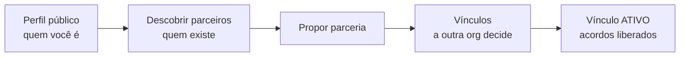

# Entrando na rede

**Onde fica:** no espaço **Rede de Parceiros** — o alternador no menu lateral (ou na aba Menu) que troca da sua Operação para a Rede, com as abas **Início · Descobrir · Acordos · Menu**. É um espaço próprio, com o seu acento visual, porque parceria é um assunto diferente do dia a dia da locação: aqui você não atende cliente, você se conecta a outras empresas.

Esta página é sobre o **primeiro passo**: como as conexões nascem. O que acontece depois — os acordos, o repasse de pedidos, o dinheiro — tem as suas próprias páginas; comece pela [visão geral das parcerias](visao-geral.md) se ainda não leu.

## Dois jeitos de se conectar {#dois-jeitos}

O LocFlow tem dois tipos de conexão, para dois momentos diferentes do seu negócio:

| | **Parceiro externo** | **Parceria interna (org↔org)** |
| --- | --- | --- |
| **Quem é** | Um transportador ou autônomo que trabalha **para você** | Outra **organização LocFlow** de verdade |
| **Como entra** | Você envia um **link de convite** | Uma das duas **propõe**, a outra **aceita** |
| **Onde ele trabalha** | **Dentro da sua conta**, com papel fixo de parceiro — vê só o que é dele | Cada uma na **própria conta**; o vínculo conecta as duas |
| **Para quê** | Repassar a execução dos seus pedidos a alguém de confiança | Acordos formais, com catálogos mapeados item a item e estoque espelhado |


**Não precisa escolher para sempre.** Muitos parceiros começam externos — o motorista que faz as suas entregas — e, quando crescem e criam a própria organização, o acordo pode ser **promovido** para org↔org sem perder a reputação acumulada. Comece pelo que resolve hoje.


## Convidar um parceiro externo {#convidar-parceiro-externo}

O jeito mais rápido de trazer alguém para dentro. Use quando existe **uma pessoa ou transportadora que executa a logística para você** — o motorista de sempre, o freteiro do bairro — e que não tem (nem precisa ter) uma conta LocFlow própria.

O caminho: **Rede › Parceiros externos**, botão de **convidar**. A tela **Convidar parceiro externo** pede quatro coisas:

1. **Nome** do parceiro (ex.: *Márcia Fretes*).
2. **E-mail (recomendado)** — e este campo faz mais do que parece: leia o aviso abaixo antes de pular.
3. **Por onde você vai enviar** o convite — o canal que ele vai usar para abrir o link.
4. **O galpão dele** — o ponto de saída do parceiro, a origem do frete que ele cobra. Você já preenche aqui, no convite; não é um cadastro para depois.

Toque em **Convidar** → o LocFlow gera um **link de convite**.


**O e-mail não é para "avisar por e-mail" — é a tranca do convite.** Informando o endereço, **só quem entrar com esse e-mail consegue aceitar** o convite. Sem ele, o próprio app te alerta:

> *Sem e-mail, o link vira a chave de acesso: quem o receber (ou interceptar) entra na sua conta como parceiro, vê os preços acordados e cadastra a própria conta bancária para receber os repasses.*

Se você for enviar mesmo assim, envie **por canal privado, direto à pessoa** — nunca em grupo.


Envie o link por onde quiser (o app tem o botão **Compartilhar link** — WhatsApp resolve). Pelo link, o parceiro **cria o próprio acesso** e cadastra os dados bancários para receber os repasses. Ao entrar, ele cai num **espaço só dele**: enxerga as reservas que você repassa, os movimentos que executa e os ganhos — e **nada** do resto da sua operação. O papel é fixo; ele não vira usuário comum da sua conta.


**Por que isso é seguro:** o parceiro externo não vê os seus clientes, os seus outros orçamentos nem a sua carteira — só existe para ele o que você repassa. O que ele **vê** é o combinado: os itens do acordo, o **preço ao cliente deles** e quanto ele ganha em cada um. Sem esse preço, "você recebe 60%" não significaria nada — e é por isso que ele aparece dos dois lados. O recorte completo está em [Rede de Parceiros: a visão](visao-geral.md).


Depois do convite aceito, falta **um** cadastro para o parceiro ficar operacional: o **recebedor** de pagamento — que só ele mesmo pode preencher, porque são os dados bancários dele. O **galpão** já ficou pronto no convite (e ele pode ajustar o pino depois, em **Meu galpão**). O passo a passo completo, incluindo o que ele enxerga por dentro, está em [Parceiro Logístico Externo](parceiro-logistico-externo.md).

### O link tem prazo — e expirar não é o fim {#renovar-convite}

O link de convite **vale por 7 dias**. O prazo aparece na própria listagem de parceiros, no selo do convite: *"Convite expira em 5 dias"*, *"expira hoje"* — e, passado o prazo, **"Convite expirado"**.

Convite expirado não abre mais — se o parceiro disser que "o link não funciona", é provavelmente isso. **Não precisa remover o parceiro nem convidar de novo**: na linha dele, o botão de copiar dá lugar ao botão de **gerar um novo link** (↻). Um toque e:

* O link antigo é **invalidado de vez** (mesmo que alguém o tenha guardado);
* Um link **novo, com prazo novo de 7 dias**, é gerado, copiado e — se o convite tinha e-mail — **reenviado por e-mail**;
* O parceiro continua **o mesmo** na sua lista: nada é duplicado, nenhum histórico se perde.

O novo link mantém o direcionamento do original (app ou navegador) e a mesma tranca de e-mail. E se o link só se **perdeu** (a mensagem sumiu, mas o prazo ainda corre), não precisa esperar nada: o botão de **copiar** continua na linha do parceiro enquanto o convite vale.

## Parceria interna: de organização para organização {#parceria-interna}

Quando **as duas partes são organizações LocFlow**, a conexão é um **vínculo de parceria** — proposto por uma, aceito pela outra. O vínculo ativo é o que habilita os acordos internos, com mapeamento de catálogo e estoque espelhado. A jornada tem três telas, todas na Rede.

### 1. Monte o seu perfil público {#perfil-publico}

Em **Rede › Perfil público** você decide **como a sua organização aparece** para quem procura parceiros. E a regra de ouro: **nada aparece sem você ativar** — a chave **"Aparecer no diretório"** vem desligada, e o seu perfil só entra na vitrine quando você a liga.

O que dá para configurar:

| Campo | Para quê |
| --- | --- |
| **Papéis oferecidos** | O que você oferece à rede: **vendedor** (tem clientes e repassa pedidos), **logístico** (executa operações para outros) — ou os dois. É obrigatório escolher ao menos um para aparecer no diretório. |
| **Apresentação** | Um texto curto sobre a sua operação (ex.: *"Transportadora com frota própria, atuação na Grande SP"*). |
| **Cidade-sede** (opcional) | De onde você opera — ajuda quem busca parceiro por região. |
| **Galpões** | Os seus galpões aparecem na vitrine com a **distância** até quem olha — a informação mais prática para decidir se a logística fecha. |
| **Exibir catálogo com preços** (opcional) | Deixa o seu catálogo de bens móveis visível na vitrine, para o parceiro em potencial ver com o que você trabalha. |
| **Sugerir a minha precificação a parceiros** | Permite que uma organização **com vínculo ativo** use os seus números como ponto de partida ao montar um acordo. Vem **ligada**; você desliga quando quiser (veja [O que o vínculo concede](#o-que-o-vinculo-concede)). |


**Perfil público não é anúncio ao cliente final.** Quem vê é **outra organização** procurando parceiro — por isso faz sentido mostrar galpões e catálogo: são os dados que um parceiro avalia antes de propor.



**Para propor, você também precisa aparecer.** O botão de propor parceria só funciona se o **seu** perfil público estiver ativo. A regra é simétrica de propósito: se você não pode ser visto, não pode pedir para ver.


### 2. Descubra parceiros {#descobrir-parceiros}

**Rede › Descobrir parceiros** é o diretório: as organizações que ativaram o perfil público, com **busca por nome** e filtros por papel (**Vendedores** / **Logísticos**). Procurando quem execute as suas entregas? Filtre por logísticos. Tem estrutura sobrando e quer receber pedidos? Olhe os vendedores da sua região.

Tocar numa organização abre a **vitrine** dela:

* A **apresentação** e a cidade-sede.
* A **reputação pública** — a nota média, quantas avaliações e o **selo** (Novo, Bronze, Prata, Ouro, Diamante). São avaliações **mútuas entre organizações**, com proteção anti-retaliação — dá para confiar no número.
* Os **galpões**, cada um com a **distância** até você.
* O **catálogo público**, quando a organização optou por exibi-lo.

### 3. Proponha a parceria {#propor-parceria}

Gostou do que viu? O botão **Propor parceria** fica na própria vitrine. Você pode anexar uma **mensagem (opcional)** — algo como *"Operamos na mesma região — vamos fechar uma parceria?"* — e enviar. A outra organização é **avisada na hora** e decide na tela de Vínculos dela.

Propor **não fecha negócio nenhum** — nem preço, nem estoque, nem obrigação de repassar. Os termos de verdade vêm depois, no **acordo**. Mas o aceite do vínculo **concede uma coisa concreta**, e vale saber qual antes de dizer sim.

### O que o aceite de um vínculo concede {#o-que-o-vinculo-concede}

Com o vínculo **ativo**, a outra organização passa a poder **usar os seus números como sugestão** ao montar um acordo com você. O app declara isso na tela, antes do "aceitar":

> Para montar um acordo, **\[a outra organização]** poderá usar como sugestão o seu **motor de frete publicado**, os seus **galpões** e o seu **preço de tabela** dos itens equivalentes. O que for derivado para um acordo fica congelado lá, mesmo que o acordo não seja fechado.

Três coisas para entender bem essa frase:

* **É sugestão, não autorização de venda.** Ela vira uma **proposta** de acordo, que você ainda precisa aprovar. Nada passa a valer sozinho.
* **O que ela puxou fica com ela.** Se a proposta for montada e o acordo não fechar, os números que entraram naquele rascunho **permanecem lá**. Não é possível "despuxar".
* **Nasce ligado, e você desliga quando quiser.** A chave fica no seu **Perfil de parceria** (**Rede › Meu perfil público**). Desligar **não** rompe o vínculo: *"você pode desligar essa sugestão a qualquer momento — o vínculo continua valendo"*.


O mesmo aviso aparece nos **dois caminhos** em que você decide: na lista de **Vínculos** e no botão de aceitar da **vitrine** do parceiro. **Recusar** não passa por essa declaração — quem recusa não concede nada.



**Aceitar um convite aprova só o que a tela mostrou.** Quando você aceita um convite (de colaborador ou de parceiro) que traz acordos junto, ficam aprovados **exatamente os acordos que apareceram na tela** — não tudo o que estiver pendente no seu nome. Se aparecer um acordo que você não reconhece, é hora de perguntar antes de tocar em aceitar.


### 4. Acompanhe em Vínculos {#vinculos}

**Rede › Vínculos** lista todas as suas conexões org↔org, cada uma com o seu status:

| Status | O que significa | O que dá para fazer |
| --- | --- | --- |
| **Pendente** | A proposta está no ar — *enviada por você* ou *aguardando sua decisão* | Quem recebeu: **aceitar** ou **recusar**. Quem enviou: **retirar a proposta**. |
| **Ativo** | As duas organizações estão conectadas | Propor e fechar **acordos internos**; ou **encerrar o vínculo**. |
| **Encerrado** | A conexão foi desfeita e os acordos do par foram cancelados | Um novo vínculo pode ser proposto no futuro — e um novo acordo, do zero. |

O vínculo **ativo** é a chave que abre a porta dos [acordos de parceria](acordos-de-parceria.md): itens mapeados entre os dois catálogos, modelo de pagamento do repasse, janelas de aceite e desistência. Sem vínculo ativo, não há acordo interno.

### Encerrar o vínculo: o que acaba e o que sobrevive {#encerrar-vinculo}

**Encerrar não é uma pausa.** É o ato terminal da relação org↔org, e ele mexe em muita coisa de uma vez — por isso pede confirmação.

O que **acaba**, na hora:

* **Os acordos entre as duas organizações são cancelados** — nos **dois sentidos**. Se vocês tinham um acordo em que você vende e ela executa, e outro em que ela vende e você executa, os dois caem.
* **Repasse novo é barrado.** Se alguém tentar repassar um pedido por aquele acordo, o app responde: *"A parceria com esta organização foi encerrada — não é possível repassar operações novas por este acordo. As operações que ela já aceitou seguem valendo."*
* **O acesso entre as contas é cortado**: ela deixa de alcançar a roteirização, a fila do balcão, os dados do cliente e a situação da cobrança dos pedidos que eram seus.
* **As solicitações que ainda aguardavam resposta são canceladas**, e o responsável de cada orçamento é avisado de que a operação voltou para ele.

O que **sobrevive**:


**O que ela já aceitou continua valendo.** As operações com aval vigente seguem sendo executadas, seguem alcançáveis por ela e **seguem sendo pagas** — encerrar o vínculo não confisca o dinheiro de um trabalho combinado antes do rompimento. Compromisso assumido é compromisso, dos dois lados.


Se a relação pode voltar, converse antes de encerrar: um vínculo novo é fácil de propor, mas os **acordos precisam ser refeitos** e o mapeamento item a item, revalidado.

## Boas práticas de conexão {#boas-praticas}

Três hábitos que separam as parcerias que engrenam das que morrem na proposta:

* **Capriche no perfil antes de propor.** Uma vitrine com apresentação escrita, galpões cadastrados e papéis claros gera muito mais aceite do que um perfil vazio — a outra organização decide pelo que vê. Se você exibe o catálogo, melhor ainda: o parceiro já avalia se os itens conversam.
* **Comece com um acordo pequeno.** Fechou o vínculo? Não mapeie o catálogo inteiro no primeiro dia. Um acordo com poucos itens e volume baixo deixa os dois lados aprenderem o ritmo um do outro — e a reputação vai se construindo a cada reserva concluída.
* **Combine uma janela de aceite realista.** O acordo define com quantas horas de antecedência o parceiro precisa responder a um repasse. Apertar demais gera prazo estourado (e penalidade para o parceiro); folgar demais deixa você sem resposta perto da operação. Conversem sobre a rotina real de cada um antes de cravar o número.
* **Sempre coloque o e-mail no convite externo.** São dez segundos que transformam um link "quem pegar, entra" numa porta que só abre para a pessoa certa. É a diferença entre um parceiro e um desconhecido dentro da sua conta.

## Por porte {#por-porte}

| Se você é… | O caminho mais provável |
| --- | --- |
| **Autônomo / MEI / micro** | Convide o seu freteiro de confiança como **parceiro externo** — link no WhatsApp, cinco minutos, e ele já recebe os seus repasses. Perfil público pode esperar. |
| **Médio** | Ative o **perfil público** e explore o Descobrir: uma parceria interna com uma organização vizinha vira capacidade extra na alta temporada — sem contratar frota. |
| **Grande / muitas filiais** | Opere os dois lados: ofereça-se como **logístico** para vendedores da região (receita com a estrutura ociosa) e mantenha vínculos ativos com vários parceiros para nunca recusar pedido por falta de braço. |

## Próximo passo {#proximo-passo}

* Convidou um parceiro externo? Complete o cadastro dele em [Parceiro Logístico Externo](parceiro-logistico-externo.md).
* Vínculo ativo? Hora de negociar os termos em [Acordos de parceria](acordos-de-parceria.md).
* Ainda situando as peças? A [visão geral das parcerias](visao-geral.md) mostra o mapa completo.
* O parceiro só cota frete para você (sem repasse de pedido)? Isso é outro papel — veja [Fornecedores de frete](fornecedores-de-frete.md).
