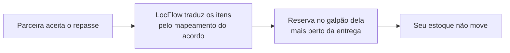

# Estoque na parceria

Quando você repassa um pedido a uma organização parceira, uma pergunta prática decide tudo: **de onde sai o material?** A resposta do LocFlow é direta — **do estoque dela**. Esta página mostra como isso acontece sozinho, sem planilha paralela e sem telefonema para "confirmar se tem".


Esta página é sobre a **parceria interna** — quando as duas partes são organizações LocFlow de verdade, conectadas por um vínculo e um [acordo de parceria](acordos-de-parceria.md). No **parceiro externo** (o convidado que trabalha dentro da sua conta), nada disto se aplica: ele não tem estoque no sistema, e o material continua saindo do **seu** galpão, como em qualquer pedido. Veja [Parceiro Logístico Externo](parceiro-logistico-externo.md).


## O essencial {#o-essencial}

No momento em que a parceira **aceita** a solicitação de repasse, o material do pedido passa a ser **responsabilidade dela**:

* O LocFlow **traduz** os itens: cada bem móvel do **seu** catálogo vira o item correspondente do catálogo **dela**, pelo mapeamento item-a-item definido no acordo.
* A quantidade é **reservada no galpão dela mais próximo do endereço de entrega** — como se ela mesma tivesse fechado aquele pedido.
* O **seu estoque não move**. Você vendeu; quem separa, entrega e recolhe o material é a parceira, com os itens dela.

É por isso que a parceria interna escala: você pode fechar um pedido numa cidade onde não tem um único item em prateleira — o material existe do lado de lá, e o sistema cuida de reservá-lo.

## O guard no aceite: sem estoque, sem aceite {#guard-no-aceite}

Aceitar um pedido sem ter o material seria assinar um problema. Por isso o aceite tem uma **trava de disponibilidade**: no momento em que a parceira tenta aceitar, o LocFlow confere se há estoque disponível **na janela da operação** para todos os itens traduzidos.

| Situação do item na parceira | O que acontece no aceite |
| --- | --- |
| **Disponível** na janela | Aceite segue normalmente. |
| **Sem estoque** para a data | O aceite é **barrado**, com a lista exata do que falta. |
| **Nunca cadastrado** no estoque dela | **Não barra** — o aceite passa, com um **aviso**. |


**Kit só passa inteiro.** Se o pedido tem um kit, a trava exige disponibilidade de **todos os componentes**. Faltou um componente na janela, o kit conta como indisponível — e o aceite é barrado do mesmo jeito.


A distinção do "nunca cadastrado" é proposital: uma parceira que ainda não usa o controle de estoque do LocFlow não fica impedida de trabalhar — ela só perde a proteção da trava para aqueles itens. O aviso existe justamente para lembrar que, ali, a conferência voltou a ser manual.

## Você vê a disponibilidade antes de repassar {#disponibilidade-antes-de-repassar}

Não é preciso esperar o aceite para descobrir que faltava material. No **comparativo de repasse** — a tela em que você escolhe para qual parceira mandar o pedido — cada candidata interna já aparece com a situação de estoque para a data da operação:

* **Disponível** — ela tem o material na janela; caminho livre.
* **Sem estoque para a data** — a candidata aparece **desabilitada**: repassar seria convidá-la a um aceite que a trava vai barrar.
* **Estoque não cadastrado** — ela pode aceitar, mas você vê o **aviso** de que a disponibilidade não foi conferida pelo sistema.

Assim a decisão de quem executa já nasce informada — a mesma trava que protege o aceite dela orienta a sua escolha, só que antes.

## Devolução, desistência e cancelamento {#devolucao-e-liberacoes}

A reserva no estoque da parceira acompanha o ciclo do pedido do começo ao fim:

| O que aconteceu | Efeito no estoque da parceira |
| --- | --- |
| **Cliente devolveu** o material (locação) | Os itens **voltam ao estoque dela**, seguindo o desfecho normal da devolução. |
| Parceira **recusou**, **desistiu**, o prazo de aceite **expirou** ou o repasse foi **cancelado** | A reserva espelhada é **liberada** — os itens voltam a ficar disponíveis para outros pedidos dela. |
| Material **já entregue** ao cliente | Só volta com a **devolução real** — cancelar o vínculo no papel não teletransporta item que está na casa do cliente. |


**Nada fica preso à toa.** Toda saída de cena do repasse — recusa, desistência, expiração, cancelamento — devolve a disponibilidade na hora. A parceira nunca fica com estoque travado por um pedido que não vai acontecer.


## Por porte {#por-porte}

| Se você é… | O que muda para você |
| --- | --- |
| **Autônomo / micro** | Nada a configurar: repassou, a parceira aceitou, o material é problema dela — e o sistema confirma que ela tem. |
| **Médio** | Use a disponibilidade no comparativo para escolher a parceira certa por data, não só por preço. |
| **Grande / rede** | O espelho por galpão mais próximo da entrega vira logística de verdade: cada pedido repassado reserva onde faz sentido operar, sem ninguém abrir planilha. |

## Próximo passo {#proximo-passo}

* O mapeamento item-a-item que faz a tradução vive no [acordo de parceria](acordos-de-parceria.md).
* Como o seu próprio estoque reserva e libera: [Galpões e disponibilidade](../estoque/galpoes-e-disponibilidade.md) e [Posição e previsão de estoque](../estoque/posicao-e-previsao.md).
* Ainda não conhece os dois modelos de parceria? Comece pela [visão geral](visao-geral.md).
