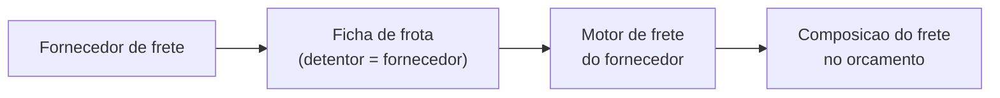

# Fornecedores de frete

Um dia a entrega é longe demais, ou chega mais carga do que a sua frota dá conta. Em vez de recusar o pedido, você aciona uma **transportadora parceira** para fazer o transporte. No LocFlow, essas transportadoras são os seus **fornecedores de frete**: terceiros que você cadastra, precifica e usa dentro dos orçamentos — como se fossem uma extensão da sua operação.

**Onde fica:** menu da organização → **Cadastros Base** → **Fornecedores**, junto de Contatos, Catálogo e Orçamentos. Ele mora ali por um motivo simples: o fornecedor é um **cadastro** de terceiro que a sua operação usa — como um contato ou um produto —, e não uma operação independente. Por isso não fica no espaço da [Rede de Parceiros](visao-geral.md), que é para parcerias entre empresas que se conectam de verdade.


**Recurso de plano superior (Pro).** Fornecedores de frete faz parte de um plano avançado. Se você não vê o item **Fornecedores** no menu — nem o campo **Detentor** na sua [frota](../cadastros/frota.md) — é porque o seu plano ainda não o inclui, não é um erro. Para liberar, veja [Minha assinatura e créditos](../configuracoes/assinatura-e-creditos.md).


## Onde isso se encaixa {#onde-se-encaixa}

O fornecedor de frete é o jeito **mais simples** de trabalhar com um transporte de fora — e é bem diferente de uma parceria de verdade. Vale entender o quadro antes de mergulhar nos detalhes.

Aqui, o fornecedor é um terceiro que **você gerencia por inteiro**. Você cadastra a empresa dele, monta a **frota** dele dentro do sistema, configura o **motor de frete** dele — e ele **não tem login**. Quem opera tudo é você. Por isso ele vive nos **Cadastros Base**: é uma ficha que a sua operação consulta, não uma operação independente que decide alguma coisa.


**Quer um parceiro de verdade, com conta própria?** Isso existe — e é outra coisa. Na [Rede de Parceiros](visao-geral.md) você convida um **parceiro logístico externo** (com acesso próprio, que aceita e executa os pedidos que você repassa) ou conecta a sua organização a **outra organização LocFlow** (parceria org ↔ org, com acordos, divisão automática de ganhos e reputação). O fornecedor de frete continua sendo a escolha certa quando você só quer **cotar e pagar um transporte**, sem envolver a outra parte no sistema.


## O conceito de detentor {#detentor}

Este é o conceito que amarra tudo. No LocFlow, **cada ficha de frota, cada motor de frete e cada composição de frete tem um titular** — o que chamamos de **detentor**. E o detentor só pode ser uma de duas coisas:

| Detentor | O que significa |
| --- | --- |
| **Própria organização** | O padrão. A ficha, o motor e a cobrança são **seus** — a sua frota, as suas regras de preço. |
| **Fornecedor de frete** | O titular é um **terceiro cadastrado**. A ficha representa um veículo *dele*, e o preço vem do motor de frete *dele*. |

Pense no detentor como o **eixo** que conecta as três coisas: a **frota** (de quem é o veículo), o **motor de frete** (de quem é a regra de preço) e a **composição do frete** no orçamento (quem, afinal, transporta e cobra). Toda ficha que você cria já nasce com um detentor — a sua organização, salvo se você escolher um fornecedor.


**Por que isso importa.** Graças ao detentor, o mesmo orçamento pode comparar o **seu** custo de frete com o de **vários fornecedores** lado a lado, cada um com o seu preço — e você escolhe quem leva a carga. É o que transforma "terceirizar frete" numa decisão de um toque, sem planilha por fora.


## Cadastrar um fornecedor {#cadastrar}

Na tela **Fornecedores**, toque no botão **+** (o **Novo fornecedor**). O cadastro é enxuto:

- **Nome** — obrigatório. É como a transportadora aparece nas listas e na composição do frete (ex.: "Transportadora Silva").
- **Serviços prestados** — o que esse fornecedor faz. É aqui que mora a parte importante (veja [Serviços prestados](#servicos)).

Todo fornecedor **nasce ativo**. Na lista, cada um mostra um selo de **status** (Ativo/Cancelado) e, quando presta frete, um selo **"Presta frete"** — o atalho visual para saber quem já está pronto para cotar transporte.

### Editar e renomear {#editar}

Tocar num fornecedor abre o mesmo formulário em modo de edição. Você pode **renomear** a transportadora e **ajustar os serviços** que ela presta a qualquer momento — o nome continua sendo obrigatório (não dá para deixar em branco).

### Cancelar (sem perder histórico) {#cancelar}

Quando um fornecedor deixa de trabalhar com você, use a ação de **cancelar** (o ícone de lixeira na lista). O app confirma com clareza:


*"Deseja cancelar \"Transportadora Silva\"? Ele deixa de ficar disponível para novos fretes."*


Cancelar é um **arquivamento**, não um apagão. O fornecedor **sai das listas de escolha** de novos orçamentos, mas **todo o histórico é preservado**: os fretes que ele já fez, os valores que cobrou, os orçamentos onde entrou. Você não perde rastro de nada — só deixa de oferecê-lo daqui para frente. Um fornecedor cancelado também não pode mais ser renomeado nem ter serviços alterados; ele fica congelado como estava.

## Serviços prestados: Frete é a chave {#servicos}

No cadastro, os serviços aparecem como **chips** que você marca ou desmarca. E há um serviço especial: o **Frete**.


Texto de ajuda do próprio app:

> Selecione o que o fornecedor faz. Quem presta **Frete** fica elegível ao motor de frete da organização.


Marcar o chip **Frete** é o que **torna o fornecedor elegível ao motor de frete** — ou seja, o que o habilita a cotar transporte nos seus orçamentos. Sem esse serviço marcado, o fornecedor até existe no cadastro, mas **não entra na composição do frete**: ele não tem preço de transporte para oferecer.

Os outros serviços (como **Mão de obra**) existem para você organizar o catálogo do fornecedor, mas **não disparam** o mecanismo de frete. Só o **Frete** faz isso. Por isso o app dá um destaque sutil ao chip de Frete — é o que muda o jogo.

## A frota-espelho do fornecedor {#frota-espelho}

Aqui está o passo que muita gente pergunta: *"Se o fornecedor não tem login, como ele cota um preço?"*

A resposta é a **frota-espelho**. Para um fornecedor conseguir cotar, você cria, dentro da sua própria [Frota](../cadastros/frota.md#detentor), **fichas técnicas atribuídas a ele** — usando o mesmo catálogo de veículos (a mesma base FIPE) que você usa para os seus carros. Ao criar uma especificação de frota, o campo **Detentor** deixa você escolher: **Própria organização** (o padrão) ou um dos seus fornecedores de frete.

Assim, cada fornecedor ganha as **fichas de veículo** que representam a frota dele no seu sistema. Você descreve os veículos dele uma vez, e eles passam a existir como opção de transporte — sem o fornecedor precisar tocar em nada.


**O detentor é escolhido na criação da ficha.** Ao editar uma ficha existente, com o acesso certo, também é possível **trocar o detentor** — o que move a ficha (e os veículos ligados a ela) de um titular para outro. Os detalhes de como cadastrar e atribuir fichas estão em [Frota](../cadastros/frota.md#detentor).


## Cada fornecedor tem o seu motor de frete {#motor-do-fornecedor}

Ter a frota-espelho é metade do caminho. A outra metade é o **preço**: quanto esse fornecedor cobra pelo transporte.

Para isso, **cada fornecedor tem o seu próprio Motor de Frete** — um conjunto de regras de preço separado do seu. As viagens atribuídas às fichas de um fornecedor são cobradas pelas **regras dele**, não pelas suas. É o que permite que a sua frota e a de um fornecedor apareçam no mesmo orçamento com **preços diferentes**, cada um justo com quem transporta.

A mecânica de configuração é a mesma do seu motor — os mesmos perfis, gatilhos e cobranças. Só muda o **titular**. Veja como montar o motor de um fornecedor em [Motor de frete por detentor](../configuracoes/motor-de-frete-detentor.md).

## Elegibilidade: fornecedor sem motor fica bloqueado {#elegibilidade}

Um fornecedor só é **elegível** para transportar de fato quando tem **motor de frete ativo**. Faz sentido: sem regras de preço, não há como saber quanto o transporte dele custa — e uma viagem sem preço não pode entrar num orçamento.

O LocFlow protege você disso **na hora de dividir a carga**. Quando você monta a composição do frete e vai escolher a ficha de cada viagem, um fornecedor **sem motor de frete ativo** aparece com um **cadeado** e a marca **"sem motor de frete"** — e **não pode ser selecionado**. O app explica o motivo ali mesmo, para você não escolher uma opção que sairia sem valor.


**Como destravar.** Se um fornecedor aparece bloqueado, é porque falta configurar o **motor de frete dele**. Configure o motor (com pelo menos uma cobrança válida) e ele passa a ser selecionável na divisão. Onde tudo isso aparece no orçamento — a composição do frete, a divisão entre transportadoras e o repasse ao cliente — está em [Valores: acréscimos, frete e descontos](../orcamentos/valores.md#composicao-do-frete).


## Como tudo se conecta {#como-se-conecta}

Juntando as peças, o caminho de um fornecedor de frete é este:

1. **Cadastre** o fornecedor e marque o serviço **Frete**.
2. **Crie a frota-espelho** dele — fichas com o **Detentor** apontando para o fornecedor.
3. **Configure o motor de frete** dele, com as regras de preço que ele cobra.
4. No **orçamento**, ele passa a aparecer na **composição do frete**, ao lado da sua própria frota, com o preço dele.
5. Você **escolhe** quem transporta — um só ou vários, dividindo as viagens — e define **quanto repassa** ao cliente.

Pule a etapa 3 e o fornecedor fica **bloqueado** na divisão. As três primeiras etapas são o preparo; a partir daí, é decisão de orçamento.

## Por porte {#por-porte}

| Se você é… | Como os fornecedores entram |
| --- | --- |
| **Autônomo / micro** | Provavelmente nem precisa: você usa a sua própria frota (ou frete manual). Fornecedores fazem sentido quando você começa a **terceirizar** entregas. |
| **Médio** | Um ou dois fornecedores para as entregas que a sua frota não cobre — longas, ou em dias de pico. Você compara o custo deles com o seu e escolhe o melhor por pedido. |
| **Grande / muitas filiais** | Uma rede de transportadoras, cada uma com a sua frota-espelho e o seu motor. O orçamento vira uma cotação automática entre várias opções, com repasse e margem controlados. |

## Situações reais {#situacoes-reais}

- **Entrega distante:** chega um pedido para uma cidade a 300 km. A sua frota não vale a pena. Você tem a "Transportadora Silva" cadastrada, com frota-espelho e motor — no orçamento, ela aparece com o preço dela e você fecha o frete com ela num toque.
- **Dia de pico:** cinco entregas no mesmo sábado, três caminhões seus. Você divide a carga: duas viagens ficam com a sua frota e três com um fornecedor, cada porção cobrada pela precificação de quem a leva.
- **Fornecedor novo, ainda sem preço:** você cadastrou a transportadora e criou as fichas, mas ainda não montou o motor dela. Ao tentar usá-la, ela aparece com **cadeado** e "sem motor de frete". Você configura o motor e ela destrava.
- **Transportadora que saiu:** um fornecedor parou de atender. Você o **cancela** — ele some dos novos orçamentos, mas os fretes antigos que ele fez continuam no histórico, intactos para os seus relatórios.

## Próximo passo {#proximo-passo}

- Entenda o quadro maior das parcerias em [Parcerias: a visão](visao-geral.md).
- Monte a **frota-espelho** de um fornecedor em [Frota](../cadastros/frota.md#detentor).
- Configure o **preço** dele em [Motor de frete por detentor](../configuracoes/motor-de-frete-detentor.md).
- Veja o fornecedor entrar no orçamento em [Valores: acréscimos, frete e descontos](../orcamentos/valores.md#composicao-do-frete).
- Precisa liberar o recurso? Veja [Minha assinatura e créditos](../configuracoes/assinatura-e-creditos.md).
- Dúvida em algum termo? Consulte o [glossário](../primeiros-passos/glossario.md).
