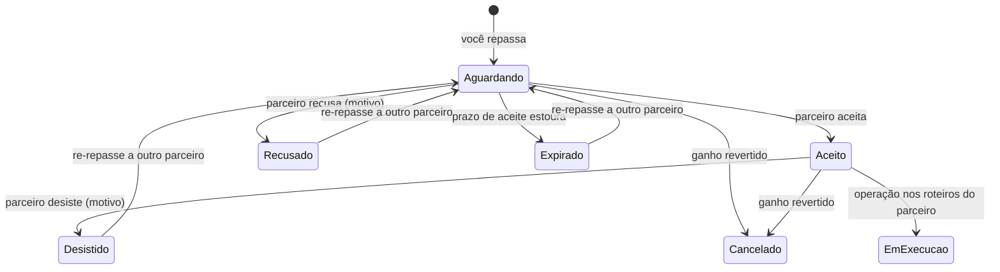

# Repassando um pedido

**Onde fica:** a ação **"Repassar a parceiro"** aparece nas **ações do orçamento** quando ele foi **ganho** e existe acordo que cobre os itens. O acompanhamento vive **na sua própria esteira de orçamentos**: todo pedido repassado ganha o selo **"da rede"** (com o nome do parceiro e o estado do aceite) no funil, na tabela e na ficha — e o filtro **Procedência › Da rede de parcerias** lista só eles. Do detalhe do repasse dá para voltar ao orçamento em um toque, e vice-versa.

Repassar é isto: você fechou um pedido com o **seu** cliente, mas quem vai executar a operação — separar o material, entregar, retirar — é um **parceiro**. O LocFlow cuida do meio do caminho inteiro: mostra **qual parceiro rende mais** para você, envia a **solicitação**, controla o **prazo de aceite**, e deixa o dinheiro combinado no [acordo](acordos-de-parceria.md) pronto para a divisão. O cliente continua sendo seu; a logística passa a ser do parceiro.


**Pré-requisito: um acordo ativado.** O repasse só existe por cima de um **acordo de parceria ativado** que cubra os itens do pedido — é ele que diz quanto o parceiro ganha por item, qual o prazo de aceite e como o frete se resolve. Se você ainda não tem um, comece por [Acordos de parceria](acordos-de-parceria.md).


## Quando repassar {#quando-repassar}

Dois requisitos, nada mais:

1. **O orçamento está ganho.** Repasse é para pedido fechado — enquanto está em negociação, ele é só seu.
2. **Existe um acordo ativado que cobre os itens.** Todo item do pedido precisa estar nos termos de pelo menos um acordo.

Com os dois valendo, a linha **"Repassar a parceiro"** aparece nas ações do orçamento. Se nenhum acordo cobre os itens, a tela não te deixa no escuro: ela **explica o que falta** — qual acordo cobriria e o que ficou de fora — em vez de simplesmente esconder a opção.


**Para quem está começando:** se você tem **um** parceiro e **um** acordo, o repasse é apertar um botão e esperar o aceite. Toda a sofisticação desta página — comparativo, créditos, ranking — só aparece quando você tem **mais de um candidato** para escolher.


## A tela de repasse: duas fases {#tela-de-repasse}

Calcular a rota real de cada parceiro até a operação **consome créditos** (é uma consulta de mapa por rota). Por isso a tela trabalha em **duas fases**: primeiro tudo o que é **grátis**, depois — só com o seu "ok" — o cálculo pago.

### Fase 1 — o esboço grátis {#esboco-gratis}

Assim que você escolhe o pedido, o LocFlow monta um **esboço sem gastar nada**: a lista de candidatos elegíveis, ranqueada pela **margem antes do frete** — os preços do acordo de cada um contra o preço que o seu cliente pagou. É a primeira leitura de "quem tende a render mais".

Junto do esboço vem a **transparência de créditos**: quanto custaria, **no máximo**, calcular as rotas reais de todos os candidatos. Você decide **quais** candidatos valem o cálculo (por exemplo, só os 3 do topo) — a estimativa mostra o teto de créditos, o seu saldo atual e quanto sobraria depois. Nada é debitado até você confirmar.


**Custo zero segue sozinho.** Quando não há rota a calcular — por exemplo, todos os acordos com **frete a combinar** —, a tela nem pergunta: vai direto ao comparativo final, grátis.


### Fase 2 — o comparativo final {#comparativo}

Autorizado o cálculo, cada candidato ganha um **card completo**, e o ranking passa a ser pela **sua margem real** — a mesma conta que vai valer na liquidação do dinheiro:

| No card | O que mostra |
| --- | --- |
| **VOCÊ LUCRA** | A sua margem no pedido com **este** parceiro: o que o cliente paga menos o repasse (itens pelo preço do acordo + frete do parceiro). É o número que ordena a lista. |
| **Frete por perna** | O custo de transporte do parceiro, aberto por movimento (entrega, retirada), calculado pelas regras de preço **dele**. |
| **Reputação** | Estrelas e selo do parceiro, mais o índice de confiabilidade — a sua experiência (e a da rede) com ele. Veja [Reputação e boas práticas](reputacao-e-boas-praticas.md). |
| **Disponibilidade** (parceria entre organizações) | Se a parceira tem **estoque** dos itens na data da operação — detalhado logo abaixo. |

Escolheu o card, tocou em repassar — a solicitação parte para o parceiro.

### Cobertura e disponibilidade {#disponibilidade}

Na parceria **entre organizações**, os itens vão sair do estoque **da parceira**. Por isso o comparativo responde, no próprio card, duas perguntas diferentes — e é importante não confundi-las:

* **Cobertura:** *o acordo traduz esta carga para o catálogo dela?* Item sem par no acordo é item que **ela não vai fornecer**, tenha ela estoque ou não.
* **Disponibilidade:** *ela tem o material livre na data?*

| O que o card mostra | O que significa | O que acontece |
| --- | --- | --- |
| **Disponível** | O acordo traduz a carga inteira e ela tem o material na data. | Card normal, pronto para repassar. |
| **Cobertura parcial** — *"3 itens desta operação não estão mapeados no acordo com este parceiro — ele não vai fornecê-los"* | Parte da carga não tem par no acordo. | **Avisa, não bloqueia.** O card leva direto ao acordo, onde o mapeamento se corrige. |
| **Nenhum item mapeado** — *"ele não vai fornecer o material"* | O acordo não traduz **nada** desta carga. | Aviso, com atalho para o acordo. Quem corrige é **você**. |
| **Parceiro sem galpão** — *"ainda não tem galpão de estoque cadastrado"* | Ela não tem onde reservar. | Aviso **sem** atalho para o acordo: não há nada errado lá. Quem corrige é **ela**. |
| **Sem estoque para a data** | Os itens estão comprometidos com outras operações na janela. | O card fica **desabilitado** — repassar seria prometer o que ela não tem. |
| **Estoque não cadastrado — confirme com o parceiro** | A parceira nunca cadastrou aqueles itens no estoque dela. | Só um **aviso** — o repasse segue, mas confirme por fora. |


**A cobertura parcial aparece já na fase grátis.** Você descobre no esboço, antes de gastar um crédito de rota, que aquela parceira não fornece 3 dos 12 itens — e decide ali: mapeia no acordo (é barato agora) ou escolhe outro candidato. Depois do aceite, essa lacuna só reaparece no galpão dela, no dia da separação.



**Por que avisa em vez de bloquear?** Porque a lacuna quase sempre é de **mapeamento** — um item novo do seu catálogo que ninguém casou ainda —, e barrar esconderia o problema real atrás de um "candidato indisponível". Você segue podendo repassar sabendo o que ele não leva; e o parceiro **também é avisado** disso antes de aceitar.


### Frete a combinar {#frete-a-combinar}

Acordo cujo frete é **manual** (a combinar por operação) não tem rota a calcular — o candidato aparece numa seção própria, **"Frete a combinar por operação"**, abaixo do ranking, com a margem **parcial** (só dos itens). Ele não compete pelo topo porque falta uma peça da conta: o transporte vocês fecham por fora, operação a operação.

### Viagem com frete fixado {#frete-fixado}

Se, lá no orçamento, alguma viagem teve o frete **fixado a uma transportadora específica** (na composição do frete), os acordos que **conflitam** com essa fixação ficam de fora do comparativo — e a tela avisa:


*"Uma das viagens deste orçamento tem o frete fixado a outra transportadora — os acordos que conflitam ficaram fora. Refaça o frete sem essa fixação para repassar."*

O caminho é reabrir o [frete do orçamento](../orcamentos/valores.md#composicao-do-frete), desfazer a fixação e voltar ao repasse.


## A solicitação chega ao parceiro {#solicitacao}

Todo repasse é uma **solicitação** — o parceiro nunca é atropelado. Ele recebe uma notificação e abre o detalhe da reserva, onde vê:

* **A operação:** o que entregar, onde, quando, para qual contato — tudo o que precisa para decidir se dá conta.
* **Os itens e quantidades**, já nos termos do acordo.
* **Quanto ele ganha** nesta operação: o repasse, a taxa que couber a ele e o líquido. **Nesta tela ele não vê o total que o seu cliente pagou** — o que ele conhece são os preços que vocês combinaram item a item, lá no [acordo](acordos-de-parceria.md#itens-acordados).
* **Quantos itens ele não fornece**, quando o acordo não traduz a carga inteira para o catálogo dele — antes de aceitar, não depois.

E decide:

* **Aceitar** — ele assume a logística da operação. Na parceria entre organizações, o material passa a sair do **estoque dele**: o sistema traduz os itens pelo mapeamento do acordo e reserva no galpão dele mais próximo da entrega. Há um guarda no aceite: **sem estoque disponível na janela, o aceite é barrado** (itens que ele nunca cadastrou não barram — só avisam).
* **Recusar** — sempre com **motivo obrigatório**, que chega a você. A posse do pedido volta e você repassa a outro parceiro ou opera você mesmo.


**"Fora do acordo":** quando a solicitação carrega algum **desvio** dos termos (por exemplo, uma condição que o acordo não previu), a tela do parceiro lista os desvios numa seção própria e o aceite vira um **aval comercial** — ele revisa e aprova ou rejeita sabendo exatamente o que está fora.


## O prazo de aceite {#prazo-de-aceite}

O acordo define uma **janela de aceite** — quantas horas antes da operação o parceiro precisa responder (zero = sem prazo). Enquanto a solicitação aguarda, o detalhe mostra o limite: *"Aceite até \[data e hora] para assumir esta operação."*

Estourou o prazo? **O sistema expira a solicitação sozinho** — uma varredura roda de tempos em tempos, você não precisa vigiar. A posse do pedido **volta para você**, que pode re-repassar a outro parceiro ou tocar a operação com a própria estrutura. Para o parceiro, deixar expirar gera uma **penalidade leve** no índice de confiabilidade — respeitar prazos é parte da reputação na rede.

## Desistência depois do aceite {#desistencia}

Aceitou e a realidade mudou? Enquanto a operação **ainda não começou**, o parceiro pode **desistir**, sempre com motivo. O acordo define uma **janela de desistência** (padrão de 24 horas antes da operação):

| Quando desiste | O que acontece |
| --- | --- |
| **Dentro da janela** | É um direito — sem registro contra ele. A posse volta para você re-repassar. |
| **Fora da janela (tardia)** | A desistência fica no **histórico** e gera **penalidade** no índice de confiabilidade, **maior quanto mais perto da operação** — quem desiste em cima da hora te deixa mais na mão, e pesa mais. |


**Depois que a execução começa, não dá mais para desistir.** Se o parceiro **já saiu para a entrega** (ou já cumpriu um lado da operação), o botão de desistir some — você e o cliente estão contando com aquela entrega a caminho. Um imprevisto real (o caminhão quebrou) se resolve **falando com você**, não com um cancelamento pelo app.


Na parceria entre organizações, a desistência (antes da execução) também **libera** o estoque que estava reservado no galpão do parceiro.

## Reverter o ganho desfaz o repasse {#reverter-ganho}

Se você **reverte o ganho** do orçamento — o cliente desistiu, o negócio voltou à negociação —, o repasse é **cancelado automaticamente**. O parceiro é notificado, o estoque espelhado (se houver) é liberado, e a reserva fica registrada como **"Orçamento revertido — repasse desfeito"**. Nenhuma ação manual, nenhuma ponta solta.

## Depois do aceite: a execução é do parceiro {#execucao}

Com o aceite, a **linha logística** da operação passa a ser do parceiro: a entrega e a retirada entram nos **roteiros dele**, e é a equipe dele que executa em campo — do jeito que a [Logística](../logistica/visao-geral.md) do LocFlow sempre funciona, só que do lado de lá. Isso vale igual para o parceiro **externo** e para a organização **parceira interna**: os dois roteirizam (veja [as linhas de responsabilidade](visao-geral.md#linhas-de-responsabilidade)).

E a responsabilidade é real: um **movimento pulado** (falha de entrega) gera a penalidade **mais pesada** do índice de confiabilidade. O parceiro que aceita, entrega.

### O que você deixa de poder fazer {#o-que-voce-deixa-de-poder}

Esta é a mudança que mais gera a pergunta *"cadê o meu botão?"*. Num pedido **repassado e aceito**, você perde cinco comandos:

| O que sumiu | Onde estava |
| --- | --- |
| **Dividir** um movimento em viagens | Plano de movimentos do pedido |
| **Consolidar** movimentos numa viagem | Plano de movimentos do pedido |
| **Reatribuir** uma folha do plano | Plano de movimentos do pedido |
| **Ressincronizar** a folha com o pedido | Plano de movimentos do pedido |
| **Marcar manualmente** como **entregue** ou **retirado** | Status logístico do orçamento |

A mensagem que aparece é direta: *"Este movimento pertence a um orçamento repassado a \[parceiro] — o parceiro cuida da logística dele, inclusive do plano de movimentos."*


**Por que isso é bom para você.** O plano de movimentos é o que o roteiro **dele** executa. Enquanto você podia mexer, dois problemas reais aconteciam: você redividia a carga e a rota do parceiro ficava desatualizada sem ninguém perceber; ou você marcava "entregue" pela sua tela e a folha do motorista dele era **fechada de forma irreversível** — ele chegava ao cliente com a entrega já dada como feita. Perder o botão é perder essa classe de acidente.

Precisa mesmo que a operação seja dividida de outro jeito? **Fale com o parceiro** — ele tem o comando. Ou desfaça o repasse, se ainda estiver a tempo.


### O que você passa a ver {#acompanhamento}

Você não fica no escuro. No detalhe da reserva, o LocFlow mostra o **fato operacional** da rota do parceiro:

* **Existe rota** montada para este pedido;
* **para quando** ele planejou a saída (no fuso de quem executa);
* **em que estado** ela está — planejada, em preparo, em rota, concluída;
* **o desfecho de cada perna** já carimbada em campo: entregue, retirado ou **pulado** — e, no caso do pulo, **o motivo** informado pelo motorista.

E o que você **não** vê, de propósito: o número do roteiro, o motorista, o veículo e **as outras paradas** daquela rota — que são de outros clientes, e possivelmente de outros vendedores. Nem existe caminho de edição: é leitura.


**Revogado o acordo, esse acompanhamento acaba.** A leitura da rota da ex-parceira vale enquanto o aval daquela operação estiver vigente — não é uma janela permanente para dentro da operação dela.


### Você é avisado do desfecho {#avisos-do-desfecho}

Quem responde ao cliente é você — então você não pode descobrir a falha da entrega pelo telefone do cliente. Dois avisos nascem no desfecho do parceiro e chegam a quem repassou:

| Aviso | Nível | Quando chega |
| --- | --- | --- |
| **Parceiro concluiu a entrega ou retirada** | Informativo | Ele cumpriu a perna. É o seu "pode avisar o cliente". |
| **Parceiro não cumpriu a entrega ou retirada** | Importante | Ele **pulou** o movimento — com o motivo em campo. É o seu "ligue agora". |

Os dois abrem direto a reserva, onde o acompanhamento da rota já está. Quem recebe é o **responsável pela operação** — dá para ajustar os canais na [Central de notificações](../configuracoes/central-de-notificacoes.md).


**E o dinheiro?** O quanto o parceiro ganha vem dos **preços do acordo × quantidades × fator de locação** (as mesmas diárias/locações do preço ao cliente), mais o frete dele — e a liquidação acontece pelo gatilho do acordo (no pagamento, na entrega ou na retirada). O acompanhamento vive no Financeiro: **Repasses** (para você) e **Meus Ganhos** (para o parceiro), com o selo "Rede". Os detalhes dessa divisão estão em [O dinheiro da parceria](dinheiro-da-parceria.md).


## O ciclo da solicitação {#ciclo-da-solicitacao}

O caminho completo de um repasse, do envio ao desfecho:

O **re-repasse** é sempre a mesma solicitação seguindo para **outro** parceiro — você volta ao comparativo e escolhe de novo.

## Os estados, como a tela mostra {#estados}

A mesma reserva aparece com rótulos diferentes conforme **quem olha** — a tela fala com você no seu papel:

| Estado | O vendedor vê | O parceiro vê |
| --- | --- | --- |
| Aguardando resposta | **Aguardando parceiro** | **Aguardando você** |
| Aceita | **Aceito** | **Aceito** |
| Recusada | **Recusado** | **Recusado** |
| Desistida pós-aceite | **Parceiro desistiu** | **Você desistiu** |
| Prazo estourado | **Prazo expirou — retomado** | **Prazo de aceite expirou** |
| Ganho revertido | **Orçamento revertido — repasse desfeito** | **Orçamento revertido — repasse desfeito** |
| Com desvio dos termos | **Fora do acordo — aguardando parceiro** | **Fora do acordo — revise** |

Todos aparecem **no selo "da rede" da sua esteira de orçamentos** e no detalhe do repasse — e a linha "Repasse a parceiro" nas ações do orçamento reflete o mesmo estado, com atalho para o detalhe. Na Rede, o que fica é a **[central de avaliações](reputacao-e-boas-praticas.md#central-de-avaliacoes)**: avaliar o parceiro e acompanhar a revelação das notas.

## Situações reais {#situacoes-reais}

- **Evento no fim de semana, sua agenda cheia.** Pedido ganho, dois parceiros com acordo. O esboço mostra os dois, você calcula as rotas (2 créditos), o comparativo diz que o parceiro A te dá R$ 180 a mais de margem. Repassa, ele aceita em uma hora, a operação some da sua agenda.
- **O parceiro não respondeu.** A solicitação mostrava "Aceite até sábado, 10h". Domingo o sistema expirou sozinho: você viu **"Prazo expirou — retomado"**, re-repassou ao segundo colocado e o índice do primeiro sentiu a penalidade leve.
- **Card apagado no comparativo.** A parceira aparece com **"Sem estoque para a data"** — as mesas dela estão em outro evento na mesma janela. O card desabilita e te poupa de um aceite que seria barrado de qualquer jeito.
- **"Ele não vai fornecer 3 itens."** O card avisa no esboço: três itens do pedido não estão mapeados no acordo com aquela parceira. Você toca no aviso, cai no acordo, mapeia os três em dois minutos e volta — agora a cobertura é total. Corrigir ali custa muito menos do que descobrir no galpão dela.
- **Cliente cancelou tudo.** Você reverteu o ganho do orçamento; o repasse se desfez sozinho, o parceiro foi avisado e o estoque dele voltou a ficar livre. Zero telefonema. (Se ele já tinha aceitado e você reverteu em cima da hora, isso conta na **sua** reputação — veja [o índice](reputacao-e-boas-praticas.md#indice-de-confiabilidade).)
- **"Preciso dividir a entrega em duas viagens, mas já repassei."** O comando é do parceiro agora. Fale com ele — ou desfaça o repasse, se ainda houver tempo.
- **"O parceiro não entregou e eu só soube pelo cliente."** Não deve mais acontecer: o aviso **"Parceiro não cumpriu a entrega ou retirada"** chega com o motivo do pulo. Se você não o recebeu, confira os canais na [Central de notificações](../configuracoes/central-de-notificacoes.md).

## Próximo passo {#proximo-passo}

- Ainda não tem acordo? Monte um em [Acordos de parceria](acordos-de-parceria.md).
- Entenda os dois modelos de parceria e as **linhas de responsabilidade** em [Parcerias: a visão](visao-geral.md).
- O acordo permite ao parceiro receber o cliente na porta? Veja [Cobrança na rua](cobranca-na-rua.md).
- Trabalha com um parceiro convidado, sem organização própria? Veja [Parceiro logístico externo](parceiro-logistico-externo.md).
- Como o pedido vira operação em campo: [Logística: visão geral](../logistica/visao-geral.md).
