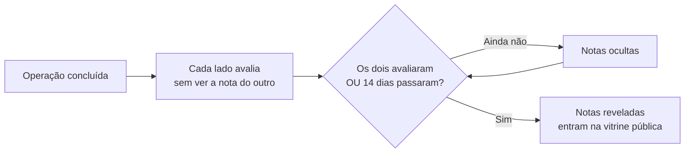

# Reputação e boas práticas

Parceria é confiança: você entrega um pedido seu nas mãos de outra pessoa. Para essa confiança não depender de "achismo", o LocFlow mede a reputação de cada parceiro com sinais claros — e mostra esses sinais exatamente onde você decide: no comparativo de repasse, na vitrine pública, no perfil do parceiro.

São **três sinais diferentes**, e cada um responde a uma pergunta:

| Sinal | Pergunta que responde | De onde vem |
| --- | --- | --- |
| **Estrelas (1–5)** | O trabalho foi bom? | Avaliações após cada operação |
| **Selo** (Novo → Diamante) | Há histórico suficiente para confiar? | Volume + qualidade das avaliações |
| **Índice de confiabilidade (0–100)** | Ele cumpre o que combina? | Fatos objetivos: prazos, desistências, entregas |


**Estrelas medem opinião; o índice mede fatos.** Um parceiro pode ter 5 estrelas de qualidade e ainda assim perder pontos no índice por deixar prazos estourarem. Os dois sinais andam separados de propósito — juntos, contam a história completa.


## Avaliação privada: a sua opinião, para os seus repasses {#avaliacao-privada}

Depois que uma operação repassada é concluída, **você avalia o parceiro**: 1 a 5 estrelas e um comentário, direto no detalhe da solicitação. É rápido — e vale ouro para você mesmo.

Essa avaliação é **privada da sua organização**: ela alimenta o ranking dos **seus próprios repasses**. Na próxima vez que você for repassar um pedido, o card de cada candidato no comparativo mostra as estrelas e o selo que **a sua experiência** construiu — quem trabalhou bem com você sobe na sua lista.

* **Uma avaliação por reserva concluída** — cada operação vira um registro.
* **Reavaliar substitui a nota** — mudou de opinião? A nova avaliação toma o lugar da anterior daquela reserva; não duplica.
* **O comentário é seu lembrete** — "chegou adiantado", "faltou lona": na hora de escolher de novo, você agradece.


**Avalie sempre, mesmo quando foi tudo bem.** A nota 5 de hoje é o critério de desempate de amanhã. Um parceiro sem avaliações fica com o selo **Novo** — e você perde a chance de dar vantagem a quem a merece.


## Avaliação pública mútua: as duas organizações se avaliam {#avaliacao-publica-mutua}

Na [parceria entre organizações](acordos-de-parceria.md), a avaliação sobe de nível: **as duas partes se avaliam** — quem vendeu avalia quem executou, e quem executou avalia quem vendeu. Essas notas entram na **vitrine pública** de cada organização, aquela que aparece para todo mundo no diretório **Descobrir parceiros**.

### Duplo-cego: ninguém retalia {#duplo-cego}

Se cada lado pudesse ver a nota do outro antes de dar a sua, a tentação seria óbvia: "ele me deu 2? então toma 1". Para impedir isso, a avaliação pública é **duplo-cega**:



* As notas ficam **ocultas** até que **os dois lados avaliem** — aí revelam juntas.
* Se um lado não avaliar, a nota do outro é revelada sozinha após **14 dias** — ninguém segura a reputação alheia como refém.
* Enquanto uma nota está cega, ela **não entra em média nenhuma** — nem por acidente.


Avalie pelo que **aconteceu**, não pelo que você imagina que o outro vai dizer. O duplo-cego existe exatamente para que a nota honesta seja a jogada mais segura.


## Selos: Novo, Bronze, Prata, Ouro, Diamante {#selos}

O selo resume **volume + qualidade** num símbolo só. Ele é derivado das avaliações — ninguém "compra" nem configura um selo:

| Selo | O que significa |
| --- | --- |
| **Novo** | Ainda não há histórico suficiente. Não é ruim — é novo. |
| **Bronze** | Já tem histórico; qualidade em construção. |
| **Prata** | Volume razoável com boa média. |
| **Ouro** | Muitas operações, média alta. |
| **Diamante** | Muito volume com excelência consistente. |

Repare no detalhe que faz diferença para quem está chegando: **quem entra na rede não começa "com nota ruim" — começa Novo**. O LocFlow trata a falta de histórico como falta de histórico, não como demérito. Conforme as operações se acumulam com boas notas, o selo sobe de faixa sozinho.


Cada faixa exige volume **e** qualidade crescentes. Uma única nota 5 não faz um Diamante — a confiança vem da consistência. Os números exatos de cada faixa estão em ["Para quem quer os números"](#para-quem-quer-os-numeros).


E quando um [parceiro externo cresce e vira organização](parceiro-logistico-externo.md), promovendo o acordo para o modelo entre organizações? **A reputação acumulada carrega junto** — ninguém recomeça do zero por ter crescido.

## Índice de confiabilidade: 0 a 100, baseado em fatos {#indice-de-confiabilidade}

O índice de confiabilidade é o sinal **objetivo** da reputação — separado das estrelas. Ele não mede opinião: mede **compromissos cumpridos**. Todo parceiro **começa com 100** e só perde pontos quando um fato concreto acontece:

| O que aconteceu | Pontos |
| --- | --- |
| **Prazo de aceite estourado** — a solicitação expirou sem resposta e o vendedor teve de retomar | **−8** |
| **Desistência tardia** — desistiu de uma reserva aceita **fora** da janela de desistência | **−15 a −25** |
| **Falha de entrega** — aceitou, mas a operação falhou (movimento pulado / não compareceu) | **−25** |

A penalidade da **desistência tardia é graduada pela antecedência**: quanto mais perto da operação você desiste, mais pesado — começa em **−15** logo depois de a janela fechar e chega a **−25** (o mesmo peso de uma falha de entrega) quando é praticamente em cima da hora. Desistir com um dia de antecedência machuca menos do que desistir com o cliente já esperando.

As penalidades são registradas **automaticamente** pelo sistema quando o fato ocorre — ninguém "dá" uma penalidade na mão. E cada operação só pode gerar uma penalidade de cada tipo para o mesmo parceiro: não existe punição em dobro.


**Desistir dentro da janela combinada não penaliza.** A [janela de desistência do acordo](acordos-de-parceria.md) existe justamente para isso: dentro dela, desistir é um direito. O que marca o índice é a desistência **tardia** — aquela que deixa o vendedor sem tempo de reagir.


### Contestar uma penalidade {#contestar-penalidade}

Errar um registro acontece — e ninguém deve ser penalizado sem direito a recurso. O parceiro pode **contestar** qualquer penalidade:

1. A penalidade contestada **sai do índice imediatamente**, enquanto a análise corre.
2. Se a contestação for **acolhida**, a penalidade é anulada e nunca mais conta.
3. Se for **mantida**, ela volta a valer no índice.

Falhas antigas também pesam cada vez menos com o tempo: o índice reflete o parceiro de **agora**, não o de dois anos atrás.

## Para quem quer os números {#para-quem-quer-os-numeros}

A partir daqui é detalhe para quem gosta de saber a conta por trás. Você **não** precisa disso para usar a rede.

### A nota exibida: média bayesiana {#media-bayesiana}

A média simples engana com pouco volume: uma única nota 5 viraria "média 5,0". Por isso a nota exibida é uma **média bayesiana** — a média real "encolhida" para um ponto de partida neutro-bom, que só cede conforme o volume cresce:

```
nota exibida = (5 × 3,8 + Σ peso × estrelas) / (5 + Σ pesos)
```

É como se todo parceiro começasse com **5 avaliações fictícias de nota 3,8**. Com poucas avaliações reais, a nota fica perto de 3,8; com muitas, converge para a média verdadeira. E cada avaliação real entra com um **peso**, produto de dois fatores:

* **Recência** — a avaliação perde metade do peso a cada **180 dias**. A reputação reflete o agora.
* **Valor da operação** — operação maior pesa mais (com amortecimento logarítmico, para uma única operação gigante não dominar tudo).

### O ranking: lower-bound de Wilson {#wilson}

Para **ordenar** parceiros (por exemplo, no comparativo de repasse), a média não basta — é preciso um score que **exija volume** para creditar nota alta. O LocFlow usa o **limite inferior do intervalo de Wilson a 95%** sobre a proporção de avaliações satisfeitas (4★ ou mais):

* 2 avaliações positivas em 2 → score conservador (pouca evidência).
* 90 positivas em 100 → score alto (muita evidência).

É o mesmo mecanismo dos rankings "melhor avaliado" dos grandes marketplaces: desconfia estatisticamente de quem tem pouco histórico, sem puni-lo na nota exibida.

### As faixas dos selos {#faixas-dos-selos}

O selo é derivado do **volume de avaliações** e da **média bayesiana**:

| Selo | Avaliações | Média bayesiana |
| --- | --- | --- |
| **Novo** | menos de 3 | — |
| **Bronze** | 3 ou mais | qualquer |
| **Prata** | 5 ou mais | ≥ 3,8 |
| **Ouro** | 10 ou mais | ≥ 4,3 |
| **Diamante** | 25 ou mais | ≥ 4,7 |

### O decaimento do índice {#decaimento-do-indice}

Cada penalidade vigente subtrai a sua gravidade do índice, com peso que cai pela metade a cada **365 dias** (meia-vida mais longa que a das estrelas — falha objetiva some devagar, de propósito). Penalidades contestadas ou anuladas não entram. O resultado é travado entre 0 e 100.

## Boas práticas {#boas-praticas}

A reputação não é um jogo a vencer — é o retrato de como você trabalha. Estas práticas mantêm o retrato bonito dos dois lados:

### Para quem vende (repassa pedidos) {#boas-praticas-vendedor}

* **Acordos claros desde o início.** Itens, preços, gatilho de repasse e janelas bem definidos no [acordo](acordos-de-parceria.md) evitam a discussão que vira nota baixa.
* **Repasse com antecedência.** Quanto mais perto da operação, mais apertado o prazo de aceite do parceiro — e maior a chance de expirar ou de uma recusa por agenda.
* **Avalie sempre.** Cada avaliação melhora o ranking dos seus próprios repasses. É você ajudando o seu "eu" do mês que vem a escolher melhor.
* **Prefira parceiro com estoque cadastrado.** Na parceria entre organizações, o comparativo mostra a [disponibilidade de estoque](estoque-na-parceria.md) da parceira para a data — "Disponível" é uma promessa que o sistema consegue verificar; "Estoque não cadastrado" é um risco que só a conversa cobre.

### Para quem executa (recebe repasses) {#boas-praticas-parceiro}

* **Aceite ou recuse rápido — com motivo honesto.** Solicitação parada é a pior resposta: se o prazo estourar, o sistema expira sozinho e o índice cai (−8). Uma recusa rápida e sincera não penaliza nada e mantém o relacionamento.
* **Mantenha estoque e frota cadastrados.** Estoque em dia faz você aparecer como "Disponível" no comparativo do vendedor; fichas de veículo em dia destravam o frete por motor nos acordos.
* **Se precisar desistir, desista o quanto antes.** Dentro da janela de desistência é um direito, sem marca nenhuma. Tardia, marca o histórico (−15) — e falhar a operação sem avisar marca muito mais (−25).
* **Capriche no perfil público.** Bio, cidade, galpões e catálogo público bem preenchidos são a sua vitrine no **Descobrir parceiros** — a reputação atrai, o perfil converte.

## Próximo passo {#proximo-passo}

* Entenda como as parcerias se estruturam em [Parcerias: a visão](visao-geral.md).
* Monte os termos que evitam atrito em [Acordos de parceria](acordos-de-parceria.md).
* Veja como o estoque da parceira entra na jogada em [Estoque na parceria](estoque-na-parceria.md).
* Está começando como parceiro convidado? Veja [Parceiro Logístico Externo](parceiro-logistico-externo.md).
