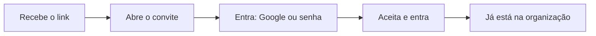

# Aceitando um convite

Nem todo mundo que usa o LocFlow precisa **criar** uma locadora. Se você foi chamado para trabalhar na operação de outra pessoa — como motorista, separador, vendedor ou qualquer outro papel —, o caminho é diferente: você **aceita um convite** e entra direto na organização que já existe, sem cadastrar empresa nenhuma.

Esta página é para você que **recebeu** um convite. Se é você quem quer convidar alguém para a sua equipe, isso fica em [Colaboradores e acessos](../configuracoes/colaboradores-e-acessos.md).

## Como o convite chega até você 

O convite é um **link**, enviado por quem te convidou — por WhatsApp, e-mail, mensagem ou qualquer outro app. Não existe um e-mail automático do LocFlow caindo na sua caixa de entrada: quem te chamou copia o link e te manda.


**Não recebeu nada?** Peça o link de novo para a pessoa que te convidou. É ela que envia — o LocFlow não dispara o convite por conta própria.


Ao abrir o link, o LocFlow mostra uma tela do convite com o **nome da organização** que está te chamando e os **papéis oferecidos** (o que você vai poder fazer lá dentro). Você ainda não está dentro — primeiro precisa entrar com a sua conta.

## Entrar e aceitar 

Para aceitar, você precisa de uma conta no LocFlow. Você tem duas formas de entrar, ali mesmo na tela do convite:

1. **Com o Google** — toque em **Continuar com Google** e escolha sua conta. É o caminho mais rápido e o acesso é imediato, sem senha para criar.
2. **Com e-mail e senha** — alterne para **Criar conta** (se ainda não tem uma) ou **Já tenho conta**, e informe seus dados.


**Você cai direto na tela de aceitar.** Diferente de quem está abrindo a própria locadora, você **não** passa pela criação de empresa nem pelo onboarding. Depois de entrar com sua conta, é só tocar em **Aceitar e entrar**.


Se você criar uma conta nova **por e-mail e senha**, pode ser que o LocFlow peça uma **confirmação por e-mail** primeiro — chega um link de confirmação, você confirma e **volta ao convite pelo mesmo link** para aceitar. Com o Google isso não acontece: a entrada é na hora.

## Convite com e-mail vinculado 

Alguns convites são reservados para **um e-mail específico**. Quando é o caso, a tela mostra o e-mail (parcialmente oculto, por segurança) com um aviso de que **só ela pode aceitar** — ou seja, você precisa entrar com **exatamente aquela conta de e-mail**.


**Entre com a conta certa.** Se o convite foi feito para `m••••@suaempresa.com`, entrar com outro e-mail (ou outra conta Google) não vai funcionar. Use o e-mail para o qual o convite foi enviado.


Nem todo convite tem esse vínculo. Quando ele **não** aparece, qualquer conta sua serve para aceitar.

## Uma pessoa, uma organização 

No LocFlow, **cada conta pertence a uma única organização por vez**. Isso mantém tudo simples: ao entrar, você sempre sabe em qual operação está trabalhando.

Por isso, se você **já faz parte** de uma locadora e abrir um convite para outra, o LocFlow avisa que **você já está em uma organização** e **não deixa aceitar** — só permite **recusar** o convite. Não dá para estar em duas ao mesmo tempo.


**Quer trocar de organização?** Como cada conta fica em uma só, a saída costuma ser usar uma conta de e-mail diferente para o novo convite, ou pedir a quem administra a organização atual para resolver seu acesso. Em caso de dúvida, fale com quem te convidou.


## O convite pode expirar 

Todo convite tem um prazo. Na tela, o LocFlow mostra até quando ele é **válido**. Um convite deixa de valer quando é **aceito**, **recusado** ou quando o prazo **expira** — nesses casos, ao abrir o link você vê um aviso de que o convite **não é mais válido**.


**Convite vencido ou já usado?** É só pedir um novo link para quem te convidou. Convites antigos não voltam a funcionar.


Se você não quiser entrar, dá para tocar em **Recusar convite**. Ao recusar, o convite é anulado e quem o enviou deixa de vê-lo na lista de pendentes.

## Situações reais 

* **"Sou motorista e o dono da locadora me chamou."** Ele te manda um link no WhatsApp. Você abre, entra com o Google e toca em **Aceitar e entrar** — pronto, já aparece a operação com os papéis que ele definiu para você.
* **"Cliquei no link e dizia que era para outro e-mail."** O convite tinha e-mail vinculado. Entre com a conta de e-mail para a qual ele foi enviado.
* **"Já uso o LocFlow na minha própria empresa e me convidaram para outra."** Como cada conta fica em uma organização só, o sistema só vai te deixar **recusar**. Para participar da outra, use uma conta diferente ou combine com quem administra.
* **"O link disse que o convite não é mais válido."** Ele já foi aceito, recusado ou venceu. Peça um novo para quem te convidou.

## Próximo passo 

Já está dentro da organização? Conheça como o LocFlow se adapta ao tamanho da operação em [A filosofia do LocFlow](filosofia.md), e entenda o que cada papel pode fazer em [Papéis, funções e competências](../conceitos/papeis-funcoes-competencias.md).
