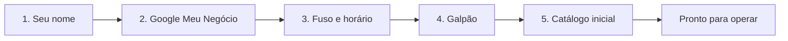

# Configuração inicial

No primeiro acesso, o LocFlow conduz um **setup-relâmpago**: poucos passos para você sair operando. Não precisa acertar tudo de primeira — o essencial agora, o refino depois.


**Por que vale fazer já:** com empresa, galpão e catálogo básicos no ar, você **fecha o primeiro orçamento no mesmo dia**. Cada passo aqui remove um atrito entre você e a próxima venda.


## Os 5 passos

| Passo | O que você faz | Por quê |
| --- | --- | --- |
| **1. Seu nome** | Cadastra o administrador da conta | Identifica quem comanda a operação (pode ser um apelido; o administrador é definitivo). |
| **2. Google Meu Negócio** | Conecta (opcional) seu perfil do Google | Aproveita dados que você já tem (horários, endereço). Não achou? É só pular. |
| **3. Fuso e horário comercial** | Define o fuso horário e o horário de funcionamento | Afeta lembretes, relatórios e cobranças. (Logo e cores você ajusta depois em Identidade visual.) |
| **4. Galpão** | Cria seu primeiro local de estoque | É de onde o material sai e para onde volta. |
| **5. Catálogo inicial** | Adiciona os primeiros produtos/kits | Sem itens não há orçamento — um item com preço de aluguel já destrava o primeiro pedido. Use o **catálogo oficial** para ir rápido. |


Cada passo tem o ícone **"?"** com a explicação ali mesmo. Dá para **pular** o que não se aplica e voltar depois em **Configurações**.


## Depois do setup: o que vale ajustar

- **Identidade visual** — logo e cores nos PDFs e links. Veja [Identidade visual](../documentos/identidade-visual.md).
- **Equipe** — convide pessoas com papéis prontos. Veja [Colaboradores e acessos](../configuracoes/colaboradores-e-acessos.md).
- **Motores** — calibre frete, cobrança e logística conforme sua operação. Veja [Motores operacionais](../configuracoes/motores-operacionais.md).

## Próximo passo

Tudo no lugar? Hora de [criar seu primeiro orçamento](../orcamentos/criando-um-orcamento.md) — ou siga a sua [trilha de leitura](trilhas-de-leitura.md).
