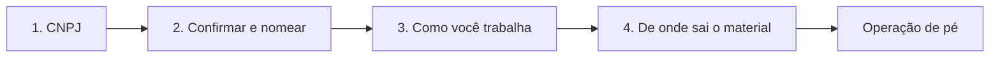

# Configuração inicial

No primeiro acesso, o LocFlow conduz uma configuração curta: **quatro perguntas e você sai operando**. Você digita só o CNPJ — a Flo busca o resto na Receita — e responde como a sua empresa trabalha. Com isso o LocFlow monta o menu do seu jeito e guarda o que você ainda não usa.


**Por que vale fazer já:** com a empresa e o local de onde o material sai no ar, você **fecha o primeiro orçamento no mesmo dia**. O resto — produtos, logo, equipe, regras finas — entra quando fizer falta, sem travar o começo.


## As 4 etapas

```mermaid
flowchart LR
    C[1. CNPJ] --> N[2. Confirmar e nomear]
    N --> T[3. Como você trabalha]
    T --> M[4. De onde sai o material]
    M --> OK[Operação de pé]
```

| Etapa | O que você faz | Por quê |
| --- | --- | --- |
| **1. CNPJ** | Digita só o CNPJ e toca em **Buscar CNPJ**. | A Flo traz da Receita a razão social, o endereço, a situação e o regime tributário — você não redigita nada. |
| **2. Confirmar e nomear** | Confere os dados e ajusta o nome que a sua equipe usa. | Ao tocar em **Confirmar**, a empresa é criada e o **teste grátis** começa. |
| **3. Como você trabalha** | Diz se **aluga, vende ou os dois** e **quantas pessoas** trabalham na empresa. | Com essas duas respostas, o LocFlow monta o menu e guarda o que você não usa até precisar. |
| **4. De onde sai o material** | Confirma o **local** de onde o material sai, diz se o **cliente busca ou você entrega** e, se entrega, **quantos veículos** usa. | É o ponto que o sistema usa para calcular frete, prazo e o que está livre. |


**Não precisa acertar tudo de primeira.** O jeito de trabalhar que você responde nas etapas 3 e 4 pode ser mudado depois, em **Ajustes**, sem migrar nada. O passo a passo de cada etapa está em [O setup passo a passo](setup-passo-a-passo.md).


## O que já vem pronto

Para não fazer você responder o que quase todo mundo responde igual, o LocFlow já deixa prontos — e diz isso na tela:

* **Horário comercial** de segunda a sexta, das 08:00 às 18:00;
* o **fuso horário** do estado da sua empresa;
* um **raio de atendimento** de 30 km a partir do local de onde o material sai.

Você ajusta qualquer um deles quando quiser: o horário e o fuso em [Horários e sazonalidades](../configuracoes/horarios-e-sazonalidades.md); o raio, no cadastro do [galpão](../estoque/galpoes-e-disponibilidade.md).

## Depois do setup: o que vale ajustar

- **Perfil da Empresa** — logo, inscrições, celular e os dados cadastrais da locadora, tudo num lugar só (o e-mail já vem da sua conta). Veja [Perfil da Empresa](../configuracoes/perfil-da-empresa.md) e [Identidade visual](../documentos/identidade-visual.md).
- **Catálogo** — cadastre seus itens quando precisar: pelo [Catálogo](../cadastros/catalogo-produtos.md) ou direto na hora de montar o orçamento.
- **Equipe** — convide pessoas com papéis prontos. Veja [Colaboradores e acessos](../configuracoes/colaboradores-e-acessos.md).
- **Plano** — todo mundo começa no teste grátis; plano e pagamento ficam em [Minha assinatura e créditos](../configuracoes/assinatura-e-creditos.md).
- **Motores** — calibre frete, cobrança e logística conforme sua operação. Veja [Motores operacionais](../configuracoes/motores-operacionais.md).

## Próximo passo

Tudo no lugar? Hora de [criar seu primeiro orçamento](../orcamentos/criando-um-orcamento.md) — ou siga a sua [trilha de leitura](trilhas-de-leitura.md).
