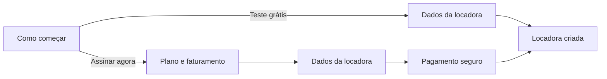

# Criando sua locadora (onboarding)

Com a [conta criada](criando-sua-conta.md), o próximo passo é dar nome e forma à **sua locadora** dentro do LocFlow. No sistema, ela é a sua **organização**: o espaço que vai guardar seus contatos, seu catálogo, seus galpões e tudo o que você fizer daqui pra frente.

É um caminho curto e sem pegadinhas. Você escolhe **como quer começar** (testando de graça ou já assinando), informa **os dados da empresa** e pronto — o LocFlow te leva direto para a [configuração inicial](configurando-sua-empresa.md).


**Você só faz isso uma vez.** Depois de criada, a sua locadora fica salva na conta — no dia a dia você só entra e usa.


## É feito no navegador (web-first) {#web-first}

A criação da locadora — o **plano** e o **pagamento inicial** — acontece no **painel web do LocFlow, pelo navegador**. Pode ser o navegador do seu próprio celular: não precisa de computador.

Por que assim? As lojas de aplicativos (Google Play e App Store) não permitem cobranças de assinatura dentro do app. Para manter tudo seguro e dentro das regras, a parte de **escolher plano e pagar** fica na web. O app continua sendo o seu dia a dia depois que a locadora estiver no ar.


**Abriu o app antes de ter a locadora?** Você verá um aviso parecido com este:

> *"A criação e a configuração da sua locadora são feitas no painel web do LocFlow, pelo navegador (pode ser o do seu próprio celular). Depois, é só voltar e entrar por aqui com a sua conta."*

É só tocar em **Abrir no navegador**, concluir o cadastro lá e voltar. Ao retornar, toque em **Já concluí — atualizar** (ou apenas reabra o app) e você entra direto na sua locadora.


## Comece no seu ritmo: teste grátis ou assinar {#comece-no-seu-ritmo}

No navegador, o LocFlow pergunta **como você quer começar**. São dois caminhos:

| Caminho | O que é | Quando escolher |
| --- | --- | --- |
| **Teste grátis** | Um período de teste, **sem cartão agora**. Você usa o LocFlow por completo durante esses dias. | Para conhecer o sistema sem compromisso. É o caminho mais rápido para começar. |
| **Assinar agora** | Você escolhe o plano e o faturamento, e segue para o **pagamento seguro** na sequência. | Quando já decidiu e quer ativar a assinatura de uma vez. |


Na tela, o teste grátis aparece como **"Teste grátis — X dias de teste, sem cartão agora"** e a assinatura como **"Assinar agora — Plano e pagamento seguro na sequência"**. A quantidade exata de dias do teste aparece ali na hora.


A diferença prática entre os dois é só um passo a mais:

* **Teste grátis:** dois passos — escolher o caminho e preencher os **dados da locadora**.
* **Assinar agora:** três passos — escolher o caminho, escolher **plano e faturamento** e, por fim, os **dados da locadora**, com o pagamento logo em seguida.

A barra de progresso no topo (**"Passo 1 de 2"**, **"Passo 2 de 3"**…) mostra onde você está.


**Não fica preso na escolha.** Começar pelo teste grátis não te amarra: você pode assinar quando quiser, mais tarde, em [Minha assinatura e créditos](../configuracoes/assinatura-e-creditos.md).


## Os dados da sua locadora {#dados-da-locadora}

É o coração do passo. Aqui você diz quem é a sua locadora:

| Campo | O que preencher |
| --- | --- |
| **CNPJ ou CPF** | Um seletor no topo. Tem empresa registrada? Use **CNPJ**. É autônomo ou pessoa física? Use **CPF**. |
| **Nome da locadora** | O nome que identifica o seu negócio (ex.: *Locadora Silva*). |
| **Documento** | O número do CNPJ ou do CPF, conforme o que você escolheu acima. |
| **E-mail** | Vem preenchido com o e-mail da sua conta. Com CNPJ, ele aparece como **"E-mail da locadora"**; com CPF, como **"Seu melhor e-mail"**. Você pode trocar. |
| **Celular do responsável** | **Opcional.** O contato de quem responde pela operação. |


**CNPJ e CPF servem igual.** O LocFlow atende tanto a empresa registrada quanto o autônomo — escolha o documento que é o seu. O sistema só ajusta os rótulos (como o do e-mail) para combinar com a sua escolha.


Ao tocar em **Finalizar configuração**, o LocFlow valida os campos e cria a sua locadora. Se você escolheu **assinar agora**, ele te leva para o **pagamento seguro**; se escolheu o **teste grátis**, vai direto para a [configuração inicial](configurando-sua-empresa.md).

## Uma locadora por conta {#uma-locadora-por-conta}

Cada conta cria **uma única organização**. Esse é o desenho do LocFlow: sua conta é o seu acesso, e a locadora é o ambiente da sua operação.

Disso seguem duas coisas práticas:

* **Tem mais gente na equipe?** Elas **não** criam uma locadora nova. Você as traz para a *sua* locadora por **convite**: você gera um **link** e envia (por WhatsApp, e-mail ou outro app) — não há e-mail automático do sistema. Ao abrir o link, a pessoa entra com a conta dela e já passa a fazer parte da equipe, com as permissões do perfil que você definir. Veja [Colaboradores e acessos](../configuracoes/colaboradores-e-acessos.md).
* **Cada documento, uma locadora.** Não dá para cadastrar duas locadoras com o mesmo CNPJ ou CPF.


Se você tentar criar uma locadora e já tiver uma, o sistema avisa que **a conta já possui uma organização associada**. Nesse caso, é só entrar normalmente — sua locadora já existe.


## Situações reais

* **"Quero só dar uma olhada antes de pagar."** Escolha **Teste grátis**. Você usa o LocFlow completo durante o período, sem informar cartão, e decide depois.
* **"Sou autônomo, não tenho CNPJ."** Sem problema: no seletor, escolha **CPF** e siga normalmente. O LocFlow atende locação **e** venda para pessoa física também.
* **"Meu sócio também quer acessar."** Ele não cria outra locadora. Você o convida para a sua, por **link**, em [Colaboradores e acessos](../configuracoes/colaboradores-e-acessos.md).
* **"Abri pelo app e apareceu uma tela pedindo para usar o navegador."** É esperado: a criação da locadora é **web-first**. Abra no navegador, conclua, e volte ao app.
* **"Já tenho uma locadora e o sistema não deixa criar outra."** É o desenho do produto — **uma por conta**. Sua locadora já está pronta; é só entrar.

## Próximo passo

Locadora criada? Hora do **setup-relâmpago**: siga para [Configuração inicial](configurando-sua-empresa.md) e deixe o LocFlow com a cara do seu negócio.

Quer entender por que o sistema cresce junto com você? Leia [A filosofia do LocFlow](filosofia.md).
