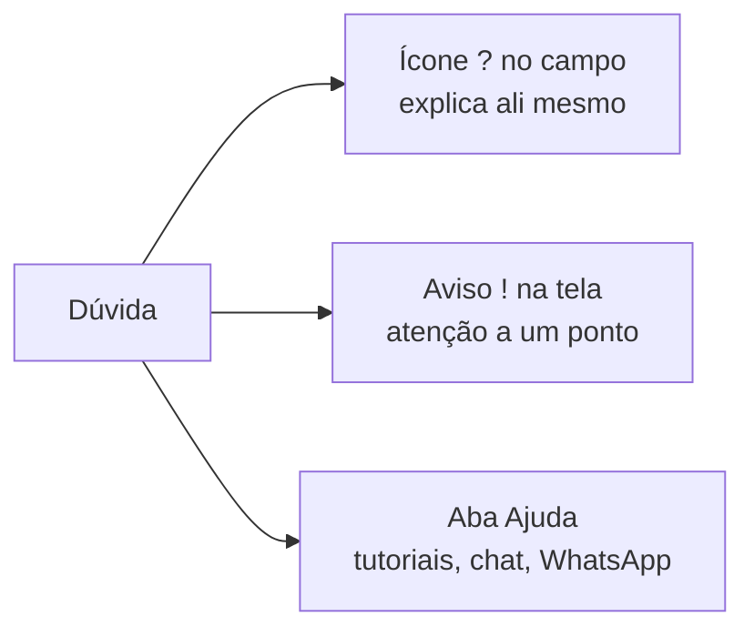

# Onde tirar dúvidas

Você nunca fica sem resposta. A ajuda do LocFlow vem em **três camadas** — da explicação ali do lado ao atendimento humano.

## 1. O ícone de ajuda "?"

Sempre que aparece um **"?"** ao lado de um campo ou seção, **toque nele**: abre uma explicação curta, em linguagem simples, do que aquilo faz e como decidir — sem sair da tela.


Procure o **"?"** principalmente nos **Motores** (regras da operação) e em campos com termos novos. É a forma mais rápida de entender uma opção **na hora de usá-la**.


## 2. O aviso de atenção "!"

Um **"!"** (triângulo de atenção) sinaliza um ponto que merece cuidado — uma regra que muda o resultado, um custo que se aplica, uma ação que não dá para desfazer. Quando vir um, **leia antes de seguir**: ele evita retrabalho e surpresa.

## 3. A aba "Ajuda"

No menu do app, toque em **Ajuda** (ícone "?"). Você encontra:

| Opção | Para quê |
| --- | --- |
| **Manuais e Tutoriais** | Abre esta central de ajuda (a documentação que você está lendo). |
| **Falar com Suporte** | Abre o **chat** com o time LocFlow — tire dúvidas em tempo real. |
| **WhatsApp e outras redes** | Fale pelo WhatsApp, Instagram ou e-mail de suporte. |
| **Informar um erro** | Achou um problema? Relate direto pelo chat — a gente resolve. |


**Dica:** para dúvida de **conceito** ("o que é separação?"), use os Manuais. Para dúvida de **agora** ("não consigo gerar o link"), use **Falar com Suporte**.


## Próximo passo

Conheça os termos do sistema no [Glossário do LocFlow](glossario.md) ou escolha sua [trilha de leitura](trilhas-de-leitura.md).
