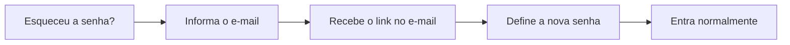

# Recuperar sua senha

Esqueceu a senha de acesso? Fica tranquilo — recuperar o acesso leva menos de um minuto. O LocFlow envia um **link de recuperação** para o seu e-mail, e por ele você define uma senha nova.

## Esqueci minha senha: o que fazer 

Na tela de acesso, abaixo do campo de senha, toque em **Esqueceu a senha?**. Você vai para uma tela curtinha com um pedido só:

> _Informe o e-mail da sua conta. Enviaremos um link para você definir uma nova senha._

É só informar o e-mail e tocar em **Enviar link de recuperação**.


Use o **mesmo e-mail** com que você criou a conta. É para ele que o link vai chegar.


## Passo a passo 

1. Na tela de acesso, toque em **Esqueceu a senha?**.
2. Informe o **e-mail** da sua conta.
3. Toque em **Enviar link de recuperação**.
4. Abra o e-mail que chega e clique no **link** para definir a nova senha.
5. Pronto — volte à tela de acesso e entre com a senha que acabou de criar.


Depois de enviar, você verá uma confirmação: _"Se existir uma conta, você receberá instruções para redefinir a senha."_ Essa mensagem aparece sempre — é uma proteção, para ninguém descobrir por aqui quais e-mails têm conta no LocFlow.


## Não chegou o e-mail? 

Se o link não aparecer em poucos minutos:

* Confira a caixa de **spam** ou **lixo eletrônico**.
* Verifique se digitou o e-mail **certo** — o mesmo do cadastro.
* Tente **enviar de novo**: é só repetir o passo a passo.


Por segurança, a tela mostra a mesma mensagem de confirmação **mesmo que o e-mail não tenha conta**. Se nada chegar depois de tentar com o e-mail certo, talvez a conta tenha sido criada com **outro endereço** — ou com o **Google** (veja abaixo).


## Você entra com o Google? 

Se você acessa o LocFlow **com a sua conta Google**, não existe senha a recuperar — quem cuida da sua senha é o próprio Google. Para entrar, é só tocar em **Continuar com Google** na tela de acesso.


**Sem senha para lembrar.** Entrar com o Google é o caminho mais rápido, no cadastro e no dia a dia. Se um dia esquecer a senha do seu Google, recupere-a pelo próprio Google.


## Situações reais 

* **"Sempre entrei com o botão do Google e agora aparece pedindo senha."** Você não precisa de senha: toque em **Continuar com Google**. O campo de senha é só para quem criou a conta com e-mail e senha.
* **"Pedi o link, mas não lembro qual e-mail usei."** Tente o e-mail principal da sua locadora. Se mesmo assim nada chegar, é provável que a conta use o **Google** — entre por ele.
* **"Recebi um convite da equipe e esqueci a senha que defini."** O fluxo é o mesmo desta página: peça o link de recuperação com o e-mail do convite. Se você aceitou o convite **com o Google**, é só entrar com o Google.

## Próximo passo 

Recuperou o acesso? Volte para [Criando sua conta](criando-sua-conta.md) para entender as formas de entrar, ou siga para [Configurando sua empresa](configurando-sua-empresa.md). Travou em outra coisa? Veja [Onde tirar dúvidas](onde-tirar-duvidas.md).
