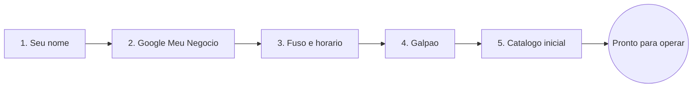

# O setup passo a passo

A página [Configuração inicial](configurando-sua-empresa.md) mostra o mapa: cinco passos curtos que deixam o LocFlow com a cara da sua locadora. Aqui a gente abre **cada um deles** — o que pede, por que pede, e o que os textos de ajuda dentro do app querem te dizer.

A boa notícia: **nada aqui precisa sair perfeito de primeira.** O setup quer só o essencial para você fechar o primeiro orçamento. O refino vem depois, no seu ritmo.


**Onde isso acontece.** A configuração inicial é **web-first**: a parte de criar a empresa e escolher o plano você faz no navegador. Os passos abaixo — nome, Google, horários, galpão e catálogo — rodam tanto no computador quanto no celular, com o mesmo visual de cartão centralizado.


## Os 5 passos 

São exatamente **cinco** passos — nem mais, nem menos. (Versões antigas tinham um passo de "motores"; ele saiu do caminho e virou um ajuste opcional, lá nas Configurações.)

O assistente é **só para frente**: cada vez que você toca em **"Próximo"**, o passo fica salvo. Por isso não existe botão "Anterior" — qualquer ajuste depois você faz nas telas normais do sistema. E no topo de cada passo há um indicador de progresso ("passo N de 5") para você saber onde está.

***

## Passo 1 — Seu nome 

O primeiro passo pergunta, com todas as letras: **"Como quer ser chamado(a)?"**

Esse nome identifica **você como administrador** da conta. A ajuda do passo explica o porquê:

> *Esse nome vai aparecer em orçamentos, conversas e logs da operação. Pode ser primeiro nome, apelido ou nome completo.*

E logo abaixo, no cartão de dica:

> *Não precisa ser o nome formal do CNPJ — escolha como a equipe vai te chamar.*

Ou seja: **não é a razão social.** É como as pessoas vão te ver no dia a dia — "João", "João Silva" ou "Joãozinho", tanto faz. Basta ter pelo menos dois caracteres.


**Este passo é definitivo.** Diferente dos outros, o administrador é criado uma única vez. Se você voltar a esta tela depois, o sistema pula direto para o passo seguinte — não dá para recriar o administrador.


***

## Passo 2 — Google Meu Negócio 

Este passo é **opcional** — e ele avisa isso na própria etiqueta: *"Opcional · economiza 3 minutos"*. A pergunta é direta: **"Sua locadora está no Google Maps?"**

Se estiver, o LocFlow se oferece para fazer o trabalho por você. A ajuda resume:

> *Importamos endereço, telefone e horários automaticamente para os próximos passos.*

Você digita o nome da sua empresa (ex.: *"Locadora ABC Eventos"*), seleciona o resultado certo, e o sistema mostra um cartão **"Dados importados!"** com o que encontrou: endereço, telefone, horários e até o fuso horário. Esses dados já chegam preenchidos nos passos 3 e 4 — você só confere.

Não está no Google, ou prefere preencher na mão? Sem stress. O cartão de ajuda diz:

> *Não encontrou? Sem problema. Use "Pular" e preenchemos manualmente.*

É só tocar em **"Pular"** e seguir. Nada se perde.


**Vale a pena quando dá.** Se a sua locadora já está no Google Maps, esse passo poupa digitação repetida — endereço e horários entram sozinhos nos passos seguintes. Mas é genuinamente opcional: pular não bloqueia nada.


***

## Passo 3 — Fuso e horário comercial 

Aqui você diz **quando sua locadora funciona**. A ajuda explica o impacto:

> *Quando sua locadora funciona? Afeta lembretes, relatórios e cobranças.*

São duas coisas neste passo:

* **Fuso horário** — aparece numa linha enxuta (ex.: *"Fuso · America/Sao_Paulo"*). Veio do Google ou está no padrão Brasília. Toque em **"Trocar"** só se precisar ajustar.
* **Horário comercial** — os sete dias da semana, cada um com hora de abrir e fechar (ou marcado como **"Fechado"**). Por padrão, segunda a sexta das 08:00 às 18:00; sábado e domingo fechados. Você confere o resumo e, se quiser mexer, toca em **"Editar horários"** para abrir os campos dia a dia.


**Você precisa de pelo menos um dia aberto.** Se marcar todos os dias como fechados, o sistema avisa: *"Marque ao menos um dia de funcionamento para continuar."* — afinal, uma locadora sempre abre algum dia.


> **Nota:** apesar do título dentro do app dizer "Identidade & horários", aqui você ajusta só fuso e horário. **Logo e cores** da sua marca ficam para depois, em [Identidade visual](../documentos/identidade-visual.md).

***

## Passo 4 — Galpão 

Hora de criar o seu **galpão principal** — o primeiro local de estoque. A ajuda pergunta:

> *Onde os itens ficam guardados? Filiais e depósitos extras podem ser cadastrados depois.*

E o cartão de dica explica por que esse ponto importa tanto:

> *O sistema usa este ponto pra calcular rotas, controlar estoque e organizar a logística.*

O galpão é **de onde os itens saem e para onde voltam**. É a referência que o LocFlow usa para medir distâncias, planejar entregas e saber o que está disponível. Por isso ele é o coração da parte logística.

Você toca em **"Cadastrar Galpão Principal"** e o sistema abre o formulário **com o nome já sugerido** — e, se você usou o Google no passo 2, **com o mapa já posicionado no seu endereço**. Ao salvar, você volta ao passo e vê o cartão *"Galpão cadastrado!"*. Pode adicionar mais de um, se já tiver filiais.


O cadastro completo do galpão (endereço, posição no mapa) tem sua própria tela e seus próprios detalhes — veja [Galpões e disponibilidade](../estoque/galpoes-e-disponibilidade.md).


***

## Passo 5 — Catálogo inicial 

O **último passo** — a etiqueta mostra um *"Último passo"* com um brilhinho. Aqui você cadastra o seu **primeiro produto**:

> *Cadastre 1 produto com preço de aluguel pra simular seu primeiro orçamento.*

E a dica reforça o porquê de bastar um:

> *Com 1 produto e preço de aluguel, dá pra simular um orçamento e gerar PDF.*

A lógica é simples: **sem itens não há orçamento.** Um único produto com preço de aluguel já destrava o primeiro pedido — você não precisa cadastrar o catálogo inteiro agora. Toque em **"Cadastre um item"**, escolha pelo **catálogo oficial** (mais rápido) ou cadastre na mão, e volte. O cartão *"Catálogo iniciado!"* confirma.


**Por que pede preço de aluguel?** O LocFlow precisa de pelo menos um item "alugável" para você simular um orçamento de ponta a ponta. Se sua operação é **só de venda**, ainda assim cadastre um item para concluir o setup — depois você ajusta o catálogo do jeito da sua loja em [Catálogo: produtos](../cadastros/catalogo-produtos.md).


Com o produto no lugar, o botão muda para **"Concluir"** — e aí acontece a parte boa.

***

## Como retomar de onde parou 

A vida acontece: você é interrompido no meio do passo 3 e fecha o app. Sem problema — o LocFlow **lembra exatamente onde você parou.**

* Na próxima vez que entrar, a tela de boas-vindas mostra **"Continuar de onde parei"** em vez de "Bora começar", e te leva direto ao passo certo. Os passos já concluídos aparecem com um ✓.
* Os passos do galpão e do catálogo (4 e 5) abrem telas reais do sistema. Enquanto você está lá dentro — e se decidir adiar — um **lembrete flutuante** segue te acompanhando pelo painel, dizendo em que passo você está e levando você de volta com um toque.

A partir do **passo do galpão**, há também um link discreto **"Prefiro configurar depois"**. Tocar nele abre um aviso:

> *Você está no passo N de 5 do onboarding. A configuração inicial fica pausada e você pode retomar de onde parou a qualquer momento.*

Você escolhe entre **"Continuar configuração"** e **"Sair e fazer depois"**. Se sair, vai para o painel — e o lembrete continua ali, paciente, até você terminar.


**Nada se perde, nada trava.** Cada passo concluído já está salvo. Pausar o setup nunca te impede de usar o resto do sistema — é só uma pendência que fica te esperando.


## A celebração no fim 

Quando você toca em **"Concluir"** no passo do catálogo, o LocFlow comemora com você. Uma tela cheia de confete aparece:

> **Tudo pronto! Sua locadora está no ar**
>
> *Você concluiu a configuração inicial. Daqui pra frente, explore o LocFlow no seu ritmo — é assim que sua operação cresce.*

É um momento proposital: a partir daqui, **o sistema deixa de te guiar passo a passo** e você passa a explorar sozinho. A própria tela te dá a bússola:

> *Qualquer dúvida, procure o **?** nas telas. E vale abrir a **Central de ajuda** no menu para ler a documentação e ver tudo o que dá pra fazer.*

Dois botões fecham a celebração: **"Explorar o LocFlow"** (vai para o painel) e **"Abrir Central de ajuda"** (te traz justamente para cá, esta documentação).


**E os "motores"?** Frete, cobrança e logística têm ajustes finos — mas eles **não fazem parte do setup**. Ficam disponíveis quando a sua operação pedir, em [Motores operacionais](../configuracoes/motores-operacionais.md). Essa é a [filosofia do LocFlow](filosofia.md): você liga cada coisa na hora em que ela passa a valer a pena.


## Situações reais 

* **"Não acho minha empresa no Google."** Normal — muita locadora pequena não tem perfil. Toque em **"Pular"** no passo 2 e preencha endereço e horários na mão. Não muda nada no resultado.
* **"Errei meu nome de administrador."** O nome em si você ajusta depois nas suas preferências de conta; o administrador como pessoa é que é definitivo. Veja [Minha conta e preferências](../configuracoes/minha-conta.md).
* **"Só trabalho com venda, não com aluguel."** Cadastre um item para concluir o passo 5 e siga em frente — depois molde o catálogo à sua loja. Entenda a diferença em [Locação e venda](../conceitos/locacao-e-venda.md).
* **"Fechei o app no meio do setup."** Entre de novo: o botão vira **"Continuar de onde parei"** e te leva ao passo exato onde você estava.
* **"Quero usar o sistema antes de terminar o setup."** Use o **"Prefiro configurar depois"** (a partir do galpão). O lembrete flutuante segura a pendência para você até quando quiser.

## Próximo passo 

Setup concluído? Hora de colocar para rodar:

* [Criando um orçamento](../orcamentos/criando-um-orcamento.md) — feche o primeiro pedido com o item que você acabou de cadastrar.
* [Contatos](../cadastros/contatos.md) — cadastre o cliente do orçamento.
* [Trilhas de leitura: por onde começar](trilhas-de-leitura.md) — siga o caminho do seu porte.

E, se travar em algo, lembre da promessa da tela de celebração: procure o **"?"** nas telas, ou volte a [Onde tirar dúvidas](onde-tirar-duvidas.md).
