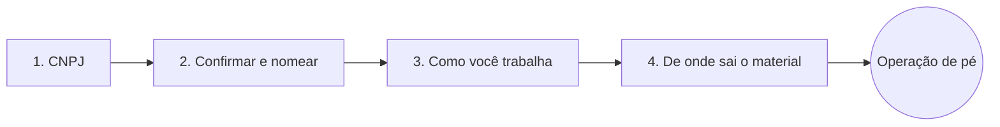

# O setup passo a passo

A página [Configuração inicial](configurando-sua-empresa.md) mostra o mapa: quatro perguntas curtas que deixam o LocFlow pronto para a sua operação. Aqui a gente abre **cada uma delas** — o que pede, por que pede, e o que os textos dentro do app querem te dizer.

A boa notícia: **nada aqui precisa sair perfeito de primeira.** O setup quer só o essencial para você fechar o primeiro orçamento. O refino vem depois, no seu ritmo, em **Ajustes**.


**Onde isso acontece.** No **navegador** (computador ou celular) e no **aplicativo para Android**, as quatro etapas acontecem ali mesmo. No **iPhone**, a criação da empresa ainda é feita pelo navegador — veja [Criando sua locadora](criando-sua-locadora.md#web-first).


## As 4 etapas 

É uma trilha só, com uma barra de progresso no topo (**Etapa N de 4**). As duas primeiras criam a sua empresa; as duas últimas dizem como ela trabalha.

```mermaid
flowchart LR
    A[1. CNPJ] --> B[2. Confirmar e nomear]
    B --> C[3. Como você trabalha]
    C --> D[4. De onde sai o material]
    D --> E((Operação de pé))
```

***

## Etapa 1 — CNPJ 

A pergunta é uma só: **"Qual o CNPJ da sua empresa?"** E a tela já avisa:

> *É só isso que você digita. A Flo busca o resto e já deixa a operação montada.*

Digite o CNPJ e toque em **Buscar CNPJ**. O LocFlow consulta a Receita e traz, sem você redigitar:

* **razão social e nome fantasia**;
* **endereço, situação e município**;
* **regime tributário e CNAE**.


**A empresa é sempre um CNPJ.** Não existe cadastro só com CPF. É autônomo com MEI? Use o **CNPJ do MEI** — o regime vem da Receita. Se aparecer *"CNPJ não encontrado na Receita"*, confira o número e tente de novo.


***

## Etapa 2 — Confirmar e nomear 

A tela pergunta **"É essa a sua empresa?"** e mostra o que veio da Receita. Aqui você:

1. Confere o **CNPJ** (errou? toque no cartão do CNPJ para corrigir) e os dados da Receita, com o regime tributário.
2. Ajusta, se quiser, o nome em **"Como sua equipe chama a empresa?"** — ele já vem preenchido pela Receita, mas pode ser o nome que todo mundo usa no dia a dia.
3. Toca em **Confirmar**.

Ao confirmar, **a empresa é criada e o teste grátis começa**. Não há escolha de plano nem pagamento neste caminho: plano e pagamento ficam para depois, em [Minha assinatura e créditos](../configuracoes/assinatura-e-creditos.md).


O **e-mail** vem da sua conta. **Logo, inscrições e celular** ficam para depois, no [Perfil da Empresa](../configuracoes/perfil-da-empresa.md).


***

## Etapa 3 — Como você trabalha 

> *Duas respostas e a gente monta o menu. O que você não usa fica guardado até precisar.*

| Pergunta | Opções |
| --- | --- |
| **Você aluga, vende ou os dois?** | **Aluga** (o item volta) · **Vende** (o item não volta) · **Os dois** (no mesmo acervo) |
| **Quantas pessoas trabalham na empresa?** | **1 ou 2** (eu e mais alguém) · **3 a 10** (time montado) · **Mais de 10** (vários setores) |

Enquanto você responde, o cartão **Seu LocFlow agora** mostra quantas telas ficam ligadas no seu menu — e quais ficam guardadas. Embaixo dele, a promessa: *"Cresceu? Liga em Ajustes, sem migrar nada."*


**Guardado não é proibido.** O que não aparece no menu continua a um toque — no **Personalizar** do menu — e volta sozinho quando você começa a usar (por exemplo, ao cadastrar o primeiro veículo). Veja [A filosofia do LocFlow](filosofia.md#interface-adapta).


***

## Etapa 4 — De onde sai o material 

A pergunta é **"O material sai de onde?"** — e a tela explica por que ela importa:

> *É o ponto que o sistema usa para calcular frete, prazo e o que está livre.*

O LocFlow já sugere o **endereço da Receita**, com o ponto no mapa. Dê um nome em **Nome do local** (se não mudar, fica *Local principal*) e escolha:

* **É aqui** — o material sai desse endereço; o local é criado na hora.
* **É outro** — abre o cadastro completo do local, com o ponto já posicionado, para você informar outro endereço.


**Prefere achar pelo nome?** Use o atalho **Busque sua empresa no Google** e escolha o seu negócio na lista: o cadastro do local abre com o ponto já no lugar. É opcional — quem opera no mesmo endereço da Receita nem precisa dele.


Com o local definido, mais uma ou duas perguntas:

| Pergunta | Opções |
| --- | --- |
| **Geralmente, o cliente busca ou você entrega?** | **Ele busca** (retira na loja) · **Eu entrego** (minha equipe leva) · **Os dois** (depende do pedido) |
| **Quantos veículos você usa para entregar?** *(só para quem entrega)* | **Nenhum** (contrato frete) · **1 a 3** (veículos próprios) · **Mais de 3** (frota) |

Uma faixa confirma o que já ficou pronto: **horário comercial de segunda a sexta, das 08:00 às 18:00**, o **fuso** do estado da sua empresa e um **raio de atendimento de 30 km** — tudo ajustável depois. Toque em **Concluir**.

***

## O que saiu do caminho 

Versões antigas desta configuração pediam mais coisas. Elas não sumiram — só deixaram de travar o começo:

| Antes era uma etapa | Agora |
| --- | --- |
| **Seu nome** | Vem da sua conta. |
| **Google Meu Negócio** | Virou o atalho opcional da etapa 4. |
| **Fuso e horário comercial** | Já vêm prontos; ajuste em [Horários e sazonalidades](../configuracoes/horarios-e-sazonalidades.md). |
| **Catálogo inicial** | Cadastre seus itens quando precisar, pelo [Catálogo](../cadastros/catalogo-produtos.md) ou na hora de montar o orçamento. |
| **Plano e pagamento** | Todo mundo começa no teste grátis; o resto fica em [Minha assinatura e créditos](../configuracoes/assinatura-e-creditos.md). |

## Como retomar de onde parou 

Cada etapa concluída já fica salva. Se você fechar o app no meio, na próxima vez que entrar o LocFlow **leva você direto à etapa que falta** — sem repetir o que já respondeu. (As duas respostas da etapa 3 ficam guardadas no aparelho até você tocar em **Concluir**: se trocar de aparelho no meio do caminho, o LocFlow volta a fazer essas duas perguntas.)

* Quando a etapa 4 abre o **cadastro completo do local** (no **É outro**), uma faixa no topo mostra **Configuração · Etapa 4 de 4** e o atalho **Voltar ao guia**.
* Na etapa 4 há também o link discreto **Prefiro configurar depois**. Ele abre o aviso *"Você está no passo 4 de 4 do onboarding. A configuração inicial fica pausada e você pode retomar de onde parou a qualquer momento."*, com **Continuar configuração** ou **Sair e fazer depois**.


**Nada se perde.** Pausar não apaga nada. Ao abrir o LocFlow de novo, ele retoma a configuração de onde você parou.


## Ao concluir 

Quando você toca em **Concluir**, o LocFlow comemora com você:

> **Sua operação está de pé**

A tela diz quantas telas ficaram ligadas no seu menu (e quantas ficaram guardadas até você precisar), resume o que já está funcionando e lembra que a [Rede de Parceiros](../parcerias/visao-geral.md) já está no menu, para quando faltar item. Dois botões fecham a celebração:

* **Criar orçamento com a Flo** — para fechar o primeiro pedido pedindo em vez de preencher. Veja [Conheça a Flo](../flo/conheca-a-flo.md).
* **Ir para o painel** — a sua [tela inicial](../painel/o-painel.md).


**E os "motores"?** Frete, cobrança e logística têm ajustes finos — mas eles **não fazem parte do setup**. Ficam disponíveis quando a sua operação pedir, em [Motores operacionais](../configuracoes/motores-operacionais.md). Essa é a [filosofia do LocFlow](filosofia.md): você liga cada coisa na hora em que ela passa a valer a pena.


## Situações reais 

* **"Sou autônomo e não tenho CNPJ."** A empresa no LocFlow é sempre um CNPJ. Se você tem MEI, use o CNPJ do MEI.
* **"O endereço da Receita não é onde fica o meu material."** Na etapa 4, toque em **É outro** (ou use a busca no Google) e informe o endereço certo.
* **"Só trabalho com venda."** Na etapa 3, escolha **Vende**. Entenda a diferença em [Locação e venda](../conceitos/locacao-e-venda.md).
* **"Terceirizo todo o transporte."** Na etapa 4, em quantos veículos, escolha **Nenhum**: Frota e Roteirização ficam guardadas no menu até você precisar.
* **"Fechei o app no meio do setup."** Entre de novo: o LocFlow abre direto na etapa que falta.
* **"Quero usar o sistema antes de terminar."** Use o **Prefiro configurar depois**, na etapa 4.

## Próximo passo 

Setup concluído? Hora de colocar para rodar:

* [Criando um orçamento](../orcamentos/criando-um-orcamento.md) — feche o primeiro pedido.
* [Contatos](../cadastros/contatos.md) — cadastre o cliente do orçamento.
* [Trilhas de leitura: por onde começar](trilhas-de-leitura.md) — siga o caminho do seu porte.

E, se travar em algo, procure o **"?"** nas telas, ou volte a [Onde tirar dúvidas](onde-tirar-duvidas.md).
